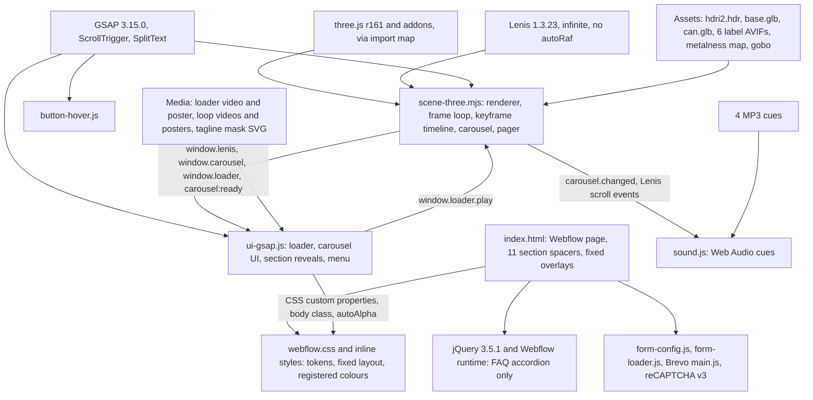

# ciaoenergy.com: architecture and asset wiring

| | |
|---|---|
| Site | https://www.ciaoenergy.com/, a Webflow page last published 17 September 2026 (ciao/markup.html:3). Built by Skaald: the footer says "BY SKAALD" (ciao/markup.html:1683) and the 3D, video and texture CDN is cdn.skaald.com |
| What Sam liked | "the scroll animations and how the assets are used for the animations" |
| Read with | [../2026-10-06-ciaoenergy-com.md](../2026-10-06-ciaoenergy-com.md) (takes and drops), [../README.md](../README.md) (the reconciled take list), the raw Chrome brief in [../raw/](../raw/2026-10-06-ciaoenergy-com.brief.txt) |
| Audience | Sam and the developer building Skreed. This file explains how the site is built. It does not change the Skreed plan; section 8 lists the few corrections the code forces on the reference notes |
| Citations | `REF` below means `/tmp/claude-0/-home-user-skreed-pre-launch/5a355426-a449-5fdb-a97b-268f46030370/scratchpad/refsites`. Code is cited relative to `REF/src/`: `ciao-live/scene-three.mjs:1170`. Bare line numbers with no file name refer to `ciao-live/scene-three.mjs`, the file most of this document is about. Captured files are relative to `REF/ciao/`. `index.html` means `REF/ciao/www.ciaoenergy.com/index.html` (the raw page). `three.module.js` means `REF/ciao/cdn.jsdelivr.net/npm/three@0.161.0/build/three.module.js`, `lenis.mjs` means `REF/ciao/unpkg.com/lenis@1.3.23/dist/lenis.mjs` |
| Screenshots | `REF/work/shots/`, named per section. They stay outside the repo |
| Inferred | Anything not read in code or seen in the mirror is marked "inferred" |

## 1. In one paragraph

ciaoenergy.com is one Webflow-published HTML page with four hand-written scripts pasted into embeds. The body holds eleven `<section>` elements, each at least 125svh tall (ciao/inline-styles.css:598-614), whose main job is to make scroll distance. The first seven keep their text in `position: fixed` full-viewport overlays (ciao/inline-styles.css:27-48). Sections 8, 10 and 11 are empty. Only section 9, with the FAQ, the newsletter and the footer, scrolls as normal content (ciao/markup.html:1072-1710). One fixed, transparent WebGL canvas sits behind it all (ciao/inline-styles.css:27-30; ciao-live/scene-three.mjs:236-246). An ES module loads three.js r161 from jsDelivr through an import map (index.html:159-161) and Lenis 1.3.23 from unpkg (ciao-live/scene-three.mjs:2). It then loads two Blender GLB files, six AVIF label textures and a studio HDR, and builds 24 cans (12 on low-power devices) around a two-part chrome podium (ciao-live/scene-three.mjs:387-485). Lenis runs in infinite mode from the scene's own requestAnimationFrame loop (scene-three.mjs:125-129, 1118). Every frame, the wrapped scroll position seeks a paused GSAP timeline whose ten tweens each last one section's share of the page height (scene-three.mjs:651-973, 1170). The tweened numbers become camera, can, podium and light settings (scene-three.mjs:1173-1244). A wheel and touch pager moves exactly one section per gesture (scene-three.mjs:1328-1428). A second, classic script runs the DOM layer with GSAP 3.15.0, ScrollTrigger and SplitText (ciao-live/ui-gsap.js). A third plays four Web Audio cues (ciao-live/sound.js), and a fourth rolls button labels on hover (ciao-live/button-hover.js). Brevo and a lazily loaded reCAPTCHA handle the newsletter (ciao-live/form-config.js, ciao-live/form-loader.js). Webflow's runtime and jQuery ship too, but the only Webflow interaction on the page is the FAQ accordion: all nine questions share one `data-w-id` (ciao/markup.html:1092-1435).

## 2. Architecture

### Layers

| Layer | What it is | Where |
|---|---|---|
| Document | Webflow HTML in Finsweet's Client-First class system. Flavours, descriptions, loop videos and FAQ come from CMS lists (`w-dyn-list`) | ciao/markup.html:1-1969 |
| Styles | Webflow's shared stylesheet, which holds the Webflow base, the Client-First and Relume utilities, the design tokens and the site classes. Inline `<style>` blocks add the fixed layout, the registered colour properties and the page backgrounds | ciao/webflow.css:1-5758; ciao/inline-styles.css:1-623 |
| Vendor runtime | Webflow runtime and jQuery 3.5.1 (index.html:3898-3899); GSAP 3.15.0, ScrollTrigger and SplitText from Webflow's GSAP CDN (index.html:3900-3905); three.js r161 and its addons (index.html:159-161); Lenis 1.3.23; Brevo's form script (index.html:1696); Umami (index.html:153) | Version-checked only (section 9) |
| Custom code | Four inline scripts: the 3D scene and scroll engine, the DOM UI, sound, button hover. Plus two small Brevo and reCAPTCHA helpers | ciao-live/*.js, ciao-live/scene-three.mjs |

### Modules

| Module | Lines | Responsibility |
|---|---|---|
| scene-three.mjs, imports and helpers | 1-109 | Imports Lenis, three, the composer passes and the loaders. Helpers: `wrap`, `clamp`, `lerp`, `round`, `on` and `off` (which also accept the home-made signals), a three-function `signal`, `debounce`, and `closest` (nearest item by value) |
| scene-three.mjs, device profile | 110-118 | `lowPower` is true on iOS or below 1024 px, decided once at load (116) |
| scene-three.mjs, Lenis and scroll helpers | 119-180 | Lenis with `autoRaf: false, infinite: true, syncTouch: true` (125-129). `scroll.position` is Lenis's scroll wrapped into the page range (140-142, 156-158). `scroll.to` subtracts 10 px from every non-zero target (144-147). `scroll.distanceTo` measures the shorter way round the loop (149-154). `scroll.snap` runs on desktop only (160-178) |
| scene-three.mjs, carousel state | 181-226 | Six label URLs (183), `carousel` with slot spacing 3.5, `getRounded`, `getIndex`, `goTo`, `next`, `previous`, the `changed` signal, all exposed as `window.carousel` (224) |
| scene-three.mjs, camera, renderer, environment | 227-299 | Perspective camera at FOV 20 (230). WebGL renderer with antialias and alpha, transparent clear, sRGB output and ACES Filmic tone mapping (236-248). The HDR goes through PMREM into `scene.environment` (261-267). `applyEnvironmentTint` patches every material's shader so environment light is scaled by a uniform (277-297) |
| scene-three.mjs, materials, lights, passes | 300-368 | `makeMaterial` returns MeshStandard on low power and MeshPhysical otherwise (303-309). Three spotlights: two key lights and spot3 with the gobo map (316-339). Composer: render, bloom (desktop), output, SMAA (desktop) (341-366) |
| scene-three.mjs, podium and cans | 369-487 | `base.glb` with one shared metal material (371-393). `can.glb`, the metalness map and the lid material (398-423). One clone per label with its own label material (425-459). Clones of those clones fill 24 or 12 slots (461-485) |
| scene-three.mjs, pointer picking and cursor | 488-552 | Raycast on click: a side can steps the carousel, the centre can pages to section 2 (490-512). Hover sets `pointer` or `grab` cursors in section 1 only (517-550) |
| scene-three.mjs, sections | 553-598 | Measures every `<section>` top and height. The `snap` flag is set for the first two sections on desktop and the first six below 1024 px (577-596) |
| scene-three.mjs, keyframe timeline | 599-977 | The `data` object of 26 numbers (620-647) and a paused timeline with one tween per section, each lasting that section's height divided by the page height (651-973) |
| scene-three.mjs, loader intro | 978-1068 | `loader.play()`: a 4.5 s GSAP intro that holds input, then releases Lenis, pointer and swipe (987-1066) |
| scene-three.mjs, frame loop | 1069-1252 | WebGL context-loss guard (1075-1097), loop guard (1099-1140), carousel easing, timeline seek, per-can transforms, podium, camera, lights, render (1105-1250) |
| scene-three.mjs, pointer, drag, paging | 1253-1430 | Input blocked while the loader runs (1263-1271). Mouse and touch drag of the carousel (1281-1323). Touch paging below 1024 px (1328-1387). Wheel paging (1392-1428) |
| scene-three.mjs, resize, start, indicator, ready | 1431-1481 | Starts the loop (1433). On width change: resize, re-measure, rebuild the timeline (1435-1449). Exposes `window.loader` (1453). Drives the scroll progress line with `gsap.quickTo` (1458-1476). Dispatches `carousel:ready` (1479) |
| ui-gsap.js, helpers | 1-137 | Breakpoints at 991 and 992 px (23-29). SplitText line-mask and character-mask factories (33-101). `[data-anim]` scanner (103-137) |
| ui-gsap.js, loader UI | 139-314 | Hides the UI, ties the percent counter to the loader video's time, and waits for both the video's end and `carousel:ready` before the exit timeline (141-314) |
| ui-gsap.js, navbar | 316-611 | Sound toggle with random equaliser bars (320-363). Looping scroll chevrons (367-394). Menu-dot and arrow hover pulses on desktop (398-486). Menu open and close (490-611) |
| ui-gsap.js, carousel UI | 613-905 | Name and description swap (617-695). Arrows (699-706). The pagination dot with drag (708-793). The conic glow ring (797-823). Flavour colours into CSS (827-844). The loop video switcher (848-905) |
| ui-gsap.js, section triggers | 907-1161 | One ScrollTrigger per section: gamme (911-935), profile (939-981), benefits (985-1017), the benefits icon rail (1019-1048), argument (1052-1117), full range (1121-1136), the FAQ HUD fade on mobile (1140-1161) |
| ui-gsap.js, init | 1163-1196 | Runs everything at DOMContentLoaded. Carousel-dependent parts wait for `window.carousel` or `carousel:ready` (1165-1171) |
| sound.js | 1-217 | Four MP3 URLs at volume 0.5 (4-11). Fetch and `decodeAudioData` (23-36). Unlock on the first gesture (59-71). Cues: carousel tick (87-94), a whoosh as the hero is left (97-131), a benefit transition (134-190), clicks (193-216) |
| button-hover.js | 1-51 | Desktop only. Each `.button` label is split into two stacked rows of characters that roll past each other on hover. The Brevo button is skipped (4-49) |
| form-config.js, form-loader.js | 1-19, 1-22 | French error strings for Brevo. reCAPTCHA v3 is injected only on the first focus of, or pointer entry into, the email field |
| Markup | ciao/markup.html:1-1969 | Navbar (91-184), loader (185-208), eleven sections (209-1724), the fixed flavour-letter grid (1725-1754), the HUD (1755-1961), four script embeds (1963-1966) |
| Site CSS | ciao/inline-styles.css:323-623; ciao/webflow.css:2145-2399, 4081-5758 | Fonts and tokens, the fixed layout, registered colours, page gradients, the strike line, the scroll indicator, the conic ring, the tagline mask, the responsive overrides |

### Boot sequence, from first byte to first interactive frame

1. The HTML arrives (252,212 B, 44,717 B gzipped at level 9). The head links Webflow's stylesheet with SRI, render-blocking (ciao/markup.html:31-37). It adds Webflow's `w-mod-js` and `w-mod-touch` class script (index.html:22-27), font smoothing and Lenis CSS (index.html:128-152), deferred Umami (index.html:153), `history.scrollRestoration = 'manual'` (index.html:154-158), the import map (index.html:159-161), and the fixed-overlay style (index.html:162-189). That style also forces `.loader { display: flex }` (ciao/inline-styles.css:50-52) over Webflow's `display: none` (ciao/webflow.css:5031), so the black loader is on screen from first paint, before any script runs.
2. Parsing the loader starts the media at once. The `<video class="loader_video">` is `muted loop playsinline autoplay preload="auto"` with a 3.6 KB AVIF poster that matches frame 0 (ciao/markup.html:193-205). The six loop-video posters are fetched at parse too, even though their videos are `preload="none"` and six screens down (ciao/markup.html:926-1001; fetched at 0.1 s in the ledger run). The CSS requests the four fonts.
3. The end of the body loads jQuery, the Webflow runtime and the three GSAP files as blocking classic scripts, then registers the plugins (index.html:3898-3905). The four custom scripts sit earlier in the body (index.html:1881, 2058, 3587, 3824). The UI, sound and hover scripts only register `DOMContentLoaded` handlers. Inside the newsletter embed, a classic inline script sets Brevo's French error strings as globals (index.html:1675; `form-config.js`), Brevo's `main.js` is a `defer` script (index.html:1696), and a second inline script binds the one-shot `focus` and `pointerenter` listeners on `#EMAIL` that inject reCAPTCHA (index.html:1698; `form-loader.js`). Two JSON-LD blocks in the head (index.html:36, 56) are data only. The scene is a module, so it is deferred and runs after parsing. It can use the global `gsap` because the GSAP tags are parsed before it runs.
4. The module graph loads: `three.module.js` (1,491,275 B unminified, 265,445 B gzipped), ten imported addons with their dependencies (18 files) and `lenis.mjs`. Then the module runs synchronously up to its first `await`. In that time it creates Lenis and `window.lenis` (125-131), the carousel state and `window.carousel` (187-224), the scene, camera and renderer, and appends the canvas to `<main>` (229-246). It starts the HDR fetch without waiting for it (261-267), starts the gobo texture (335), builds the composer (341-366), and stops at `await gltfLoader.loadAsync(base.glb)` (387).
5. `DOMContentLoaded` fires while the module waits. That a module's top-level `await` does not hold back `DOMContentLoaded` is inferred from the HTML spec and confirmed by the order in the real-time mirror run: DOMContentLoaded at 3.9 s, `carousel:ready` at 5.6 s (`REF/work/shots/realtime/desktop.log`). `initLoader` hides the navbar, HUD, hero overlay and canvas with `autoAlpha: 0`, sets `--loader-reveal` to 100vh, stops Lenis and locks overflow (ui-gsap.js:156-175). The carousel UI binds immediately, because `window.carousel` already exists (ui-gsap.js:1165-1171). The `window.__sceneReady` fallback at ui-gsap.js:242 is never set anywhere, so it is dead. sound.js creates a suspended AudioContext and fetches and decodes the four MP3s (sound.js:33-36, 73). button-hover.js rewrites the button labels (button-hover.js:4-49).
6. The module resumes. `base.glb` resolves first. Only then is `can.glb` requested (387, 398), so the two GLBs load one after the other. The metalness map starts without being awaited (400). The six label AVIFs load in parallel inside `Promise.all` (467-485), and the clones are made.
7. The module wires the raycaster, cursor, sections, timeline, loader and input handlers. It starts the frame loop (1433), scrolls to 0 (1451), publishes `window.loader` (1453) and dispatches `carousel:ready` (1479). Nothing is visible yet, because the canvas is still at `autoAlpha: 0`.
8. The loader video plays to its end, 7.05 s (verified). The counter shows `currentTime / duration x 99` (ui-gsap.js:274-282). If the video has not started after 3 s, or errors, or autoplay is refused, a fake 8 s `power1.out` count to 90% starts (ui-gsap.js:246-253, 261-267, 294-309). Those three paths also set `videoEnded` at once and call `enterScene`, so the exit begins as soon as `carousel:ready` has fired, and `enterScene` kills the fake count with `gsap.killTweensOf(percentObj)` (ui-gsap.js:191). The video gate therefore only holds when the video actually plays.
9. `enterScene` runs only when the video has ended and `carousel:ready` has fired (ui-gsap.js:187-188). It calls `window.loader.play()` at once (ui-gsap.js:231-233) and runs the DOM exit timeline (ui-gsap.js:200-229). After 0.5 s the loader fades, the canvas fades in, the page gradient slides up, and the navbar, HUD and hero overlay come in.
10. `loader.play()` (scene-three.mjs:987-1066) blocks input. It sets `pointer.prevent` (blocking wheel and touchmove in the capture phase, 1263-1271), holds the carousel and swipe, and plays the 4.5 s intro. It resolves on the intro's `onComplete` or on a wall-clock `setTimeout` of `max(duration, 2.5 s)`, whichever comes first (1041-1052). Only then are Lenis, pointer and swipe released (1054-1059). Two scripts own this lock. The DOM exit timeline also calls `lenis.start()` and clears `overflow` in its `onComplete`, about 2.0 s after `enterScene` (ui-gsap.js:203-208). Wheel and touch stay blocked by `pointer.prevent` until 4.5 s, but between 2.0 s and 4.5 s nothing in the custom code blocks keyboard scrolling (inferred; not tested).
11. First interactive frame: at least 7.05 s of video plus 4.5 s of intro, about 11.6 s after the video starts on any device where it plays, however fast the network. If the video stalls for 3 s, errors or is refused, the wait drops to whenever `carousel:ready` fires plus the 4.5 s intro (step 8). In the real-time mirror run the video started at 4.1 s, so interaction would be possible at about 15.9 s wall clock.

Screenshots: `ciao-loader-1280.png` (step 8, counter mid-run), `ciao-s1-rest-1280.png` (after step 11).

### The frame loop, in order (scene-three.mjs:1106-1250)

1. `delta` is the time since the last frame, in seconds. The next frame is scheduled (1107-1109).
2. A negative Lenis target is clamped to 0, so the page cannot wrap backwards past the top (1112-1116).
3. `lenis.raf(time)` advances the smooth scroll (1118). Lenis's scroll event updates `scroll.position` (156-158), the progress line (1471-1475) and both sound listeners (sound.js:113-125, 171-183). Lenis writes the native scroll position, and ScrollTrigger reacts to the native scroll event. Nothing ties ScrollTrigger to Lenis directly, so ScrollTrigger runs off the browser's scroll events (inferred from the absence of any `ScrollTrigger.update` call).
4. Loop guard: if the position jumped backwards by more than 60% of the scrollable range, the page has wrapped. It scrolls to section 1 over 1.2 s, locked, with a cubic ease-out, then re-arms 1.3 s later (1121-1140).
5. Carousel: the ring bounds for 24 cans, so ±42 units (1142-1144). Drag deltas are applied (1146-1147). The pointer is smoothed (1150-1151). The target snaps to the nearest slot unless a finger or mouse is down, and the position eases towards it (1153-1156).
6. The camera FOV is set from `data.fov` (1158-1159). This happens before this frame's seek, so FOV lags one frame behind the rest of the keyframe values.
7. If the centred index changed, `carousel.changed` fires (1161-1167). Its listeners swap the UI text, move the pagination dot, turn the conic ring, recolour the page, switch the video and play the tick.
8. `p0`, the progress out of section 1, is computed, and the timeline is sought to `scroll.position / scrollHeight` (1169-1170).
9. Every can's position, rotation and scale is computed from its slot and the sought `data` (1173-1222).
10. The podium halves are offset (1225-1226). Then the camera position and rotation (1228-1233), the light intensities and cone angles, the gobo light position (1235-1242), and the shared tint strength uniform (1244) are set.
11. The frame is rendered through the composer, unless the WebGL context is lost (1247).

### Module diagram



The scene owns time, scroll and input. The UI script is a client of the scene: it reads `window.carousel` and `window.lenis`, listens to `carousel.changed`, and hands control back through `window.loader.play()`. The two never share state any other way.

## 3. The scroll system

### Input

| Input | Where it goes | Code |
|---|---|---|
| Wheel or trackpad | The pager, for sections 1 to 7. It is not gated by width, so a narrow desktop window pages too | ciao-live/scene-three.mjs:1392-1428 |
| Vertical touch, below 1024 px | The touch pager, for sections 1 to 8 | ciao-live/scene-three.mjs:1328-1387 |
| Horizontal drag, mouse or touch, on the canvas | The carousel, only while the timeline has `swipe.active` on: from the top until section 2's top, then from section 7's top until section 9's top. Because every page turn lands 10 px short of a top, drag is still live at the section 2 rest point (990) and still off at the section 7 rest point (5990). It switches on at 6000, so a visitor paged into section 7 cannot drag until they move on to section 8 (verified, see section 7) | ciao-live/scene-three.mjs:1281-1323, 691, 853, 918 |
| Click on a can, section 1 only | A side can steps the carousel. The centre can pages to section 2 | ciao-live/scene-three.mjs:490-512 |
| Arrows and the pagination bar | `carousel.previous`, `carousel.next`, `carousel.goTo`. The pagination bar is draggable with pointer capture | ciao-live/ui-gsap.js:699-706, 758-792 |
| Menu links and benefit icons | Plain in-page anchors (`#gamme`, `#benefits-1`, `#FAQ`, `#newsletter`). The custom code does not intercept them, and Lenis's `anchors` option defaults to false, so the jump is left to the browser and Webflow (inferred; not tested). sound.js only mutes scroll cues for 1.8 s after such a click | ciao/markup.html:148-149, 758-804; lenis.mjs:428; ciao-live/sound.js:79-84, 196-209 |
| Keyboard | No handler in the custom code. Keys only unlock audio | ciao-live/sound.js:70 |
| Anything during the loader | Wheel and touchmove are cancelled in the capture phase while `pointer.prevent` is true | ciao-live/scene-three.mjs:1263-1271 |

### Smoothing

Lenis 1.3.23 smooths the wheel with its default `lerp` of 0.1 (lenis.mjs:428; the mirror read `lerp: 0.1` back from the live instance) and smooths touch because `syncTouch` is on (ciao-live/scene-three.mjs:128; default `syncTouchLerp` 0.075, lenis.mjs:428). `autoRaf: false` hands the clock to the scene, which calls `lenis.raf` once per frame before anything else reads the scroll (1118). With `infinite: true`, Lenis's own position grows without bound. The scene wraps it into the page with `scroll.position = wrap(animatedScroll, 0, scrollHeight - viewportHeight)` (140-142, 156-158), and every consumer reads that wrapped value. There is no other smoothing between scroll and scene: no scrub lag and no spring. Inside section 1 the only extra easing is on the carousel, which is not scroll-driven.

### How scroll position becomes animation

The choreography is a table of numbers. `data` holds 26 values: camera position, rotation and FOV, can scale, position and rotation, label spin, spacing, wave, swirl, podium offset, key-light intensity and cone, environment tint, gobo intensity and height, pointer influence, drag speed (ciao-live/scene-three.mjs:620-647). A copy is kept as `startData` (649). `createTimeline` builds a paused GSAP timeline, default ease `power1.inOut` (653-657), with one `tl.to(data, {...})` per section. Each tween's `duration` is `section.items[i].height / lenis.dimensions.scrollHeight` (687 and every tween after it). Timeline time is therefore measured in fractions of the page, and seeking by scroll fraction lines the keyframes up with the section tops:

```js
// ciao-live/scene-three.mjs:1169-1174
const p0 = clamp(scroll.distanceTo(0) / section.items[0].height, 0, 1);
timeline.seek(scroll.position / lenis.dimensions.scrollHeight);

// ====== ANIM CANNETTES ======
const windowRatio = clamp(1440 / lenis.dimensions.scrollWidth, 1, 2.4);
const wave = windowRatio * 0.25 * (1 - p0) * data.wave;
```

Each tween ends at the next section's top, so a keyframe named after a beat is the state of the beat that follows it. Three zero-duration `tl.set` calls switch the carousel drag (691, 853, 918), and one teleports the camera (920-931). GSAP reverts a zero-duration set when the playhead moves back past it, so all four are reversible by scrolling up (GSAP behaviour, inferred). Changing the window width re-measures the sections and rebuilds the timeline (1437-1449). Height-only changes are ignored (1438), so a phone's URL bar showing or hiding does not rebuild anything, and the 125svh section unit does not change height either. The same rule ignores content that grows the page. Opening the first FAQ question in the mirror took `scrollHeight` from 11484 to 11643 (`drive-ciao-desktop.json`, `s9-faq-open`). Lenis picks up the new height, but the section tops and tween durations keep their old values, so the seek fraction `scroll.position / scrollHeight` drifts: the section 2 rest point (990) then sits at 97.6% of the Taste tween instead of 99%, and the wrap point moves 159 px past the end of the Loop tween (computed from the code and the measured heights).

At 1280 x 800 the sections are 1000 px, the FAQ section is 1484 px, `scrollHeight` is 11484 and the wrap point is 10684 (verified). Each section's tween therefore lasts 0.087 timeline units (1000 / 11484) and the FAQ's lasts 0.129.

| Keyframe (code) | Reached at the top of | Camera x, y, z | Camera pitch, yaw, roll (deg) | FOV | Can y, z | Can pitch, yaw, roll (deg) | Label spin (deg) | Spacing | Wave, swirl | Podium offset | Key lights, cone | Tint | Gobo, height | Pointer, drag speed |
|---|---|---|---|---|---|---|---|---|---|---|---|---|---|---|
| start values, `data` (620-647) | Section 1, scroll 0 | 0, 0, 29 | 0, 0, 0 | 20 | 0, 0 | 0, 0, 0 | 0 | 1 | 1, 0 | 0 | 50, 1x | 1 | 0, 3 | 0.2, 1 |
| Taste (659-688) | Section 2, profile | 0, 0, 6 | 0, 0, 0 | 40 | -0.5, 0 | -37.5, 15, 22.5 | 0 | 3.5 | 0, 0 | 3 | 30, 1x | 1 | 0, 3 | 0.2, 1 |
| Advantage 1 (693-722) | Section 3, benefit 1 | 0, -2, 12 | 10, 0, -10 | 20 | -0.8, 0 | 0, 0, 0 | 120 | 2.2 | 0, 0 | 3 | 0, 1x | 0.2 | 35, 2.2 | 0, 1 |
| Advantage 2 (725-754) | Section 4, benefit 2 | 0, -2, 12 | 10, 0, 5 | 20 | -0.48, 0 | 0, 0, 0 | 130 | 2.2 | 0, 0 | 3 | 0, 1x | 0.2 | 35, 2.2 | 0, 1 |
| Advantage 3 (757-786) | Section 5, benefit 3 | 0, -2, 12 | 10, 0, -10 | 20 | 0.02, 0 | 0, 0, 0 | 120 | 2.2 | 0, 0 | 3 | 0, 1x | 0.2 | 35, 2.2 | 0, 1 |
| Advantage 4 (789-818) | Section 6, benefit 4 | 0, -2, 12 | 10, 0, 5 | 20 | 0.5, 0 | 0, 0, 0 | 130 | 2.2 | 0, 0 | 3 | 0, 1x | 0.2 | 35, 2.2 | 0, 1 |
| No bullshit (821-850) | Section 7, argument | 0, 0, 8 | 0, 0, 0 | 45 | 0, -0.5 | -20, 0, -5 | 0 | 5 | 0, 0 | 3 | 45, 1.5x | 2 | 0, 3 | 0.2, 1 |
| Packshot (855-884) | Section 8, full range | -3, -3.5, 20 | 10, -9, -10 | 30 | 0, -0.4 | 0, 0, 0 | 0 | 0.47 | 0, 1 | 20 | 10, 3x | 2 | 0, 3 | 0, 2 |
| Move offscreen (887-915) | Section 9, FAQ | 0, -5.5, 10 | 0, 0, 0 | 30 | 0, -0.4 | 0, 0, 0 | 0 | 0.6 | 0, 1 | 20 | 0, 3x | 2 (not keyed, carried over) | 0, 3 | 0, 1 |
| Teleport, `tl.set` (920-931) | Same instant as the row above | 0, 8, 10 | 0, 0, 0 | 20 | unchanged | unchanged | unchanged | 5 | swirl 0 | unchanged | unchanged | unchanged | unchanged | unchanged |
| Return on screen (933-962) | Section 10, `is-last-copy` | 0, 0, 29 | 0, 0, 0 | 20 | 0, 0.5 | 0, 0, 0 | 20 | 5 | 0, 0 | 10 | 50, 1x | 1 | 0, 3 | 0.2, 1 |
| Loop (965-969) | Section 11, `is-last` | start values | | | | | | | | | | | | |

Notes on the table. `canScale` is 1 everywhere. `canPosX` (0.5 in Taste, 669) is never read by the frame loop, which places every can at `slot x * data.spacing` (1184, 1203). "Spacing" multiplies the 3.5-unit slot pitch: 1 shows a wave of neighbours, 3.5 and above pushes them off screen, 0.47 packs them into a line. Cone values multiply the key lights' base angle of 45 degrees (1236, 1238). The pitch keyframe is added to every can, while yaw and roll reach only the centred can (section 4). Because paging lands 10 px short of each top (144-147), the scene rests at 99% of each tween, not 100%.

Two eases compose on every page turn. The scroll position follows the pager's cubic ease-out over 1 or 1.5 s, and the keyframe values follow `power1.inOut` across that distance, so the 3D moves on `power1.inOut(cubicOut(t))`.

The DOM layer does not read the playhead. Each section has a ScrollTrigger with `toggleActions: 'play reverse play reverse'` that starts time-based tweens when the section's top reaches the viewport bottom (`start: 'top bottom'`; for example ui-gsap.js:949-978, 995-1015). At 1280 x 800 that point is 200 px into a 1000 px page. With the cubic ease-out it arrives about 0.1 s after the wheel notch (computed). The 3D is a pure function of position; the text is a timed animation set off by position.

### Snapping and paging

The wheel pager (ciao-live/scene-three.mjs:1409-1423):

```js
const anchor = closest(section.items, scroll.position, (item) => item.top).index;
if (anchor > wheelPager.lastSnap) return;
e.preventDefault();
if (wheelPager.locked) return;
if (Math.abs(e.deltaY) < 4) return;
const dir = e.deltaY > 0 ? 1 : -1;
const target = clamp(anchor + dir, 0, section.items.length - 1);
if (target === anchor) return;
const duration = wheelPager.slowIndexes.includes(anchor) ? wheelPager.durationSlow : wheelPager.durationFast;
wheelPager.locked = true;
scroll.to(section.items[target].top, {
  duration,
  lock: true,
  easing: (t) => 1 - Math.pow(1 - t, 3),
});
```

| Rule | Desktop (1024 px and up) | Below 1024 px |
|---|---|---|
| Paging gesture | One wheel event with `abs(deltaY) >= 4`. Native scroll is cancelled with `preventDefault` (1411-1413) | A vertical swipe longer than 24 px, axis locked after 2 px. `touchmove` is cancelled and Lenis stopped during the gesture (1334, 1355-1363, 1374) |
| Sections that page | Anchor index 0 to 6 (`lastSnap: 6`, 1396), so sections 1 to 7 page and section 8 onwards scrolls freely | Anchor index 0 to 7 (`lastSnap: 7`, 1335), so sections 1 to 8 page |
| Duration | 1.5 s when leaving sections 1, 2, 6 or 7 (`slowIndexes: [0, 1, 5, 6]`), 1 s otherwise (1397-1399, 1417) | Always 1.5 s (1381) |
| Easing | `1 - (1 - t)^3` (1422) | Same (1382) |
| Lock | Lenis `lock: true`, plus `wheelPager.locked` for exactly the duration (cooldown 0, 1400, 1425). Extra notches during a turn are swallowed | No lock; the pager re-arms on the next touchstart (1340-1347) |
| Landing point | Section top minus 10 px (144-147) | Same |
| Settle when idle | 250 ms after the last scroll event, or 50 ms after `scrollend` (169-178). Goes to the nearest section if it is section 1 or 2. Otherwise, if within half a section of section 1 measured around the loop, goes to section 1 (160-167) | None. `scroll.snap` returns at once below 1024 px (161), so the `snap = i < 6` flags set for phones (583-585) are never read |

Measured in the mirror at 1280 x 800 under a 50 ms virtual frame: section 1 to 2 reached 50% in 0.45 s, 90% in 0.95 s and 99% in 1.3 s. The 1 s benefit turns reached 99% in 0.85 to 0.9 s. Three wheel notches 100 ms apart moved exactly one section (`REF/work/shots/drive-ciao-desktop.json`, `travel-*` rows). From section 8 one notch moved the page by exactly the wheel delta, 6990 to 7110 (`freeWheelAt8`). Inferred, not tested: a trackpad's inertial tail keeps emitting wheel events with `deltaY` of 4 or more after the lock lifts, so one long flick can turn two pages.

### The loop

The page has no end. Section 11 (`is-last`) is an empty spacer. The Loop tween returns `data` to `startData` (965-969) by the time section 11's top is reached. The wrap point, `scrollHeight - viewportHeight`, lies 200 px further on at 1280 x 800 (10684): the extra 25svh of the last section. There `p0` is back to 0 and the frame is the same as at scroll 0. Four pieces make the wrap invisible:

1. Lenis `infinite: true` keeps scrolling past the end. For a programmatic `scrollTo`, Lenis picks the shorter way round the loop (lenis.mjs:756-762). A snap to 0 from 10474 therefore travels 210 px forward through the wrap, not 10474 px backwards.
2. `scroll.distanceTo` measures distance around the loop (149-154). `p0`, the blend out of the carousel layout, falls back to 0 over the last section, so the wave of cans re-forms before the wrap.
3. The idle settle pulls anything within half a section of the wrap point to section 1 (164-166). In the mirror, a jump to 10 px above section 11's top (10474) settled at 0 (`ciao-s11-1280.png`). Two further wheel notches then moved it only to section 2 (990). In that run the first FAQ question was still open, so the real wrap point was 10843, not 10684, and the settle travelled 369 px forward rather than 210 (computed from `s11` in `drive-ciao-desktop.json`). It still settled, because 369 is under half a section.
4. The loop guard catches a wrap during a fling and settles on section 1 over 1.2 s with the input locked (1121-1140). The clamp at 1112-1116 stops the loop running backwards from the top.

Screenshots: `ciao-s2-profile-1280.png` and `ciao-s3-benefit1-1280.png` (landings 10 px short of their tops), `ciao-s4-benefit2-burst-1280.png` (three notches, one page), `ciao-s8-fullrange-1280.png` (the last paged beat on desktop), `ciao-s11-1280.png` and `ciao-after-wrap-1280.png` (the loop).

## 4. Scene by scene

### The parts every scene shares

The page backdrop is CSS, not 3D. The canvas clears to transparent (ciao-live/scene-three.mjs:236, 241). Behind it sit two fixed pseudo-elements on `body`. `body::before` is the grey studio floor, a 9 degree linear gradient `#eeeeee -30%, #959492 15%, #000000 65%` moved by `translateY(var(--loader-reveal))`. `body::after` is the flavour wash, a radial gradient of the two flavour colours over black, which fades in with `body.is-profile-active` over 0.4 s (ciao/inline-styles.css:468-497).

Stacking decides what sits in front of the cans. Sections default to `z-index: 2`, so their fixed text overlays paint above the canvas. The argument and full-range sections are set to `z-index: 0` (ciao/webflow.css:4081-4101), so the canvas, which is appended to `<main>` later in the DOM, paints over the loop video and the tagline (inferred from CSS stacking rules, and consistent with every screenshot).

The cans come from one function of slot and scroll:

```js
// ciao-live/scene-three.mjs:1176-1189
cans.forEach((can, i) => {
  var target = i * carousel.spacing - carousel.position;
  const x = wrap(target, minX, maxX);

  // Carousel
  let p = clamp(1 - Math.abs(x) / carousel.spacing, 0, 1);
  const p1 = Math.min(p, p0);
  let canScale = 1.2;
  let canPosX = x * data.spacing;
  let canPosY = Math.sin(canPosX * wave);
  let canPosZ = (Math.abs(x) * -1 - 0.2) * data.wave;
  let canRotX = (-Math.PI / 180) * 20 * data.wave;
  let canRotY = (canPosX * 0.5 - (Math.PI / 180) * 20) * data.wave;
  let canRotZ = (Math.PI / 360) * 22.5 * data.wave;
```

In words: `x` is the can's slot on a ring of 24 slots, 3.5 units apart. `p` is how centred the can is: 1 for the centre can, 0 one slot away. `p0` is how far the page has scrolled out of section 1. In the carousel, each can sits on a sine wave whose frequency is `0.25 x windowRatio` (1173-1174) and recedes 3.5 units in depth per slot. Every can is pitched -20 degrees and rolled 11.25 degrees, and yawed by half a radian per world unit of x, so neighbours show different sides of their labels. Leaving section 1, scale, height and depth blend to the keyframe values by `p0` (1195-1197). The keyframe pitch is added to every can (1198). Keyframe yaw and roll reach only the centred can, through `p1` (1199-1200). The pointer tilts only the centred can (1212-1213). The label spin rotates each child mesh about the can's own axis by `0.6 x yaw + canSpin x p` (1217-1221). That works because the Blender export rotates every part 90 degrees on X (`can.glb` nodes 0 to 2), so local Z is the can's long axis. Two lines are dead: `can.rotation.z` set at creation (457) is overwritten every frame (1208), and `can.material = canMaterial` (1215) sets a property on a Group, which three.js never draws.

### Shaders and post, in plain words

- Materials are three.js's built-in physically based materials, not custom shaders. On desktop they are MeshPhysical. The lids have a clearcoat of 1 (a varnish layer) and a sheen of 0.8 (a soft rim). The label has a clearcoat of 0.5 and a metalness of 0.9 with the label art as its colour, so the printed colours read as tinted aluminium. On low power they are MeshStandard, with clearcoat and sheen stripped out (ciao-live/scene-three.mjs:303-309, 374-384, 402-415, 430-444).
- One shader patch dims the studio light. three.js sums all the light reaching a pixel. The patch then scales the indirect part, the HDR's reflections and ambient light, by a colour times a strength. The spotlights are not touched:

```js
// ciao-live/scene-three.mjs:287-294
shader.fragmentShader = shader.fragmentShader.replace(
  '#include <lights_fragment_end>',
  `
		#include <lights_fragment_end>
		reflectedLight.indirectDiffuse *= tintColor * tintStrength;
		reflectedLight.indirectSpecular *= tintColor * tintStrength;
		`,
);
```

Every material gets this patch through `onBeforeCompile`, and all of them share the same uniform objects (256-259, 279-280). One assignment per frame, `tint.strength.value = data.tintStrength` (1244), therefore dims or brightens every can and the podium together. The colour is white and stays white: `environment.setColor` (269-275) is never called, so the CSS flavour colours never reach the 3D.
- The gobo is a spotlight with a texture. three.js r161 projects a spotlight's `map` from the light's point of view and multiplies the light's colour by the texture where the projection lands (three.module.js:14497, `lights_fragment_begin`; 22784-22792 updates the light matrix even without shadows). spot3 carries the 2.7 KB crescent:

```js
// ciao-live/scene-three.mjs:332-339
const spot3Intensity = 0;
const spot3Distance = 15;
const spot3 = new THREE.SpotLight(white, spot3Intensity, spot3Distance, Math.PI / 8, 1, 0.1);
spot3.map = new THREE.TextureLoader().load('https://cdn.prod.website-files.com/69fb53371d5b8e9c3f4e4c69/6a0dda5d7623b3bbf4dd327a_72448b0503e6054a4c92df14f52d7eef_spot-mask.avif');
spot3.position.set(0, 3, 5);
spot3.target.position.set(0, 0.5, 0);
scene.add(spot3);
scene.add(spot3.target);
```

Every frame the light is placed at `(0, spotY, 2)` aiming 2.5 units below itself, and its intensity comes from the timeline (1239-1242). The two key lights are fixed spotlights above (0, 3.5, 0) and below (0, -3, 2) the can. Their intensity and cone come from the timeline (316-330, 1235-1238).
- Post, in order: render; bloom at half resolution with strength 0.1, radius 0.1 and threshold 1, so only values brighter than 1.0 glow (the specular glints, desktop only); then output, which applies ACES Filmic tone mapping and sRGB; then SMAA edge anti-aliasing (desktop only) (341-366, 244, 248). The render target is half-float on desktop, so highlights above 1.0 survive until tone mapping, and 8-bit on low power (354-361). No shadows are cast and no custom vertex shaders exist.
- On the DOM side, the "shaders" are CSS and SVG. A gooey filter on the pagination: a 4 px Gaussian blur, then an alpha contrast of `20 x alpha - 10`, so the dot and the bar fuse like liquid where they touch (ciao/markup.html:443-446). Then a backdrop blur clipped to the tagline's letter shapes by an SVG mask, and screen and drop-shadow blends on the tagline (ciao/webflow.css:4929-4953; ciao/inline-styles.css:582-596).

### Loader

- On screen: black. The vertical chrome CIAO ENERGY wordmark video is centred, 24.1svh wide (ciao/webflow.css:5048-5058). A letter-spaced percent counter sits under it (ciao/webflow.css:5035-5039). A hidden SVG of a vertical can is never loaded: it is lazy and `display: none` (ciao/markup.html:186-191).
- What moves: the video, 7.05 s at 25 fps, and the counter, `round(currentTime / duration x 99)` on each `timeupdate` (ciao-live/ui-gsap.js:274-282).
- Exit: when both the video's `ended` and `carousel:ready` have fired, the counter runs to 100 in 0.4 s (`power2.out`) and fades in 0.4 s after 0.3 s. Then, after 0.5 s: the loader fades in 0.6 s (`power2.in`) and switches to `display: none`; the canvas fades in over 0.6 s; `--loader-reveal` runs from 100vh to 0 over 1 s (`power2.out`) at 0.2 s, sliding the grey floor up; the navbar drops from `yPercent: -120` at 0.3 s; the HUD sides slide in from ±10rem at 0.4 s (0.9 s each, `power3.out`); the hero overlay fades in over 1 s at 0.5 s (ciao-live/ui-gsap.js:187-229).
- Screenshots: `ciao-loader-1280.png`, `ciao-loader-390.png`.

### 3D intro (runs in parallel with the exit)

- What moves (ciao-live/scene-three.mjs:999-1037). Defaults: 2.5 s, `power4.out`. First the start state is set: camera z 25, spacing 10 (neighbours 35 units away, off screen), podium open at 3, no wave, key lights 0 (the can is lit only by the HDR), cone 2x, label spin 20 degrees. At 0 s the key lights rise to 30. At 1 s the camera pulls back to z 29. At 2 s everything tweens to the start values: neighbours slide in from both sides as spacing goes from 10 to 1, the wave forms, the podium closes, the lights reach 50 and the spin returns to 0. Total 4.5 s, read back as `window.loader.timeline.duration()` in the mirror. The carousel is reset to Double Litchi first (1006-1007).
- Screenshots: none mid-intro. The progression is recorded in `drive-ciao-desktop.json` (`loaderRows`).

### Section 1, the range carousel

- On screen: a wave of about seven cans at 1280 px, with the centre can larger (scale 1.2) and lit. Chrome podium halves sit above it (behind the logo) and below it (behind the name). The flavour name is in Franklin Gothic ATF Black Italic, uppercase, 38.4 px at 1280. Also: dotted prev and next arrows, a gradient pagination bar with a dot, "SCROLLER POUR DÉCOUVRIR", HUD corner brackets and mono side letters, a progress line along the top, and a coloured glow at the bottom edge.
- What moves. The carousel position eases towards its target at 10 per second, `lerp(position, target, delta x 10)` (1155). The centre can follows the pointer: with the cursor in the middle of a 1280 x 800 screen it is turned about 5.7 degrees in yaw and 3.6 in pitch, because the tilt uses raw `clientX / 1280 x 0.2` and `clientY / 1280 x 0.2` radians and is not centred (1212-1213). The cursor shows `grab` anywhere in section 1, `grabbing` during a horizontal drag, and `pointer` over any can whose flavour matches the centred one (`i % 6 === carousel.index`, so the copies of that flavour further round the ring count too) (517-550). Each index change fires these:
  - Name and description swap. The wrappers cross-fade in 0.5 s (`power2.inOut`). The old characters exit to `yPercent: -110` and the new ones rise from 110 after 0.3 s, both 0.6 s `power3.out` with a 0.01 s stagger (ciao-live/ui-gsap.js:68-101, 653-681).
  - The pagination dot slides to its slot in 0.6 s (`power3.out`). Across the wrap it shrinks out sideways in 0.3 s and back in from the other side in 0.45 s (ciao-live/ui-gsap.js:734-756).
  - The conic ring turns by 60 degrees in 0.8 s (`power2.inOut`) (ciao-live/ui-gsap.js:797-823). The ring sits 95% below the viewport and is blurred by 6rem, so only its top rim shows, as the bottom glow (ciao/webflow.css:4892-4900, 5151-5160). Its six stops are about 72 degrees apart while each step turns 60, so the colour at the bottom edge only approximates the flavour (computed from ciao/inline-styles.css:570-580).
  - The flavour colours are written to `:root` after a 150 ms debounce, and CSS cross-fades them over 0.6 s (ciao-live/ui-gsap.js:827-844; section 5).
  - A tick sound plays (ciao-live/sound.js:87-94).
- The bar under the name is six flavour colours in catalog order, and the dot carries the same gradient (ciao/markup.html:448-460).
- Leaving section 1, when its bottom reaches the viewport bottom (scroll 200 at 1280 x 800): the pagination, chevrons, prev arrow, scroll prompt and ring fade out over 0.5 s (`toggleActions: 'play none none reverse'`, start `bottom bottom`). On desktop the hero name fades and the arrow pair spreads to 55% width. On phones the next arrow fades and the name rises 2.5rem (ciao-live/ui-gsap.js:911-935). The whoosh plays once at `max(3% of section 1, 24 px)` going down, which is 30 px at 1280 x 800 (ciao-live/sound.js:97-131).
- Screenshots: `ciao-s1-rest-1280.png`, `ciao-s1-arrow1-1280.png`, `ciao-s1-arrow2-1280.png`, `ciao-s1-midfade-1280.png` (the name masked out mid-swap), `ciao-s1-rest-390.png`, `ciao-s1-hswipe-390.png`.

### Section 2, profile (keyframe Taste)

- On screen: the flavour wash, a huge diagonal close-up of the centred can at FOV 40 from 6 units away, and the name and description on the left inside small corner brackets (ciao/webflow.css:4646-4659). The flavour name is spread across the background as a 30% white letter grid. Each SplitText line becomes a flex row with `space-between` (ciao/inline-styles.css:509-516; ciao/webflow.css:4793-4822). The benefit icon rail fades in on the right (ciao-live/ui-gsap.js:1019-1038).
- What moves: neighbours fly out as spacing goes from 1 to 3.5. The wave flattens as `p0` rises. The centred can's own scale eases from 1.2 to 1 while the camera closes from 29 to 6 units, so on screen it grows, and it swings to pitch -37.5, yaw 15, roll 22.5 degrees. The podium opens to 3, out of frame. The key lights drop from 50 to 30. The DOM: `body.is-profile-active` turns the wash on; the profile overlay fades in over 0.5 s; the description reveals line by line (0.7 s, `power3.out`, 0.08 s stagger) (ciao-live/ui-gsap.js:33-66, 939-981).
- The can sits at x 0. It looks right of centre only because of its rotation: the keyframe's `canPosX` is ignored (section 3 notes).
- Carousel drag is still on at this beat's rest point. The `tl.set(swipe, { active: false })` sits exactly at section 2's top (691), and the pager stops 10 px short of it, so a horizontal drag on the canvas still changes the flavour here (verified: a 200 px drag at scroll 990 moved the target from 0 to 3.5).
- Screenshots: `ciao-s2-profile-1280.png`, `ciao-s2-profile-390.png`.

### Sections 3 to 6, the four benefits (keyframes Advantage 1 to 4)

- On screen: the can turned to its back panel and nearly black. A soft crescent of light picks out one printed benefit block. On the left: a white tag with the bad ingredient struck through, next to an × square in the flavour colours (ciao/webflow.css:4485-4510); the benefit heading; a paragraph. The icon rail marks the current step with a ring and an inner glow in the flavour colour (ciao/webflow.css:4373-4379).
- What moves. On entering benefit 1: the camera drops to (0, -2, 12) with a 10 degree pitch and FOV 20. The key lights fall from 30 to 0. The environment tint falls from 1 to 0.2. The gobo rises from 0 to 35 at height 2.2. The label spins 120 degrees, turning the printed back panel to the camera. Each further page lifts the can, from y -0.8 to -0.48 to 0.02 to 0.5 (steps of 0.32, 0.50 and 0.48 units). The camera roll alternates -10, 5, -10, 5 degrees and the label spin 120, 130, 120, 130. The light never moves, so a lower printed block enters the band each time: MOINS DE SUCRES, ARÔMES NATURELS, CAFÉINE ISSUE DE GRAINS DE CAFÉ, STEVIA (ciao-live/scene-three.mjs:693-818).
- DOM: the overlay fades in after 0.35 s, the text reveals, and 1 s after entry the strike line draws over 0.8 s (`power3.out`). The line is `scaleX(var(--benefits-line))` on a pseudo-element, and GSAP tweens that plain custom property from 0 to 1 (ciao/inline-styles.css:518-528; ciao-live/ui-gsap.js:985-1017). The DOM strike copies the label itself, which prints each replaced ingredient struck through under its benefit (seen in the six label textures). Each move into a benefit section from an adjacent section plays the transition sound (ciao-live/sound.js:171-183).
- Screenshots: `ciao-s3-benefit1-1280.png`, `ciao-s4-benefit2-burst-1280.png`, `ciao-s5-benefit3-1280.png`, `ciao-s6-benefit4-1280.png`, `ciao-s3-benefit1-390.png`.

### Section 7, argument (keyframe No bullshit)

- On screen: the can upright and bright (FOV 45, 8 units away, key lights 45 with a 1.5x cone, tint 2) over a full-screen loop video of flavour-coloured smoke. Behind the can, ZERO / BULLSHIT is set in twelve SVG shapes, one per letter, filled with the flavour's light colour at 72% opacity (ciao/markup.html:1012-1057; ciao/inline-styles.css:582-585). The letters carry two drop shadows in the two flavour colours and screen-blend over the video. A second layer, `backdrop-filter: blur(2rem)` clipped to the same letters by `zero-bullshit-mask.svg`, adds a frosted glow (ciao/webflow.css:4929-4953; ciao/inline-styles.css:587-596). The bottom gradient overlay fades out (ciao-live/ui-gsap.js:1116).
- What moves: the letters pop from scale 0.6 to 1 (0.5 s, `back.out(2)`, 0.04 s stagger, 0.4 s delay) and the glow fades in at 1 s (ciao-live/ui-gsap.js:1062-1081). The video for the current flavour cross-fades in over 0.6 s (section 5). Drag is meant to be live again here (853), but the `tl.set` that turns it on sits at section 7's top, 10 px past where the pager lands. At the rest point (5990) a 200 px drag did nothing; at 6010 the same drag stepped the carousel (verified). In practice drag works from section 8 onwards, and the flavour can only be changed in this beat by the nav arrows, which are faded out.
- Screenshots: `ciao-s7-argument-1280.png`, `ciao-s7-argument-late-1280.png`, `ciao-s7-argument-390.png`.

### Section 8, full range (keyframe Packshot)

- On screen: all the cans in a tight diagonal line on the grey floor. No DOM content. The wash is switched off (ciao-live/ui-gsap.js:1121-1135).
- What moves: spacing falls to 0.47, so the cans nearly touch. `swirl` blends each can's pitch to `x x 0.06 x windowRatio + 0.2` (1192), which twists the line from bottoms on the left to tops on the right. The camera moves off axis to (-3, -3.5, 20) with rotations 10, -9, -10 degrees. The podium moves 20 units out. The key lights drop to 10 with a 3x cone, which is wider than a hemisphere, so effectively unbounded (inferred). Drag speed doubles. The wheel scrolls freely here.
- Screenshots: `ciao-s8-fullrange-1280.png`, `ciao-s8-fullrange-390.png`.

### Section 9, FAQ, newsletter and footer (keyframe Move offscreen, then the teleport)

- On screen: the two-line FOIRE AUX QUESTIONS heading, `clamp(2.25rem, 7.5vw, 10rem)` with a line height of 0.8, so 96 px at 1280 (ciao/webflow.css:4681-4688). A nine-question accordion, animated by Webflow's interactions engine. On desktop, hovering the list dims the other items to 30% white (ciao/inline-styles.css:334-345). Then the Brevo signup with a floating label (ciao/inline-styles.css:358-440) and the footer in a blurred pill (ciao/webflow.css:4966-4981).
- What moves: the camera sinks to y -5.5, so the cans leave through the top, and the lights go out. At the FAQ top the camera jumps to y 8, which nobody sees because no can is in view on either side (920-931). Over the 1484 px FAQ section the camera comes back down to (0, 0, 29), so cans appear only near the end. On phones the HUD fades (ciao-live/ui-gsap.js:1140-1161).
- Screenshots: `ciao-scroll7600-1280.png` (cans leaving), `ciao-scroll7990-1280.png` and `ciao-scroll8010-1280.png` (either side of the teleport), `ciao-scroll8600-1280.png` (newsletter), `ciao-s9-faq-1280.png`, `ciao-s9-faq-open-1280.png`, `ciao-faq-teleport-contact-1280.png`.

### Sections 10 and 11, the return and the loop

- Section 10's top (keyframe Return on screen): one small can centred far away at camera z 29 and spacing 5, spun 20 degrees, with the podium at 10 (933-962). Screenshot: `ciao-scroll9484-1280.png`.
- Section 11 (keyframe Loop): everything returns to the start values and the wave re-forms as `p0` falls. The settle or the loop guard then lands the page on section 1 (section 3). Screenshots: `ciao-s11-1280.png`, `ciao-after-wrap-1280.png`.

## 5. Assets

### How the pipeline works

- Formats. 3D: plain glTF binary from Blender (glTF I/O 4.4.56), with no Draco, no meshopt, no quantisation and no embedded textures (both GLB headers read with `REF/work/glb.py`). Rasters: AVIF for everything except the HDR and two favicons. Lighting: one Radiance HDR (`#?RADIANCE`, RGBE with run-length encoding, 1024 x 512). Video: VP9 WebM with an H.264 MP4 fallback in each `<video>`. Sound: MP3. Type: WOFF2. Logo, icons and tagline: SVG.
- Decoders. three.js's GLTFLoader parses the GLBs in JavaScript on the main thread; no DRACOLoader or MeshoptDecoder is attached (ciao-live/scene-three.mjs:371). TextureLoader hands the AVIFs to the browser's own image decoder. RGBELoader parses the HDR in JavaScript, then PMREMGenerator prefilters it on the GPU into a cube-UV environment map, and the source texture is disposed (261-266). Videos use the browser's media stack. MP3s go through `fetch` and `AudioContext.decodeAudioData` (ciao-live/sound.js:23-31). The custom code uses no workers and no WebAssembly.
- Two CDNs. Webflow's asset CDN (cdn.prod.website-files.com) serves the CSS, Webflow and GSAP scripts, fonts, small images, posters and sounds. Skaald's own CDN (cdn.skaald.com) serves the 3D files, the label textures and every video. Why the heavy files bypass Webflow is not stated anywhere; inferred, Webflow's upload limits and file types.
- What gates what. Only `base.glb`, `can.glb` and the six labels are awaited before `carousel:ready` (387, 398, 472). The HDR, the gobo and the metalness map are fire-and-forget (263, 335, 400). The loader video's end is the real gate (ciao-live/ui-gsap.js:187-188).
- Loading order. These are wall-clock times on SwiftShader from the ledger run, desktop first and 390 px in brackets. They show order, not real-world speed. 0.0 s: HTML and CSS. 0.0 to 0.1 s: loader poster. 0.1 s: jQuery, GSAP, all six loop posters. 0.2 s: fonts, logo, tagline mask (desktop only). 0.3 s: loader WebM, Lenis, the three.js module graph. 0.4 s: Webflow chunks and three.js addons. 5.7 s (2.1 s): HDR, `base.glb`, gobo, the four MP3s. 6.2 s (2.6 s): `can.glb`, metalness map, six labels. On reaching section 7: the active flavour's loop video, and another each time the flavour changes there.

### Ledger

Sizes are bytes on disk in the capture. Paths are relative to `REF/ciao/`. `website-files` stands for `cdn.prod.website-files.com/69fb53371d5b8e9c3f4e4c69/` and `skaald` for `cdn.skaald.com/ciaoenergy/`, unless a row says otherwise.

| File | Size | Format | Loaded by | Becomes | Drives | When |
|---|---|---|---|---|---|---|
| skaald/webgl/hdri2.hdr | 1,429,581 | Radiance RGBE, RLE, 1024 x 512 equirectangular photo studio (softboxes, umbrella, grey floor) | ciao-live/scene-three.mjs:261-267 | PMREM cube-UV map on `scene.environment` | All reflections and ambient light on cans and podium, scaled per beat by the tint patch | Module start, not awaited. 5.7 s desktop, 2.1 s phone |
| skaald/webgl/base.glb | 621,704 | glTF binary, 14,733 vertices, 24,432 triangles. Nodes `bot_base_metal` (with `bot_cable_cuivre`, `bot_tubes_metal`) and `top_base_metal`. No materials, no textures | scene-three.mjs:387-393, awaited | Group of two halves, all on one grey metal material (374-385). The copper cable renders grey | The podium. Halves offset by `baseOffset` (1225-1226) | First awaited fetch. 5.7 s |
| skaald/webgl/can.glb | 162,956 | glTF binary. `Shell` 297 vertices (Blender material "Etiquette"), `Bottom` 489, `Top` 3,132. One UV set; every node rotated 90 degrees on X and scaled 0.3 | scene-three.mjs:398-485 | Template. Six flavour clones with their own label material, then clones of those to 24 (12 on low power) | Every can on screen | After `base.glb`. 6.2 s, 2.6 s |
| skaald/textures/ciao-energy_texture_double-litchi.avif | 192,030 | AVIF 2048 x 1603, flat print dieline, purple | scene-three.mjs:183, 427-428 | `map` of the flavour's label material, sRGB | Carousel index 0, the printed back panel in the benefits | In parallel after `can.glb` |
| skaald/textures/ciao-energy_texture_coco-citron-vert.avif | 243,750 | AVIF 2048 x 1603, blue | same | same | Index 1 | same |
| skaald/textures/ciao-energy_texture_Kiwi-Concombre.avif | 236,899 | AVIF 2048 x 1603, green | same | same | Index 2 | same |
| skaald/textures/ciao-energy_texture_peche-blanche.avif | 204,252 | AVIF 2048 x 1603, orange | same | same | Index 3 | same |
| skaald/textures/ciao-energy_texture_pomme-rhubarbe.avif | 233,775 | AVIF 2048 x 1603, magenta | same | same | Index 4 | same |
| skaald/textures/ciao-energy_texture_abricot_framboise.avif | 252,726 | AVIF 2048 x 1603, crimson | same | same | Index 5 | same |
| website-files/..._can-metallic-2.avif | 35,092 | AVIF 1024 x 1024, grey brushed noise | scene-three.mjs:400 | `metalnessMap` (three reads the blue channel) on the lids and every label | Brushed-metal break-up of reflections | After `can.glb`, not awaited |
| website-files/..._spot-mask.avif | 2,678 | AVIF 408 x 408, soft white crescent on black | scene-three.mjs:335 | `spot3.map`, a projected gobo | The four benefit beats | Module start |
| skaald/loader/Ciao-energy_loader-v2.webm | 372,455 | VP9 540 x 1080, 25 fps, 7.05 s, plus an Opus track that is never heard (the element is muted) | ciao/markup.html:193-205; ciao-live/ui-gsap.js:255-313 | The loader's `<video>` | The loader, the counter, and the moment the exit may start | Parse, `preload="auto"`. 0.3 s |
| website-files/..._Ciao-energy_loader.avif | 3,649 | AVIF 540 x 1080, frame 0 of the loader | ciao/markup.html:201 | Poster | First loader paint | 0.0 s, the first image request |
| skaald/loop/Ciao-energy_background_kiwi-concombre.webm | 1,109,041 | VP9 1918 x 1728, 25 fps, 5.2 s, no audio; mirrored blurred green light streaks | ciao/markup.html:950-962; ciao-live/ui-gsap.js:848-905 | One `<video>` in the argument stack | The smoke behind the tagline when Kiwi is the flavour | Only with section 7 in view and Kiwi active |
| The other five loop videos (WebM and MP4) | not captured | as above | ciao/markup.html:928-929, 943-944, 973-974, 988-989, 1003-1004 | as above | One per flavour. Abricot Framboise points at a `..._background_framboise` stem, unlike its siblings | as above |
| `cdn.prod.website-files.com/6a0b2e16bc1f4f247bae8461/` six posters: double-litchi, coco-citron, kiwi-concombre, peche-blanche, pomme-rhubarbe, abricot-framboise | 10,715; 12,861; 13,925; 14,095; 14,120; 13,044 | AVIF 2600 x 2342 each | ciao/markup.html:926, 941, 956, 971, 986, 1001 | Video posters | Placeholder until the loop decodes | All fetched at parse (0.1 s), 78,760 B together |
| website-files/..._CIAO-ENERGY-defilementui.mp3 | 6,394 | MP3 48 kHz stereo 192 kb/s, 0.264 s | ciao-live/sound.js:5, 23-36 | AudioBuffer | Carousel tick (sound.js:87-94) | DOMContentLoaded |
| website-files/..._CIAO-ENERGY-doubleclic-canette.mp3 | 133,690 | MP3, 5.568 s | sound.js:6 | AudioBuffer | Whoosh as the hero is left (sound.js:97-131) | same |
| website-files/..._CIAO-ENERGY-transition2.mp3 | 111,226 | MP3, 4.632 s | sound.js:7 | AudioBuffer | Each benefit transition and benefit-icon click (sound.js:134-190, 204-209) | same |
| website-files/..._CIAO-ENERGY-Clickui.mp3 | 4,090 | MP3, 0.168 s | sound.js:8 | AudioBuffer | Menu button, menu links, FAQ questions (sound.js:193-216) | same |
| website-files/..._Franklin_Gothic_ATF_Black_Italic.woff2 | 33,548 | WOFF2, 563 glyphs, not subset | ciao/webflow.css:2154-2161; token 2185 | Family "Franklin Gothic Atf" | Every heading and flavour name | CSS, 0.2 s |
| website-files/..._Geist-Light.woff2 | 45,448 | WOFF2, weight 300, not subset | ciao/webflow.css:2163-2170, 2183, 2282 | Body face | Paragraphs, labels, the counter | 0.2 s |
| website-files/..._Geist-Regular.woff2 | 45,168 | WOFF2, weight 400 | ciao/webflow.css:2172-2179 | Body face, 400 | Buttons, menu links | 0.2 s |
| website-files/..._GeistMono-Regular.woff2 | 34,992 | WOFF2, 1,158 glyphs | ciao/webflow.css:2145-2152, 2232, 4547 | Mono face | HUD letters | 0.3 s |
| website-files/..._Ciao-Energy_logo.svg | 7,043 | SVG 130 x 47 | ciao/markup.html:121-127 | `` | Navbar wordmark | 0.2 s |
| website-files/..._zero-bullshit-mask.svg | 3,415 | SVG, one path of the tagline, same viewBox as the inline letters | ciao/inline-styles.css:587-596 | CSS `mask-image` | Clips the frosted glow to the letters | Desktop at parse. Never requested at 390 px, because the layer is `display: none` at 991 px and below (ciao/webflow.css:5416-5418) |
| website-files/..._Ciao_energy-fav-dark.png (512) and ..._fav-light.png (32) | 31,554; 835 | PNG | ciao/markup.html:39-75 | Icons | Tab and install icon | Browser's choice; four more sizes referenced but not captured |
| `_DataURI/data.image.png.*` (two) | 44,294; 174 (text) | PNG 160 x 560 and 66 x 33 as data URIs inside three's SMAAPass.js | SMAAPass constructor (ciao-live/scene-three.mjs:348) | SMAA area and search lookup textures | Desktop anti-aliasing | Built on every device; used only on desktop |
| `_DataURI` blob and mailto entries | 68; 29 | Scraper artefacts | none | none | none | none |
| www.ciaoenergy.com/index.html | 252,212 | HTML, 44,717 gzipped | Navigation | The document | Everything | First request |
| website-files/css/ciao-energy.webflow.shared.f33632a1c.min.css | 121,718 | CSS, about 18.6 KB gzipped (prettified: ciao/webflow.css) | ciao/markup.html:31-37 | Stylesheet | Layout and type | Render-blocking |
| website-files/js/webflow.*.js, entry plus 12 chunks | 438,080 | JS, 65,797 gzipped | index.html:3899 | Webflow runtime: IX2 and Lottie in one chunk, `w-nav` and focus-visible in others | The FAQ accordion only | Parse; one chunk arrives late (5.7 s) |
| d3e54v103j8qbb.cloudfront.net/js/jquery-3.5.1.min.dc5e7f18c8.js | 150,952 | JS, 36,508 gzipped | index.html:3898 | jQuery | The Webflow runtime only | Parse |
| website-files `gsap/3.15.0/gsap.min.js`, `ScrollTrigger.min.js`, `SplitText.min.js` (under `cdn.prod.website-files.com/`) | 116,418; 74,155; 13,340 | JS, 32,441; 20,839; 4,304 gzipped | index.html:3900-3905 | Globals `gsap`, `ScrollTrigger`, `SplitText` | The keyframe timeline, every DOM tween, the section triggers, the text masks | Parse |
| cdn.jsdelivr.net/npm/three@0.161.0/build/three.module.js | 1,491,275 | Unminified ES module, 265,445 gzipped | Import map, index.html:159-161 | `THREE` | The renderer | Module graph, 0.3 s |
| three addons in use: GLTFLoader with BufferGeometryUtils, RGBELoader, EffectComposer, RenderPass, OutputPass, MaskPass, Pass, ShaderPass, CopyShader, OutputShader, UnrealBloomPass with LuminosityHighPassShader, SMAAPass with SMAAShader | 290,896 for all addon files together | Unminified ES modules, 83,814 gzipped including the dead ones | ciao-live/scene-three.mjs:4-13 | Loaders and passes | Loading and post | Module graph |
| three addons imported but never used: BloomPass with ConvolutionShader, FXAAShader | 4,515 + 1,991; 8,550 | ES modules | scene-three.mjs:9, 11 | Nothing | Nothing | Downloaded anyway. `ShaderPass` (6) is also imported and unused, but EffectComposer loads it regardless |
| unpkg.com/lenis@1.3.23/dist/lenis.mjs | 31,485 | ES module, 7,727 gzipped | scene-three.mjs:2 | `window.lenis` | Scroll smoothing, the loop, scripted page turns | Module graph, 0.3 s |
| unpkg.com/lenis@1.3.23 `package.json` and `packages/core/src/*.ts` | 42,546 for eight files | TypeScript sources | Not referenced by the page | Nothing | Nothing | Capture artefacts, probably from the source map comment at the end of `lenis.mjs` (inferred) |
| sibforms.com/forms/end-form/build/main.js | 992,553 | JS, 148,863 gzipped | index.html:1696, `defer` | Brevo form runtime | Newsletter validation and submit | Parse, on every visit |
| sibforms.com/forms/end-form/build/sib-styles.css | 73,021 | CSS, 9,679 gzipped | ciao/markup.html:85 | Brevo form styles | The form | Parse |
| www.google.com/recaptcha/api.js and its loads (recaptcha__fr.js 1,421,542; anchor.html 57,687; styles__ltr.css 83,419; webworker.js 102; logo_48.png 2,228) | 1,960 for api.js | JS, HTML, CSS | ciao-live/form-loader.js:6-21 | reCAPTCHA v3 | Spam check on submit | First focus of, or pointer entry into, the email field |
| cloud.umami.is/script.js | 11,086 | JS, 2,912 gzipped | index.html:153, `defer` | Analytics | Page views | Parse. The beacon to gateway.umami.is was the only request the mirror could not answer |
| gateway.umami.is/api/send.html | 439 | JSON (`cache`, `sessionId`, `visitId`) | Umami's beacon, a POST from `script.js` | Nothing on the page | Analytics session | After load. Captured, but the mirror does not serve it because the live request path is `/api/send`, so it shows as the one missing request |
| translate.googleapis.com, translate.google.com, translate-pa.googleapis.com, the translate CSS on www.gstatic.com, fonts.gstatic.com Roboto and translate logo | about 1.77 MB | various | The capture browser's translate bar (inferred) | Nothing on the site | Nothing | Not part of the site |

Weight notes, all from the files above. The HDR is 1.43 MB and gzip only takes it to about 956 KB. A 512 x 256 map would serve reflections this blurred. The GLBs ship uncompressed; meshopt or Draco would cut `base.glb` several times over (inferred). The loop posters are 2600 px wide, larger than the 1918 px videos they stand in for. The Kiwi loop is tagged `alpha_mode=1`, but a frame decoded at 2 s has a fully opaque alpha plane (checked with ffmpeg and ImageMagick), so the alpha layer costs bytes and does nothing. The loader WebM carries a silent Opus track. The fonts are not subset. three.js ships unminified, and two dead addon imports (BloomPass and FXAAShader) still cost three requests, BloomPass pulling in ConvolutionShader. The third unused import, ShaderPass, costs nothing extra because EffectComposer imports it anyway. Brevo's 149 KB gzipped runtime loads on every visit for one email field.

### How each asset is used in the animation

1. The label is the script. The six label textures are flat print dielines at the can's true wrap ratio (2048 x 1603). Their back panel prints the four benefits in order, each with the replaced ingredient struck through underneath ("11G DE SUCRES", "ARÔMES ARTIFICIELS", "CAFÉINE ARTIFICIELLE", "ASPARTAME SUCRALOSE ACESULFAME K"). The benefits beat adds no artwork. It spins the label 120 to 130 degrees to show that panel and lifts the can 0.32 to 0.5 units per beat under a fixed light, so the camera literally reads the packaging (ciao-live/scene-three.mjs:693-818). The DOM repeats each line in large type and even copies the printed strike with its own drawn line (ciao/inline-styles.css:518-528).
2. A 2.7 KB crescent narrates four beats. spot3 projects the soft arc onto the can (scene-three.mjs:332-339, 1239-1242). Because the object moves and the light stays put, one texture and one height (2.2) produce four different lit lines. The arc echoes the curve of a printed line on a cylinder seen from slightly below, so the band hugs the text (inferred from the texture and `ciao-s6-benefit4-1280.png`).
3. One HDR, three moods. The studio map is the only ambient light. The tint patch scales it to 1 in the carousel, 0.2 in the benefits (so the gobo reads on a near-black can) and 2 in the argument and line-up beats (scene-three.mjs:287-294, 1244). One shared uniform changes every material at once.
4. One can, six skins, 24 instances. `can.glb` is loaded once. Six clones each get one label material, and eighteen more clones (six on low power) share those materials and the geometry (425-485). The colourway lives entirely in the texture, which is why every flavour comes as a separate 192 to 253 KB file.
5. A podium in two halves acts as a lid. `baseOffset` keeps the halves closed around the hero can (0), opens them to 3 for the profile and benefits, sends them 20 units away for the line-up, and brings them back to 10, then 0, for the loop (1225-1226). A 622 KB prop plays four roles with one number.
6. Video time is the progress bar. The loader counter is the loader video's clock, not a byte count (ciao-live/ui-gsap.js:274-282), so the 7.05 s video sets a fixed minimum wait on every connection, and the asset decides when the site may begin.
7. Poster equals frame 0. The 3.6 KB loader poster is the video's first frame, so there is no flash between poster and playback (ciao/markup.html:201).
8. One loop shape for every screen. The 1918 x 1728 loops are stretched with `object-fit: fill` on desktop and cropped with `cover` on phones (ciao/inline-styles.css:598-614). On a 1280 x 800 screen that stretches a 1.11 ratio to 1.6, which nobody notices because the content is pure blur.
9. Video by flavour and visibility. Each loop has `preload="none"`. The switcher waits 150 ms after a flavour change, then calls `load()` and `play()` on the new video and starts the 0.6 s wrapper fade in the same step, so decoding and the fade overlap. It does this only while the argument section is in view; the old video is paused when its fade-out completes (ciao-live/ui-gsap.js:848-905):

```js
// ciao-live/ui-gsap.js:857-864
const activate = (video) => {
  video.setAttribute('autoplay', '');
  if (video.readyState === 0) video.load();

  const tryPlay = () => video.play().catch(() => {});
  if (video.readyState >= 2) tryPlay();
  else video.addEventListener('canplay', tryPlay, { once: true });
};
```

The in-view trigger ends at `bottom top` (ciao-live/ui-gsap.js:895-904). The loop therefore keeps decoding, invisibly, through the whole full-range beat: verified, with the Kiwi video at `paused=false` while the argument overlay was at opacity 0 at scroll 6990 (desktop) and 7375 (phone) (`drive-ciao-desktop.json` and `drive-ciao-phone.json`, `s8-fullrange`).
10. Flavour colour as data. Each CMS slide carries `data-taste-primary` and `data-taste-secondary` (ciao/markup.html:242-243, 263-264, 284-285, 305-306, 326-327, 347-348). The UI copies the active pair into two registered properties on `:root`, and CSS animates them:

```css
/* ciao/inline-styles.css:444-448 and 462-466 */
@property --color-scheme-1--taste-primary {
  syntax: "<color>";
  inherits: true;
  initial-value: #959492;
}
/* lines 450 to 461: the same for --color-scheme-1--taste-secondary and --loader-reveal */
:root {
  transition:
    --color-scheme-1--taste-primary 0.6s ease-in-out,
    --color-scheme-1--taste-secondary 0.6s ease-in-out;
}
```

The readers: the wash (ciao/inline-styles.css:485-493), the tagline fill (ciao/inline-styles.css:582-585), the tagline's two drop shadows (ciao/webflow.css:4932-4933), the benefit × square (ciao/webflow.css:4489-4490) and the active benefit icon's ring and inner glow (ciao/webflow.css:4373-4378). No reader is in WebGL. A registered `<color>` interpolates, so one `setProperty` repaints every reader together. In the mirror one intermediate value, `rgb(40, 50, 107)`, was caught between `#3D2B68` and `#27326B` (`drive-ciao-extra.json`).
11. The tagline mask reuses the lettering. The same artboard ships twice: as inline SVG paths, which animate letter by letter, and as a one-path SVG used as a CSS mask on a `backdrop-filter` layer, which turns the video behind into frosted letters (ciao/markup.html:1012-1060; ciao/inline-styles.css:587-596).
12. Four sounds, decoded once. The MP3s become AudioBuffers at DOMContentLoaded. They stay silent until the first pointer, touch, key or wheel unlocks the AudioContext, and the navbar's `is-muted` class silences them (ciao-live/sound.js:39-71). The benefit cue skips non-adjacent jumps, so the loop's wrap does not trigger it (sound.js:179-180).
13. One display face for every heading. The heading weight token is 500 (ciao/webflow.css:2186), but only the 900 italic file ships (ciao/webflow.css:2154-2161), so the browser draws every heading in the Black Italic (inferred from CSS font matching; the mirror read `500 italic` as the computed style).

Screenshots: `ciao-s3-benefit1-1280.png` and `ciao-s6-benefit4-1280.png` (the label read by the gobo), `ciao-s7-argument-late-1280.png` (loop video and tagline mask), `ciao-s1-arrow2-1280.png` (colour data after a flavour change), `ciao-loader-1280.png` (loader video and poster).

## 6. Phone and low-power paths

Two switches decide the phone experience, and they do not agree.

| Switch | Rule | Read where | Consequence |
|---|---|---|---|
| `lowPower` | iOS at any width (including iPads that report MacIntel with touch), or a window below 1024 px. Decided once at load (ciao-live/scene-three.mjs:112-116) | Material, can count, post, DPR, render target | Never changes after load: resizing across 1024 px or rotating a tablet keeps the rendering path it started with |
| `isMobile()` and the 1024 checks | `innerWidth < 1024`, read live (161, 583, 1338) | Touch paging, idle settle, section snap flags | Follows the current width |
| UI breakpoints | 991 and 992 px (ciao-live/ui-gsap.js:23-29; ciao/webflow.css:5168; ciao/inline-styles.css:184-189, 598-614; ciao-live/button-hover.js:4) | Menu, hover effects, layout, tagline glow | Between 992 and 1023 px a window gets the desktop UI with the phone scene and touch-paging rules. An iPad at 1024 px or wider gets low-power rendering with the desktop pager (both inferred from the code) |

Rendering on low power, against desktop:

| | Desktop | Low power | Code |
|---|---|---|---|
| Material | MeshPhysical with clearcoat and sheen | MeshStandard, with clearcoat, sheen, IOR and reflectivity stripped | ciao-live/scene-three.mjs:303-309 |
| Cans | 24 | 12 | 477 |
| Bloom, SMAA | On | Off. Both modules still download, and SMAAPass is still constructed | 346-348, 364, 366 |
| Render target | Half-float | 8-bit | 354-361 |
| DPR cap | 1.5 | 2 | 238 |
| Keyframes | as section 3 | identical | 651-973 |

The DPR comment is French in the source: "DPR 2 on mobile: sharp (the jagged edges came from DPR 1 plus SMAA being off), while staying about 44% of native pixels" (237). 44% is (2/3)² for a DPR 3 phone. The phone therefore draws more pixels per CSS pixel than the laptop: the mirror's 390 x 844 canvas was 780 x 1688. The keyframes are unchanged, so the phone sees a portrait crop of the same stage. `windowRatio` reaches its 2.4 cap at 390 px, against 1.125 at 1280 px. The carousel wave is therefore 2.13 times tighter and the line-up twists harder (1173-1174, 1192).

Phone input and UI:

- Vertical swipes turn pages for sections 1 to 8, 1.5 s each (1328-1387). Horizontal swipes drag the carousel; during a drag Lenis stops and `body` gets `overflow: hidden` (1304-1311).
- No hover. The pointer tilt keeps its starting value of half the screen, so the centre can holds a fixed tilt of about 1.7 degrees of yaw and 3.8 degrees of pitch at 390 x 844 (1255-1259, 1212-1213; computed). A tap moves it, because mobile browsers fire a compatibility `mousemove` at the tap point (inferred, not tested). No cursor states, no button letter roll, no menu-dot or arrow pulses (ciao-live/button-hover.js:4; ciao-live/ui-gsap.js:399, 444).
- The menu opens full screen at 100svh with extra blocks (a mark, the contact button and socials), on slower timings: 0.8 s open, 0.1 s link stagger, 0.45 s link delay (ciao-live/ui-gsap.js:507-549; ciao/webflow.css:5291-5307, 5426-5452).
- At 991 px and below: the flavour letter grid, the tagline glow layer and its drop shadows, the hero blur strip and the corner brackets are removed. Text blocks drop to the bottom, centred. The contact button is hidden. The loop video switches to `object-fit: cover` (ciao/webflow.css:5318-5418; ciao/inline-styles.css:607-613; ciao/markup.html:177).
- On leaving the hero, the next arrow fades and the name rises 2.5rem (ciao-live/ui-gsap.js:931-934). Over the FAQ the HUD fades out (ciao-live/ui-gsap.js:1140-1161).
- Geometry stays put. Sections are 125svh, which ignores the URL bar (1055 px at 844 px, verified), and only width changes rebuild the timeline (ciao-live/scene-three.mjs:1438).
- WebGL context loss pauses rendering until the context is restored, with a comment calling this "crucial on iOS, limited memory" (1075-1097).

Screenshots: `ciao-loader-390.png`, `ciao-s1-rest-390.png`, `ciao-s1-hswipe-390.png`, `ciao-s2-profile-390.png`, `ciao-s3-benefit1-390.png`, `ciao-s7-argument-390.png`, `ciao-s8-fullrange-390.png`.

## 7. Verified in the browser

### What was run

The local mirror (`REF/mirror.mjs`) answers every request from the capture on the site's real origin and runs Playwright Chromium with SwiftShader WebGL2. The drivers are `REF/work/drive-ciao.mjs` (desktop at 1280 x 800, DPR 1; phone at 390 x 844, DPR 2, `isMobile`, touch) and `REF/work/drive-ciao-extra.mjs` (colour sampling, the teleport, section 10). Results are in `REF/work/shots/drive-ciao-desktop.json`, `drive-ciao-phone.json`, `drive-ciao-extra.json` and the `.log` files beside them.

SwiftShader takes 300 to 700 ms per frame. The final runs therefore inject a virtual clock: `performance.now`, `Date.now` and the rAF timestamp advance a fixed 50 ms per frame (16.7 ms for the carousel test), so GSAP, Lenis and the scene share one consistent time. Durations below are virtual unless marked real. `setTimeout`, CSS transitions and video playback still run in real time. The only request the mirror could not answer was the Umami beacon.

Screenshots for this section: every `ciao-*.png` in `REF/work/shots/`. The first real-time run is kept in `REF/work/shots/realtime/` as evidence of the lerp bug in the last row of the discrepancy table.

### Measured values

| Measure | Desktop 1280 x 800 | Phone 390 x 844 | Source |
|---|---|---|---|
| Section height, FAQ height | 1000, 1484 | 1055, 1527 | `sections` |
| Scroll height, wrap point | 11484, 10684 | 12077, 11233 | `loader.scroll` |
| Root font size | 14 px | 14 px | `env.htmlFont` |
| Flavour name, FAQ title | Franklin Gothic Atf 500 italic, 38.4 px and 96 px | 31.5 px and 31.5 px | `env.fonts` |
| Paragraph | Geist 300, 17.5 px | same | `env.fonts` |
| Canvas backing store | 1280 x 800 | 780 x 1688 | `canvas` |
| Lenis options read back | `infinite: true, syncTouch: true, lerp: 0.1, autoRaf: false` | same | `env.lenisOpts` |
| Loader video | WebM, 7.05 s, `playing` 100 ms after DOMContentLoaded | same | `events` |
| 3D intro | `window.loader.timeline.duration()` = 4.5 s | 4.5 s | `loaderRows` |
| Carousel step by arrow, 60 fps | Position 1.475 of 3.5 three frames into the move (42%), 3.107 after twelve (89%), settled at 3.5 | Swipe of 200 px moved 3.943 units, then eased back to 3.5 | `arrow1Rec`, `hswipeRec` |
| Colour after one step | `rgb(61, 43, 104)` to `rgb(39, 50, 107)`, then `rgb(2, 74, 68)` after the second | same rules | `arrow1Rec`, `arrow2Rec` |
| Page turns | 1.5 s turns: 50% at 0.45 s, 90% at 0.95 s, 99% at 1.3 s. 1 s turns: 99% at 0.85 to 0.9 s | Every turn the same profile: 99% minus 50% equals 0.85 s, as for the desktop 1.5 s turn, after about 1.25 s of scripted finger movement | `travel-*` |
| Landing points | 990, 1990, 2990, 3990, 4990, 5990, 6990 | 1045, 2100, 3155, 4210, 5265, 6320, 7375 | `travel-*` |
| Burst of three notches 100 ms apart | One section | not run | `s4-benefit2-burst` |
| Wheel at section 8 | Moved by the wheel delta, 6990 to 7110 | not run | `freeWheelAt8` |
| Benefit icon states | 1000, 0100, 0010, 0001 | same | `benefitIcons` |
| Section 7 video | Kiwi `readyState` 4, playing; the other five `readyState` 0, never fetched | same | `argVideos` |
| Section 8 video | Kiwi still playing with the argument overlay at opacity 0 | same | `s8-fullrange` |
| Jump to 10474 | Settled at 0. Two more notches reached only 990 (first FAQ question open in this run) | not run | `s11`, `wrapRec` |
| 200 px mouse drag on the canvas at rest points | 990: target 0 to 3.5. 5990: no change. 6010: 7 to 10.5. 6990: 10.5 to 17.5, double steps at drag speed 2 | not run | `REF/work/shots/factcheck-swipe.json` |

### Discrepancies with the Chrome brief

Everything else the brief says about mechanics matched the code and the mirror: the keyframe numbers, paging durations and easing, the carousel easing figures, the flavour colours, 24 and 12 cans, the DPR caps, 125svh sections, lazy loop videos, the SplitText timings and the intro. The rows below are where the three sources differ.

| Brief said | Code says | Render shows |
|---|---|---|
| Profile: "can at (0.5, -0.5)" | `canPosX` is never read. Cans sit at `slot x * data.spacing` (ciao-live/scene-three.mjs:669, 1184, 1203) | The can is centred; it reads right of centre only through its rotation (`ciao-s2-profile-1280.png`) |
| "On release the last movement is multiplied by 8 as a fling" | The frame loop consumes and zeroes `swipe.deltaX` every frame (1146-1147) before the release handler multiplies it (1316-1317), so the fling is usually zero | A swipe moved exactly one can and eased back from 3.943 to 3.5 with no overshoot (`ciao-s1-hswipe-390.png`) |
| Idle settle "back to section 1 or 2 if one of them is nearest" | It also settles on section 1 from anywhere within half a section of the wrap point, measured around the loop (164-166) | 10474 settled at 0 (`ciao-s11-1280.png`) |
| The colour variables repaint "the radial wash, the tagline fill and the loop video choice" | The video follows `carousel.changed` through its own 150 ms debounce (ciao-live/ui-gsap.js:890-893). The variables also paint the × square, the active icon ring and the tagline shadows (ciao/webflow.css:4373-4378, 4489-4490, 4932-4933) | In section 1 the wash is off (`body::after` at opacity 0), so the visible recolour there is the dot, the ring and the can (`ciao-s1-arrow1-1280.png`) |
| "Scroll unlocks at 4.5 s" | Two owners: the DOM exit calls `lenis.start()` at about 2.0 s (ciao-live/ui-gsap.js:203-208), while wheel and touch stay blocked by `pointer.prevent` until the intro resolves, on `onComplete` or a wall-clock timer (ciao-live/scene-three.mjs:1041-1059) | Under the virtual clock the real-time timer released input with the intro at 14% (`loaderRows`). That is a mirror artefact; on a device both land at 4.5 s |
| At 390 px "the wave is 2.4x deeper" | `windowRatio` scales the wave's frequency; the amplitude stays 1 unit. Against 1280 px the factor is 2.4 / 1.125 = 2.13 (1173-1185) | Neighbours sit at steeper offsets (`ciao-s1-rest-390.png`) |
| The crescent "lights one printed benefit line" | A fixed π/8 cone at height 2.2 | About three printed lines lit at benefit 1, one block at benefit 4 (`ciao-s3-benefit1-1280.png`, `ciao-s6-benefit4-1280.png`) |
| "Ten-item accordion" | Nine questions (ciao/markup.html:1092-1435) | Nine |
| "The cans descend back during the newsletter" | Return on screen spans the FAQ's whole 1484 px from camera y 8 (933-962) | No can in view at 8600 (newsletter); one small can at 9484 (`ciao-scroll8600-1280.png`, `ciao-scroll9484-1280.png`) |
| Wrap "snaps (1.2 s cubic ease-out)" by the guard | The guard fires only on a backward jump of more than 60% of the range in one frame (1128). On desktop the idle settle catches the tail first | The settle was observed; the guard was not exercised |
| "Six loop videos 0.86 to 1.14 MB" | n/a | Only Kiwi was captured (1,109,041 B); the other five are unverified |
| "JS 0.49 MB" | Brevo's `main.js` (148,863 B gzipped) is a plain `defer` script on every visit (index.html:1696). Computed at gzip -9: about 0.67 MB of JS with it, 0.52 MB without | Inferred: the brief's total leaves Brevo out |
| Pointer "smoothed at 10/s", carousel easing at 10/s | Both use `lerp(a, b, delta x 10)` with no clamp (1150-1155): above 100 ms per frame it overshoots, above 200 ms it diverges | In the first real-time run on SwiftShader, `carousel.position` reached -1,371 during the loader and -21,254,998 after two arrow clicks (`REF/work/shots/realtime/desktop.log`) |

The last row is a real bug, not a mirror quirk. On a device it shows whenever one frame takes longer than 200 ms while the carousel is moving, for example a tab returning from the background mid-move or a long main-thread stall (inferred). The line in question:

```js
// ciao-live/scene-three.mjs:1149-1156
// Pointer smoothing
pointer.smoothX = lerp(pointer.smoothX, pointer.x, delta * 10);
pointer.smoothY = lerp(pointer.smoothY, pointer.y, delta * 10);

if (!animation.paused) {
  if (!swipe.holding) carousel.target = carousel.getRounded(carousel.target);
  carousel.position = lerp(carousel.position, carousel.target, delta * 10);
}
```

The frame-rate-safe form is `lerp(a, b, 1 - Math.exp(-10 * delta))`.

## 8. What Skreed can learn

Skreed's fixed decisions frame this section: Astro static, GSAP, no WebGL in the five spine sections, no preloader, native scroll never captured, phone first, Poppins, Source Serif 4 and Open Sans only, Pearl Whisper, Urban Slate and Ember Luxe for chrome, with the 240 shades as swatches and render tints only (CLAUDE.md; docs/references/README.md). Every row below fits inside them.

### Mechanisms that transfer, and how

| Mechanism | Where in ciao | How Skreed builds it without WebGL | README take |
|---|---|---|---|
| Scroll as the playhead over a table of keyframes. Tween durations are proportional to section heights; the timeline is rebuilt on width changes only | ciao-live/scene-three.mjs:620-687, 1170, 1437-1449 | One paused GSAP timeline per pinned laptop stage, driven by ScrollTrigger `scrub` on native scroll. The poses live as data in the stage config, labels act as rest poses, and the values are written to transforms or CSS custom properties on DOM elements and ``. Rebuild on width change, never on height change | Item 1, the scrubStage utility (laptop only) |
| Registered colour properties with a transition on `:root`. JavaScript only sets the value; CSS animates every reader together | ciao/inline-styles.css:444-466; ciao-live/ui-gsap.js:827-844 | `@property --shade { syntax: '<color>' }` with a 600 ms transition, and `--shade-today` written at build time, exactly as the README specifies. ciao's 150 ms debounce before writing (ciao-live/ui-gsap.js:842) is worth copying for swipes through the Wall | Item 3 |
| The name swap: characters leave upward through a line mask, the next name rises from below | ciao-live/ui-gsap.js:68-101, 668-681 | SplitText `chars` with `mask: 'lines'`. ciao's numbers are the starting point: out to `yPercent -110`, in from 110, 0.6 s `power3.out`, 0.01 s stagger, the new name delayed 0.3 s. The README tightens this to one 400 ms move | Item 4 |
| Fixed light, moving object: a tiny mask carries the highlight | ciao-live/scene-three.mjs:332-339, 693-818, 1239-1242 | The highlight mask over the hero render: a soft white shape under 5 KB as a screen-blended layer or a CSS `mask-image`. Either the render moves under a still mask, or the mask moves with the gyroscope or pointer. It needs no 3D: the effect is a layer and a transform | Item 2, the highlight mask |
| Centredness as the one falloff: `p = clamp(1 - abs(x) / pitch, 0, 1)` multiplies scale, tilt and response, so only the centred item reacts and the rest recede by rule | ciao-live/scene-three.mjs:1181, 1199-1200, 1212-1213, 1219 | For the laptop spiral and the family ring: compute each tile's slot distance and scale its transform by `p`. A DOM transform per tile | Implementation detail of planned items; no new take |
| Two eases compose: the page-turn ease times the keyframe ease | ciao-live/scene-three.mjs:655, 1422 | If the flagged laptop settle ships, choose its ease knowing it multiplies the scrub timeline's eases | Item 1 (settle behind Sam's flag) |
| Media gated by beat and by choice: `preload="none"`, load on selection, play only in view | ciao-live/ui-gsap.js:848-905 | Lifestyle photographs and any per-shade asset load when their section is near and only for the chosen item. Unlike ciao, do not let posters load at parse: use `loading="lazy"` with a small LQIP, and end the in-view window with the visible state, not with `bottom top` | Asset lessons, "atmosphere loads only in its beat" |
| Poster equals frame 0 | ciao/markup.html:201 | The hero `` is frame 0 of anything that later animates, so the swap is invisible | Item 2 |
| Frame-rate-independent smoothing | The bug at ciao-live/scene-three.mjs:1150-1155 | Any lerp written by hand uses `1 - Math.exp(-k * dt)`, or `gsap.quickTo`, never `dt * k` | New, a rule for the build skill rather than a take |
| One breakpoint shared by CSS and JavaScript | 991 px in CSS and UI, 1024 px in the scene | Define the phone and laptop split once and read it in JS with `matchMedia` on the same query | New, a rule for the build skill |
| svh section heights plus width-only resize handling | ciao/inline-styles.css:598-614; ciao-live/scene-three.mjs:1438 | Pinned stages measured in svh, and ScrollTrigger refreshes on width changes, so the phone's URL bar never re-lays the page | Consistent with phone first; no new take |
| Decode-once sound with a gesture unlock and a mute class | ciao-live/sound.js:18-71 | The four planned UI ticks: decode once, play only after a gesture and only when sound is on, never from scroll | Sound decision (unchanged) |
| A button label that rolls: two stacked copies of the characters swap places on hover | ciao-live/button-hover.js:4-49 | A candidate for the primary button only, in Open Sans with Ember Luxe. Position and easing, never opacity (rules 14 and 48) | Not in the take list. A candidate for Sam, not a plan change |

### Mechanisms that do not transfer, and why

| Mechanism | Why | Rule or decision |
|---|---|---|
| The WebGL scene itself: renderer, HDR and PMREM, the shader tint, the gobo spotlight, bloom, SMAA, the podium, 24 live cans | No WebGL in the spine sections. As ciao ships it, three.js alone is 265 KB gzipped, more than Skreed's whole 250 KB JS budget | CLAUDE.md stack and performance budget |
| The wheel and touch pagers that cancel native scroll and lock for 1 to 1.5 s | Native scroll is never captured on any device. It also breaks keyboard scrolling, and trackpad inertia can turn two pages (inferred) | Fixed decision; README dropped list |
| The infinite loop, the wrap guard and the end-of-page settle to the hero | The teaser has an end: reserve, share, footer, Privacy and Terms | README dropped list |
| The 7 s loader video, the counter tied to video time and the 4.5 s intro | No preloader; LCP under 2.5 s. The counter is also a fake count | Checklist C1 to C4, D1, H1; CLAUDE.md "never fake counts" |
| Fixed overlays toggled with `autoAlpha` over spacer sections, with the text of sections 1 to 7 at opacity 0 until its trigger | Sections are visible at rest and in normal flow | Rule 12; checklist D1 |
| The radial flavour wash, the tagline glow and drop shadows, the conic ring and the six-colour gradient bar and dot | No gradients as a brand device, no glow blobs; shades never colour UI | Rules 1, 21, 24, 42 |
| `backdrop-filter` blur on the menu, the benefit icons, the footer pill, the tagline glow and the hero strip | No glass panels | Rules 6, 28 |
| `box-shadow` glow on buttons and on the active icon | No drop shadows | Rule 25 |
| Struck-out ingredient tags | "Not X, it's Y" in visual form, and Skreed has nothing to strike | Rule 35 |
| HUD corner brackets, mono side letters, the background letter grid | No mono UI text and no decoration that is not the product | Rules 10, 34, 38 |
| Franklin Gothic ATF Black Italic uppercase headings, Geist and Geist Mono | Outside the type system; Geist is banned by name | Rules 4, 18, 19, 30 |
| The uncentred pointer tilt on the hero object | Cursor budget is the 6 px light shift | Rule 13 |
| Sounds on scroll (the whoosh, the benefit transition) | Sound only on a user's tap, off by default | Sound decision |
| One texture file per colourway | 240 shades would mean 240 files per device. Skreed tints one neutral base | README item 2 |
| `user-select: none` on the whole body (ciao/inline-styles.css:64-69) | Visitors could not copy a shade name or legal text (inferred cost) | Quality bar, not a numbered rule |
| Hidden lorem ipsum left in CMS slides (ciao/markup.html:255-260 and five more) | Real content only | CLAUDE.md "never lorem ipsum" |

### Changes to the reference notes

The code reading changes no take and no drop in docs/references/README.md. It corrects these statements about ciao, and adds three weak spots:

1. README index row for ciaoenergy.com: "a neutral can coloured by a registered CSS property" is not what ciao does. Each flavour is its own printed label texture (ciao-live/scene-three.mjs:183, 425-459). The shader's tint colour is white and never changes, because `environment.setColor` is never called (253-259, 269-275). The registered colour pair paints only the DOM. Suggested wording: "six printed label textures on one can; a registered CSS colour pair for the page". The neutral-base-plus-data-colour idea in item 2 stands as Skreed's own adaptation for 240 shades. ciao demonstrates the opposite: one 192 to 253 KB texture per colourway.
2. README dropped list, "ciao's single-pass 'multiply' tint", and item 2's source line, "ciao's neutral can plus data colour": ciao has no colour tint at all. Its only tint is a scalar dimmer on environment light (287-294, 1244). The multiply tint was this project's earlier proposal, as the per-site note's "Where this site's own analysis differed" already says. The drop stands; the attribution changes. Likewise, "snapTo [0, 0.33, 0.66, 1], delay 0.1 s" was the earlier Skreed proposal. ciao's own settle is a 250 ms debounce (or 50 ms after `scrollend`) to sections 1 and 2 and the loop point only (160-178).
3. Per-site note, "What makes it work" 4: the can rises 0.32, 0.50 and 0.48 units per beat, not 0.3 (704, 736, 768, 800).
4. Same list, 5: the loop-video choice is driven by `carousel.changed`, not by the colour variables (ciao-live/ui-gsap.js:890-893). The variables also paint the × square, the active icon and the tagline shadows.
5. Same list, 8: the release fling does almost nothing (ciao-live/scene-three.mjs:1146-1147, 1316-1317). Verified: no overshoot.
6. Same list, 9: the strike line is a plain custom property tweened by GSAP, not a registered one. The registered properties are the two colours and `--loader-reveal` (ciao/inline-styles.css:444-460, 518-528).
7. Same list, 10: the posters are 10.7 to 14.1 KB at 2600 px and all six load at parse. Only one loop video (1.11 MB) was verified. The active loop keeps decoding, invisibly, through section 8.
8. Same list, 11: low power means iOS at any width, or below 1024 px. Its DPR cap (2) is higher than desktop's (1.5). The UI switches at 991 and 992 px, not 1024.
9. Same list, 12, weak spots to add: the unclamped frame-rate-dependent lerp (ciao-live/scene-three.mjs:1150-1155), which diverges when a frame takes over 200 ms; Brevo's 149 KB gzipped script on every visit (index.html:1696); and the drag toggles placed exactly on section tops (691, 853), which the 10 px-short landings miss, so drag stays on in section 2 and is off in section 7 (verified).
10. Per-site "Asset lessons", first bullet: "Render the product neutral and let data colour it" is Skreed's rule, not ciao's practice. Keep the lesson and drop the implication that ciao does it.

## 9. Method

- Read line by line: `REF/src/ciao-live/scene-three.mjs` (1,481 lines), `ui-gsap.js` (1,196), `sound.js` (217), `button-hover.js` (51), `form-config.js` (19), `form-loader.js` (22). `REF/src/ciao/markup.html` (1,969), with long SVG path data skimmed as data. `REF/src/ciao/inline-styles.css` (623): lines 1-321 are Finsweet Client-First boilerplate, read and set aside; 323-623 are site rules, read in full. `REF/src/ciao/webflow.css` (5,758), split by origin. Webflow's base (1-2144: normalise, `w-*` components, the icon font, the responsive grid) and the Client-First and Relume utilities and Relume styleguide classes (2400-4080) were identified and skimmed. The site-specific parts were read in full: fonts and tokens (2145-2399), `.heading-style-h2` (2919-2926), `.button` (3071-3147), `.form_input` (3251-3299), and every site class and media query from 4081 to 5758. In the raw page, the script and style order was checked (index.html:22-27, 128-152, 162-189, 1696, 1880-1881, 2057-2058, 3586-3587, 3823-3824, 3898-3905).
- Vendor code was identified and version-checked only. three.js r161 (`REVISION = '161'`). The spotlight-map chunk and light-state code were read to confirm the gobo mechanism (three.module.js:14497, 22620-22625, 22778-22795). Lenis 1.3.23: the constructor defaults and the infinite `scrollTo` branch were read (lenis.mjs:428, 756-762). GSAP 3.15.0 with ScrollTrigger and SplitText (licence header). jQuery 3.5.1. The Webflow runtime: entry plus 12 chunks, fingerprinted by keyword (IX2 and Lottie, `w-nav`, focus-visible). Brevo `main.js` and `sib-styles.css`, reCAPTCHA, Umami. The Google Translate files and the Roboto font belong to the capturing browser, not the site.
- Repaired scripts. The scraper's HTML beautifier treated `<` inside the inline scripts as the start of a tag and re-wrapped the code, splitting tokens: `value +=s ize` and `const lenis=n ew Lenis` in `REF/src/ciao/scene-three.mjs:6, 16`. Those copies do not parse: `node --check` rejects the scraped module at line 6 and accepts the clean one. Clean copies fetched from the live site are in `REF/src/ciao-live/`, and they are the ones read here. The mirror serves `index.patched.html`, which holds those clean scripts with the SRI `integrity` attributes removed; it is ours, not theirs.
- Assets inspected directly: both GLB headers (`REF/work/glb.py`); video, image and audio streams with ffprobe; the HDR header; one decoded loop frame checked for alpha with ffmpeg and ImageMagick; the gobo and one label texture viewed. Sizes and gzip figures were measured on the captured files. Request timings come from the ledger pass (`REF/work/ciao-ledger-timing.mjs`). They are wall-clock under SwiftShader, so they show order, not speed. A second desktop run during fact-checking gave the same order, with the HDR, `base.glb` and MP3 phase at 2.8 s instead of 5.7 s. The drag check at the rest points is `REF/work/factcheck-swipe.mjs` (virtual clock, synthetic mouse events on the canvas).
- Limits of software rendering. SwiftShader draws a frame in 300 to 700 ms. The scene's unclamped lerp diverged in the first real-time run, so the final runs used a virtual clock, which keeps GSAP, Lenis and the scene consistent but leaves `setTimeout`, CSS transitions and video in real time. Real-time durations therefore could not be measured exactly: the loader video, the 4.5 s fallback timer, the 150 and 250 ms debounces and the 0.6 s colour transition. One intermediate colour was caught, which confirms the interpolation, not its timing. Bloom, SMAA and the physical materials ran in software, so shading fidelity is approximate, and nothing here measures GPU cost or frame rate on a real device. Only the Kiwi loop video was captured, so section 7 was driven with Kiwi selected, and the Abricot Framboise video URL could not be checked. Four favicon sizes and two chevron SVGs (used only by unused select styles, ciao/webflow.css:3283, 3290) were not captured.
- Screenshots stay in `REF/work/shots/`. No image from the site is embedded in this repository.
