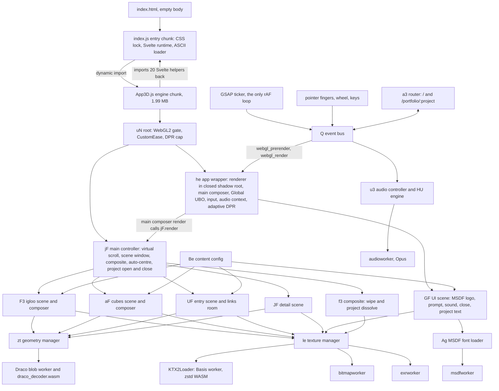

# igloo.inc: architecture and asset wiring

| | |
|---|---|
| Site | https://www.igloo.inc/, built by the studio abeto (console credit at App3D.js:43927) |
| Read on | 6 October 2026 |
| Who it is for | Sam, and the developer building the Skreed teaser |
| Code read | Prettier copies of the shipped files in the session scratchpad, folder `refsites/src/igloo/`: `App3D.js` (60,419 lines, from `assets/App3D-f554a111.js`), `index.js` (877 lines, from `assets/index-2eb69c09.js`), and the four workers (`audioworker`, `exrworker`, `msdfworker`, `bitmapworker`) |
| Raw capture | `refsites/igloo/www.igloo.inc/`, 107 files, 19.8 MB uncompressed |
| `refsites/` means | `/tmp/claude-0/-home-user-skreed-pre-launch/5a355426-a449-5fdb-a97b-268f46030370/scratchpad/refsites/` |
| Line numbers | Always the formatted copies. `App3D.js:59885` means that file, that line |
| Screenshots | Not embedded. Each section names the files in `refsites/work/shots/` that show it |
| Earlier notes | Chrome brief `docs/references/raw/2026-10-06-igloo-inc.brief.txt` (cited as "brief:line"), reference note `docs/references/2026-10-06-igloo-inc.md`, reconciled takes `docs/references/README.md` |
| Marking | "Inferred" means reasoned from code shape, arithmetic or naming, not read as a literal or seen in the browser |

We study this site to learn how it is built. Nothing from it is copied into Skreed.

## 1. What the site is, technically

igloo.inc is a single-page WebGL2 application with no page content in the DOM. The HTML is an empty `<body>` and one module script (`www.igloo.inc/index.html`). A 22 KB entry chunk injects the global CSS, paints an ASCII loader and dynamically imports a 1.99 MB engine chunk (index.js:812-855). The engine bundles three.js r165 (App3D.js:28), GSAP 3.12.5 with CustomEase (App3D.js:33275, 34738), pmndrs postprocessing 6.35.5 (App3D.js:26057-26062), three-mesh-bvh, Draco and KTX2 decoders, and about 20,000 lines of the studio's own engine and scene code. It puts one canvas inside a closed shadow root (App3D.js:42150-42159), sets `html` and `body` to `overflow: hidden; touch-action: none` (index.js:77), and replaces native scrolling with one virtual number that wheel, arrow keys and drag move (App3D.js:60145-60167). Two followers smooth that number. It is wrapped around a 10.85-unit loop of three stacked scenes (igloo 2.35, cubes 3, entry 5.5) and turned into a progress value that seeks each scene's paused GSAP timeline (App3D.js:59878-59925). Each visible scene renders into its own off-screen composer, and one full-screen shader mixes two scenes at a boundary with an ice-crack wipe drawn from a 1 MB data texture (App3D.js:44329-44527). Every word on screen is MSDF geometry inside WebGL. The assets are 22 Draco meshes, 49 KTX2 textures, one EXR, 18 Opus files and four PNGs, about 17.4 MB on the wire, decoded or laid out in six kinds of worker (Draco, Basis, bitmap, EXR, MSDF text layout and Opus). Every mesh and texture the scenes start with is fetched, decoded and uploaded to the GPU before the loader is released. Only the audio, and the two room volumes that are swapped in later (App3D.js:54813-54816), are not waited for.

## 2. Architecture

### Layers and modules

About two thirds of `App3D.js` is vendor code. It was identified by banners, version strings and code shape, and only version-checked (section 9). The studio's code sits between line 30391 and the end, with vendor islands inside it.

| Module | Lines | Kind | Responsibility |
|---|---|---|---|
| Entry shell | index.js:1-877 | Studio and vendor | Vite modulepreload polyfill and preload helper `mt` (1-76). Global CSS string `pt` with `--bgColor: #A0A5B1`, the overflow and touch-action lock, and two `@font-face` rules that no element uses (77). Svelte runtime (79-532). ASCII loader component `Ht` with a 5 s CSS keyframe ticker and a 750 ms cubic in-out fade (534-811). Boot IIFE (812-855). Exports the 20 runtime helpers App3D needs (856-877) |
| Svelte import | App3D.js:1-22 | Glue | Imports those 20 helpers back from the entry chunk, so there is one Svelte runtime |
| three.js r165 | App3D.js:23-25146 | Vendor | Core maths, materials, `ShaderChunk`, `WebGLRenderer` (18807-20010), loaders, `BatchedMesh` (20721), `UniformsGroup` (24951) |
| CommonJS interop, eventemitter3, ua-parser-js 1.0.38 | App3D.js:25147-26056 | Vendor | The event-bus class and the user-agent parser |
| postprocessing 6.35.5 | App3D.js:26057-30390 | Vendor | `EffectComposer`, `EffectPass`, mipmap bloom, SMAA |
| Shared GLSL strings | App3D.js:30391-30398 | Studio | `ae` (the `Global` uniform block), `ii` (MSDF sampling), `Ue` (`_linstep`, `falloff`, `falloffsmooth`), `h_` (shaping curves, unused) |
| Router, class helpers, debug stub | App3D.js:30399-30562 | Vendor and glue | A navaid-style path router (identity inferred), esbuild private-field helpers, a no-op debug GUI singleton `tu` |
| GSAP 3.12.5 | App3D.js:30563-34976 | Vendor | Core, CSSPlugin, CustomEase, CustomWiggle, CustomBounce |
| Event bus, GSAP defaults, frame clock | App3D.js:34977-35043 | Studio | Bus `Q`; defaults 0.6 s `power2.inOut`, `overwrite: "auto"`; eases `inOut1` to `inOut4`; clock `Fe` with `ratio = min(5, delta / 16.667 ms)`; the only animation loop, on `gsap.ticker` |
| Engine toolkit | App3D.js:35044-36620 | Studio | Environment singleton `q` (device, OS, browser, capabilities, debounced resize), maths `ie` (frame-rate independent `damp`, `lerpFPS`, `fit`, `falloff`, `ease`), pointer fingers `Ul` and manager `$t`, base camera with parallax and noise shake, renderer wrapper `Je` with a float render-target probe, plane unprojection, pixel-placed UI helper `positionUI` |
| Scene base and loaders | App3D.js:36621-37626 | Studio | Base scene `Jo` with the GPU upload step `_upload`, worker pool, Opus loader `Ow`, Draco blob worker, geometry splitters (batched, instanced, curves), MSDF font loader, geometry manager `zt` |
| ktx-parse, zstddec, KTX2Loader | App3D.js:37627-38445 | Vendor | KTX2 container parsing, inline zstd WASM, Basis transcoder worker |
| Texture manager | App3D.js:38446-38792 | Studio | Bitmap, EXR, SVG and video loaders and the texture manager `le` with mode flags. Its `loadProgressive` and `loadCurves` helpers are never called |
| DRACOLoader, GLTFLoader | App3D.js:38793-41279 | Vendor | Wired up at 41280-41291 but no glTF is ever requested, so unused at runtime (inferred from the request log) |
| Input, Global UBO, audio context, adaptive DPR | App3D.js:41280-41576 | Studio | Wheel source `Px`, keyboard source `Dx`, the `Global` uniform group, the gesture-unlocked `AudioContext`, the adaptive DPR controller `UU` |
| Passes and composers | App3D.js:41577-42031 | Studio | Pass base, `tA` composer that always sorts the gamma pass last (41878-41884), `Fd` wrapper around postprocessing |
| App wrapper `he` | App3D.js:42032-42206 | Studio | Renderer, closed shadow root, main composer (render pass, then SMAA with output encoding), UBO writers, render loop hook, input and audio init |
| Audio engine | App3D.js:42208-42446 | Studio | Master gain with `setTargetAtTime` smoothing (0.35 s), per-sound volumes, muted by default |
| Fluid sim, interaction, text, particles | App3D.js:42447-43862 | Studio | Grid fluid solver `$U`, mesh hover and click helper `pA` with BVH raycasts, MSDF text material `i3` and mesh `Ui`, GPGPU particle helpers |
| Router class `a3` | App3D.js:43864-43926 | Studio | Routes `/` and `/portfolio/:project` onto the bus |
| Content config `Be` | App3D.js:44001-44171 | Studio | Every string, colour, layout grid, portfolio entry and room link, as one object |
| Audio controller `u3` | App3D.js:44172-44297 | Studio | Registers the 18 sounds and listens for volume and play events |
| Composite and intro overlay | App3D.js:44298-44583 | Studio | `f3`: the wipe, the project dissolve, the plain pass-through; `p3`: the intro overlay that mixes `#8b909d` into the scene |
| Igloo scene | App3D.js:44584-48335 | Studio | LUT pass, sky, smoke, ground, cage, outline, mountains, terrain, intro particles, snow, plexus labels, the 70-block igloo `U3`, manifesto `L3`, scene `F3` |
| Cubes scene | App3D.js:48336-48526, 50959-53195 | Studio | LUT pass, background, blurry text, ice material `WL`, callouts, mouse frost, cube `nF`, scene `aF` |
| three-mesh-bvh | App3D.js:48638-50958 | Vendor | `MeshBVH` (class at 50707) for fast raycasts against the cubes. Version not stamped |
| Entry scene and links room | App3D.js:53196-56972 | Studio | Rings, floor, light room, text cylinders, smoke, tunnel, plasma, 150,000-particle sculpture, room UI, post pass, scene `UF` |
| UI scene | App3D.js:56973-58875 | Studio | Logo, scroll prompt, sound toggle, close button, project text column, orthographic scene `GF` |
| Detail scene | App3D.js:58876-59785 | Studio | Background, logo object, light shaft, light plane, particles, mouse sim, scene `JF` |
| Main controller `jF` | App3D.js:59791-60172 | Studio | Virtual scroll, scene stacking, composite inputs, auto-centre, project open and close |
| Svelte root | App3D.js:60173-60419 | Studio | WebGL2 gate with a one-line fallback, router component, root `uN` that registers five more eases, caps DPR and boots everything. It also defines the two routes (60199-60212) and asks for shadow maps (`shadowMap: true`, PCF soft), although no object in the studio code sets `castShadow` to true |
| Workers | audioworker 2,670 lines; exrworker 5,107; msdfworker 177; bitmapworker 189 | Vendor and studio | Opus decode (wasm-audio-decoders), EXR decode to half float, MSDF text layout, `createImageBitmap` off the main thread |

### Boot sequence, first byte to first interactive frame

Times are from the local mirror, which answers every request from disk with no network delay (`refsites/work/ledger/reqlog.txt`). On the live site the gaps are network-bound. The brief reports about 10 s of loader on a fast line (brief:12); that figure was not re-measured here.

1. **0 ms. Document.** `index.html` holds metadata and one `<script type="module">`. The body is empty.
2. **22 ms. Entry chunk.** It appends the global style (index.js:812-814), adds a viewport meta `width=device-width, initial-scale=1.0, shrink-to-fit=no, minimal-ui, viewport-fit=cover` (index.js:815-819; the HTML ships none, and the lookup selector `meta[viewport]` would not match a `name="viewport"` tag anyway, so it always appends), creates `#app`, mounts the loader and calls `show()` (index.js:820-830).
3. **39 ms. Engine chunk.** `import("./App3D-f554a111.js")` through Vite's preload helper with an empty dependency list (index.js:832). Module evaluation registers GSAP plugins and the four `inOut` eases, starts the ticker loop, builds the environment singleton (UAParser, capability probes, `html` classes) and logs the studio credit (App3D.js:34977-35043, 35224-35414, 43927).
4. **Root mount.** index.js constructs `uN` with the loader element as `anchor`, so the canvas container is inserted before the loader and the loader stays on top (index.js:833-842). `onMount` checks `q.capabilities.webgl2`; without it the user gets one sentence of text and the boot stops (App3D.js:60352-60355, 60178-60179). Otherwise it awaits Svelte's `tick()` so `div#webgl` exists, registers `inOut5`, `entry_ease`, `entry_ease_2`, `entry_ease_3` and `igloo_ease_1`, and computes the DPR cap (App3D.js:60356-60374).
5. **`he.init`** (App3D.js:42057-42093). Asset base paths are set (42141). The `WebGLRenderer` is created with no antialias, depth or stencil, shader error checks off, and a one-pixel float render-target probe (36381-36423). The canvas goes into a closed shadow root (42150-42159). The KTX2 transcoder target format is detected (42159). Resize and render listeners are attached (42162-42167). The adaptive DPR controller is created (42079). Pointer, wheel and key sources start (42083-42091). The audio context waits for a first click, touch end or key (41466-41471). The main composer gets a render pass and an SMAA pass marked as the gamma pass (42193-42205).
6. **`new jF()`** (App3D.js:59791-59834). First the composite materials `f3` and `p3` are compiled with `_upload` (59836-59848), which is why the wipe's three data textures are the first textures requested (544 to 548 ms). Then the UI scene and its pass, the three scroll scenes each with its own composer, and the detail scene are constructed (59849-59876). Every scene component starts its own `zt.load` and `le.load` calls in its `init`, so loading order is whatever the `await` chains produce. Texture loads also start one zero-delay timeout later than geometry loads (38709), which is why geometry requests go out first: font metrics at 485 ms, the Draco decoder at 493 ms, all non-cube geometry by 520 ms except `shattered_ring.drc`, which waits for `shattered_ring2.drc` to decode because the ring class awaits the two in sequence and the Draco pool has one worker (requested at 1,298 ms, 53439-53448), UI and data textures by 588 ms, the Basis transcoder at 692 ms, the terrain bakes by 917 ms, the igloo lightmaps at 1,233 ms (requested only after `igloo.drc` decodes, 46947-46950), cube geometry at 1,282 ms, and the cube normal and roughness maps last, at 1,541 to 1,620 ms (requested only after the cube meshes decode, 52681-52709).
7. **GPU upload.** Each scene's `ready` triggers `_upload` (36621-36699). It forces every mesh visible, compiles all programs with `compileAsync`, calls `initTexture` on every loaded texture, renders once into a 2 x 2 dummy target and restores visibility. `jF` awaits the `uploaded` promises of five scenes: the UI scene, the three scroll scenes and the detail scene (59870-59876). The main scene that holds the composite triangle was uploaded first, in step 6. Nothing hitches the first time a scene scrolls into view, because nothing is compiled or uploaded lazily.
8. **Audio starts loading.** The audio controller is created only after the scenes are uploaded (59824). The 18 OGG files are requested at 2.90 to 2.94 s and the audio worker at 3.30 s. None of it is awaited.
9. **Ready.** `jF` renders each scroll composer once (59830), `f.start()` emits `webgl_render_active` (rendering on, adaptive DPR armed) and `webgl_router_start` (60027-60029). The root resolves `ready` (60388-60389). index.js then fades the loader out (750 ms on `#loader`, 250 ms on the text, cubic in-out) and destroys it (index.js:844-853, 711-720). In the mirror this happened 1.8 to 1.9 s after navigation (`refsites/work/drive-igloo-1280.jsonl` and `drive-igloo-390.jsonl`, "ready").
10. **Intro.** The router's first route emits `webgl_router_request_switch_scene("home")`. On first navigation `navigateToSection` swaps the composite for `p3`, tweens a flat `#8b909d` overlay away over 1 s with `inOut3`, and plays the igloo intro timeline (8.2 s long) while waiting a fixed 5 s (60034-60049, 48269-48271).
    A deep link boots differently. If the first route is `/portfolio/<slug>`, `navigateToSection` jumps the intro timeline to its end, centres the cubes on that project with no tween, sets both detail uniforms to 1, plays the detail scene's in-animation, fades the `p3` overlay in over 1 s with `power2.inOut`, and opens straight into the project with scroll still disabled (60084-60116). Scrolling starts only after the user closes it.
11. **First interactive frame, at about ready + 5 s.** The composite is swapped back to `f3` and `enableScroll()` subscribes the wheel, key and drag handlers (60047-60049, 60145-60149). Pointer hover and camera parallax work from step 5 onward; scrolling works from here.

Shots: `igloo-intro-1p5s-1280.png`, `igloo-intro-4s-1280.png`, `igloo-intro-7s-1280.png` (and the `-390` versions).

### The per-frame loop, in order

There is one `requestAnimationFrame` loop in the whole app, GSAP's ticker. three.js `setAnimationLoop` is never used for drawing.

1. **GSAP ticker tick.** Lag smoothing is left at GSAP's default, so any gap over 500 ms counts as 33 ms (App3D.js:31372-31393). GSAP advances its active tweens: the intro timeline, the auto-centre tween, UI tweens. That GSAP renders its root timeline before user ticker listeners is inferred from how GSAP registers its own updater, not read in this bundle.
2. **The studio's ticker callback** (App3D.js:35034-35043) measures the frame delta in whole milliseconds, stores it in the sample buffer, and every 0.5 s with at least 5 samples emits `webgl_average_fps_update`. The adaptive DPR controller listens to that (41552-41575). It then updates the clock `Fe` and emits three events on the bus, in order.
3. **`webgl_prerender`.** The Global UBO gets `time` and `dtRatio` (42178-42181). Pointer and wheel velocities decay by `0.95^ratio` and `0.97^ratio` (35680-35684, 41347-41350). Frame-count waits resolve (35145-35163).
4. **`webgl_render`.** If rendering is active, `he` resets renderer stats and renders the main composer (42182-42187). Composite and post materials re-randomise their blue-noise offsets (44523-44525, 56287-56289). Inside the main composer:
   1. The render pass draws the main scene. Its `updateMatrixWorld` override (36703-36711) updates the camera and runs `beforeRenderCbs`, one of which is `jF.render()` (59825-59827).
   2. `jF.render()` (59878-59986) runs the two scroll followers and the velocity, lays the three scenes end to end, finds which one or two scenes the 1-unit screen window touches, and sets each visible scene's `progress`. It renders those scenes' own composers. Each scene's own `updateMatrixWorld` then runs its `update`: `timeline.progress(progress)`, copy the timeline proxies into the camera's base pose, update objects, and run its per-scene passes (LUT grade). The cubes add their refraction pre-pass here (53076-53108). It also fills the composite's uniforms, checks the 1.4 s auto-centre rule, and renders the detail composer if a project is open.
   3. The full-screen triangle is drawn with `f3`, or with `p3` during the intro.
   4. The UI pass draws the orthographic UI scene on top, without clearing (59853-59855).
   5. One bloom pass runs: 6 mip levels, luminance threshold 0.2, intensity 1, radius 0.85 (47764-47780).
   6. SMAA with output encoding goes to the screen. The composer sorts it last whatever the insertion order (41878-41884).
5. **`webgl_postrender`.** Emitted every frame. Nothing listens to it.

At most two scroll scenes render in a frame, and none while a project is fully open (59926-59935). A scene that is not visible is not updated at all, because its update runs only inside its own render.

### Module diagram



## 3. The scroll system

Shots: `igloo-scrollout-1280.png`, `igloo-scrollout-390.png`, `igloo-transition1-half-1280.png`, `igloo-transition1-half-390.png`.

### Input

There is no native scroll. `html` and `body` are `overflow: hidden` with `touch-action: none` (index.js:77), and the pointer manager also sets `touch-action: none` on the canvas and blocks `touchstart`, `dblclick` and the context menu (App3D.js:35715-35730). The `touchstart` block is lifted while the audio context waits for its unlock gesture (`allowTouchStart`, 41466-41477, 35782-35784). Three inputs add to one target value, `scroll.targetY2`:

- **Wheel.** A non-passive listener on the canvas calls `preventDefault` (41310-41318, 41334-41336). The raw `deltaY` is used as is. Only Firefox's line mode is converted, at 33 px per line (41338, 41351). The controller adds `deltaY x 0.00075` units, so one unit is 1,333 px of wheel travel (60155-60158).
- **Keys.** ArrowDown and ArrowUp add or subtract `150 x 0.00075 = 0.1125` units (60159-60164).
- **Drag.** `touch_drag` adds the change in `position01.y` times 1.25. `position01` is 0 to 1 over the screen height, so a full-height swipe moves 1.25 units (60165-60167, 35653, 35665). Despite the field's name, `delta11` is a 0 to 1 delta here.

Every input first calls `stopAutoCenter()`, so a settle in progress is cancelled by any touch of the controls (60168-60171). The handlers are subscribed only after the intro (60145-60149) and unsubscribed while a project is open (60150-60154).

### Smoothing

The follower chain lives in `jF.render()`. This is the whole of it (App3D.js:59885-59899):

```js
((this.scroll.targetY1 = ie.lerpFPSLimited(
  this.scroll.targetY1,
  this.scroll.targetY2,
  0.075,
  100 * this.scrollMultiplier,
)),
  (this.scroll.y = ie.lerpFPS(this.scroll.y, this.scroll.targetY1, 0.15)));
const t = 750 * this.scrollMultiplier;
((this.scroll.targetY2 = ie.clamp(this.scroll.targetY2, this.scroll.y - t, this.scroll.y + t)),
  Math.abs(this.scroll.y - this.scroll.targetY2) < 0.1 * this.scrollMultiplier &&
    ((this.scroll.y = this.scroll.targetY2), (this.scroll.targetY1 = this.scroll.targetY2)),
  (this.scroll.velocity += Math.abs(this.scroll.y - e) * 1),
  (this.scroll.velocity *= ie.frictionFPS(0.98)),
  (this.scroll.velocity = ie.clamp(this.scroll.velocity, 0, 1)),
  Math.abs(this.scroll.velocity) < 0.001 && (this.scroll.velocity = 0),
```

In plain words:

- A first follower, `targetY1`, chases the input target at 7.5% of the gap per 60 fps frame. Its step is capped at `100 x 0.00075 = 0.075` units, multiplied by the frame ratio (35444-35448).
- The rendered value `y` chases `targetY1` at 15% per frame.
- After both moves, the input target is clamped to within 0.5625 units (`750 x 0.00075`) of `y`. Input that runs further ahead than that is thrown away.
- When `y` is within 0.000075 units of the target, everything snaps to it so the chain stops.
- `velocity` adds the distance `y` moved this frame, decays by `0.98^ratio`, is clamped to 0 to 1 and zeroed below 0.001.

"Per frame" is made frame-rate independent: every coefficient goes through `damp(k, ratio) = 1 - (1 - k)^ratio`, and every friction through `k^ratio`, where `ratio = min(5, delta / 16.667 ms)` (35024-35026, 35438-35458). A 120 Hz phone and a 60 Hz laptop move the same distance per second, and a stall longer than 83 ms slows the motion down instead of making it jump.

Simulated at 60 fps with the code's constants (inferred, not measured), a single 100 px wheel notch (0.075 units) reaches 90% of its travel in 0.63 s and snaps closed at 1.62 s. A 0.5625-unit input reaches 90% in the same 0.63 s, because both followers are proportional. The 0.075 per-frame cap only binds when large input keeps arriving: under a continuous fling the rendered value tops out at 0.075 units per frame, 4.5 units a second, so one full loop takes at least 2.4 s.

### From scroll position to animation

1. **Stacking.** Every frame the three scroll scenes are laid end to end in a fixed order: igloo, cubes, entry (`ty`, 59786-59790). Each gets `__top` and `__bottom`, and the total is 2.35 + 3 + 5.5 = 10.85 (59900-59904).
2. **Wrapping.** `y` is taken modulo 10.85, with negative values wrapped forward (59905-59907). The screen is a window exactly 1 unit tall: its top is `n` and its bottom is `(n + 1) mod 10.85`.
3. **Which scenes are live.** A scene is the top scene if the window's top is inside it, or the bottom scene if the window's bottom is inside it. Positions are rounded to two decimals first (59910-59925). At most two scenes are live.
4. **Progress.** Each live scene gets `progress = (window edge - __top) / (height + 1)`, using the window's bottom edge `n + 1` for the top scene and the wrapped bottom for the bottom scene (59921). Dividing by `height + 1` means progress 0 is the moment the scene's first unit enters from below, and 1 is the moment it leaves at the top. The scene is live, and its timeline seekable, for the whole time any part of it is on screen.
5. **Seek.** Each scene's `update` calls `this.timeline.progress(this.progress)` on a paused GSAP timeline (igloo 48322, entry 56943). The timelines are authored in seconds (igloo 21 s, entry 9.2 s), but no clock ever plays them. Scroll is the playhead. The igloo's base camera is a `lerpVectors` between an intro pose and the timeline pose, weighted by an intro value that only the intro animates (48320-48330). The cubes need no timeline: their camera height is `-23 x progress` (53067-53070).
6. **Composite input.** The overlap amount, `bottom - __top` of the lower scene (0 to 1), becomes the wipe's `uProgress`, and `velocity` becomes `uProgressVel` (59936-59937).
7. **Velocity as a visual.** The only live consumer of `velocity` is the cubes camera: `fov = 45 - 5 x velocity`, so a fast scroll widens the lens from 45 to 40 degrees (53111-53112). The composite's velocity-reactive cut exists only inside a comment block (44415-44420).

### Snapping and paging

1.4 s after the input target last changed, and only if no settle is running, the controller decides where to rest (59878-59884, 59938-59980). It uses one tween, `centerScroll`: the destination is rounded to two decimals, `scroll.y` is tweened directly with the `inOut3` ease (cubic-bezier 0.6, 0, 0, 1), and both targets are kept equal to `y` on every update so the followers stay still (59988-60004).

| Where the window is | What happens | Destination | Duration | Source |
|---|---|---|---|---|
| Straddling two scenes | The nearest scene edge to either screen edge wins. Overlap below 0.5 goes back, 0.5 or more goes forward. The winning scene's own rest offset is then added | The scene's rest pose | 2 s plus twice the offset | 59944-59975 |
| Igloo to cubes, going back | Offset `(1 - 0.495 - 1/3.35) x 3.35 = 0.69` | 0.66 | 3.38 s | 47709-47710 |
| Igloo to cubes, going forward | Cubes have no rest offset | 2.35 (cube 1) | 2 s | 52950-52965 |
| Cubes to entry, going back | No offset | 4.35 (cube 3) | 2 s | |
| Cubes to entry, going forward | Entry offset `(0.2 - 1/6.5) x 6.5 = 0.3` | 5.65 | 2.6 s | 56307 |
| Entry to igloo (the loop), going back | Offset `(1 - 0.76 - 1/6.5) x 6.5 = 0.56` | 9.29 | 3.12 s | 56308 |
| Entry to igloo, going forward | Offset 0.66 | 0.66 after the wrap | 3.32 s | 47709 |
| Fully inside the cubes | Snap to the cube whose `centeredProgress` (0.25, 0.5, 0.75) is nearest | 2.35, 3.35 or 4.35 | `clamp(6 x distance, 1.6, 2.4)` s | 53128-53139 |
| Fully inside the entry | If entry progress is above 0.15 (always true once fully inside), glide to the room | 9.29 | `clamp(4 x distance, 2, 20)` s, so 14.6 s from 5.65 | 56960-56966 |
| Fully inside the igloo (0 to 1.35) | Nothing. `F3` has no `autoCenter` method | Wherever the user stopped | none | 47692-48335 |

Rest poses are therefore 0.66 (igloo hero, timeline at 49.5%), 2.35, 3.35 and 4.35 (cubes), and 9.29 (links room), plus 5.65 at the top of the shaft. A settle does not trigger another settle: the tween keeps the input target equal to `y`, so the idle timer only restarts when the user scrolls again (59878-59884, 59996-60000). From 5.65 the glide to the room therefore starts 1.4 s after the next scroll input inside the entry, not by itself (inferred from the code; the mirror always reached the room after a wheel input).

Two side effects matter:

- `jF.resize()` calls `stopAutoCenter()` and resets the targets (60006-60011), and every adaptive DPR step emits `resize` (42095-42097). A slow device that steps its DPR in the middle of a settle stops between poses. The settle restarts after another 1.4 s, unless the window is fully inside the igloo, where nothing restarts it. Section 7 shows both cases.
- The scroll prompt hides once `|y - 0.5| > 2.35 x 0.25` (58852-58861). The code compares a scroll position with a rounded timeline progress (0.495 rounded to 0.5), so the prompt actually hides at `y > 1.09`, 0.43 units past the hero rest. That reads as a units slip in their code (inferred).

### The numbers in one place

| Quantity | Value | Source |
|---|---|---|
| Wheel scale | 0.00075 units per px; 1 unit = 1,333 px | 59812, 60157 |
| Arrow key | 0.1125 units a press | 60161-60163 |
| Drag | 1.25 units per screen height | 60166 |
| Follower 1 | 7.5% a frame, step cap 0.075 x ratio | 59885-59890 |
| Follower 2 | 15% a frame | 59891 |
| Lead clamp | 0.5625 units | 59892-59893 |
| Stop threshold | 0.000075 units | 59894 |
| Velocity | +abs(dy), x0.98^ratio, 0 to 1 | 59896-59899 |
| Frame ratio | delta / 16.667 ms, max 5 | 34999-35003, 35024-35026 |
| Scene heights | 2.35, 3, 5.5; loop 10.85 | 47699, 52963, 56305 |
| Screen window | 1 unit | 59907 |
| Progress | (edge - top) / (height + 1) | 59921 |
| Idle before settle | 1.4 s | 59938 |
| Settle ease | `inOut3`, `M0,0 C0.6,0 0,1 1,1` | 34993-34995, 59994 |
| Cube FOV kick | 45 - 5 x velocity | 53111 |
| Scroll unlock | 5 s after the intro starts | 48269-48271, 60046-60049 |

## 4. Scene by scene

The loop runs igloo (0 to 2.35), cubes (2.35 to 5.35), entry (5.35 to 10.85), then wraps to the igloo. The screen window is 1 unit tall, so each boundary is a 1-unit cross-fade (section 3).

### 4.1 Loader and intro (time-based, not scroll-based)

Shots: `igloo-intro-1p5s-1280.png`, `igloo-intro-4s-1280.png`, `igloo-intro-7s-1280.png`, and the same three at `-390`.

- **On screen.** The `#A0A5B1` page with a 10-character ticker of `-`, `=` and `+` drawn by a CSS `content` keyframe animation: 100 steps over 5 s, one every 50 ms (index.js:548-692). Then a flat `#8b909d` overlay mixed into the first rendered frame and faded out over 1 s with `inOut3` (`p3`, App3D.js:44528-44583; tween at 60034-60046). Then the igloo builds itself while the camera glides down from overhead.
- **Driving code.** The paused timeline `introTL` (App3D.js:47817-48267) is played by clock, not by scroll, from `playInAnimation` (48269-48271). Its `onStart` first sets the scroll to the hero rest pose with a zero-length `centerScroll`, so the hero is in place before the user can scroll (47819-47827). The timeline is 8.2 s long. The fixed `delayedCall(5)` means scroll unlocks at 5 s, 3.2 s before the intro ends.
- **What moves, in timeline seconds.**

| Time | What | Ease | Source |
|---|---|---|---|
| 0 to 2.5 | Igloo outline draws on from the top down | power3.inOut | 47878-47889, shader 45232 |
| 0 to 4 | Wireframe cage: a shockwave ring travels out from the origin, lines flicker | sine.inOut | 47902-47913, shader 45124-45129 |
| 0 to 0.1, then 2.1 to 5.1 | Cage opacity up to 0.4, then down to 0; hidden at 5.1 | power2.inOut | 47914-47950 |
| 0.5 to 4.5; fade 1.75 to 3.75 | Intro digit particles burst and fade | sine.out; linear | 48139-48175 |
| 0.7 to 3.7 | Mountains fade in | default power2.inOut | 48032-48041 |
| 0.7 to 8.2 | Ground disc, terrain, patches, mountains: two shockwave rings sweep out to 32 units | inOut1 and inOut3 | 48042-48137, shader 45015-45035 |
| 1 to 2 | Igloo material progress | power2.inOut | 48213-48223 |
| 1 to 5 | LUT pass diagonal gradient on | sine.inOut | 48237-48247 |
| 1.1 to 3.35 | The 70 blocks appear from the top down: a blue emissive band with a triangle pattern sweeps down the igloo; above it the blocks are solid, below it nothing is drawn yet | igloo_ease_1 | 47952-47976, shader 47069-47078 |
| 1.5 to 4.5 | Sky | power2.inOut | 48201-48211 |
| 2 to 4 | Block breathing switches on | linear | 47978-47988 |
| 2 to 5 | Outline fades out (alpha 1 to 0) once the blocks stand | inOut4 | 47890-47901 |
| 2 to 5; 2 to 6 | Smoke; snow | power2.inOut | 48177-48199 |
| 2 to 7 | Pointer parallax fades in (`touchAmount` 0 to 1) | default | 47869-47877 |
| 2 to 7.5 | Camera blends from the overhead pose (-14, 21, 14) looking at (0, 0.5, 0) to the scroll timeline's pose | inOut1 | 48256-48266, 47825-47826 |
| 2.5 to 4.5 | Bloom intensity 1.5 down to 1 | sine.inOut | 48225-48235 |
| 4.5 | `webgl_show_ui_intro`: logo, manifesto, prompt and sound toggle reveal | | 48249-48254, 47570, 57082, 57200, 57591 |

- **Shaders in plain words.** Every reveal is the same function, `falloff`, a soft edge that travels across a value as a progress goes from 0 to 1 (4.10). The cage uses distance from the centre, so it is a ring. The outline and the blocks use height, so they are a curtain moving down. The terrain uses distance from the centre plus 3.5 x a blocky noise from `mosaic.ktx2`, so the front is a ragged, stepped ring rather than a circle (45015-45035). The cage's per-line flicker is `sin(vertexColour.r x 13 + time x 6)`: the red channel of the line's vertex colour is used as a random phase, not as a colour (45129).

### 4.2 Igloo hero and scroll-out

Shots: `igloo-hero-defaultpointer-1280.png`, `igloo-hero-defaultpointer-390.png`, `igloo-hero-1280.png`, `igloo-hero-hover-1280.png`, `igloo-scrollout-1280.png`, `igloo-scrollout-390.png`.

- **On screen.** The igloo on a snowy knoll, five fogged mountains, the logo top left, the manifesto top right, the scroll prompt and sound toggle bottom left.
- **Camera.** FOV 30, base pose (-14, 4, 14) looking at (0, 1, 0), parallax 0.07 and 0.025, shake 0.01 at speed 0.5 (47755-47763). On portrait screens `zoom = min(1, aspect x 1.25)` (48332).
- **Scroll timeline** (48272-48318, 21 s of timeline time). Camera height falls from 11.5 to 2.5 and its target from 15 to 1 over 0 to 14 s with `power2.out`. From 7 to 21 s the camera moves x from -13.25 to -15.25 and z from 13.25 to 23.25 with `power1.inOut`. At the hero rest pose, scroll 0.66 equals progress 0.4955, which is 10.4 s of timeline: camera (-13.49, 2.65, 14.43) looking at (0, 1.24, 0). The mirror measured exactly that (section 7). Past the rest pose the camera mostly dollies back along z while its height stays near 2.5. The big height change only shows when you arrive from the room side of the loop.
- **The 70 blocks** (`U3`, 46934-47228). Each block is a separate piece of one Draco mesh, recentred on its own centroid and drawn through one `BatchedMesh` (47104-47135). Each frame, on the CPU, every block gets a displacement and a matrix:

```js
// App3D.js:47185-47193
const d = ie.smoothstep(0.45, 0.7, a.centroid.y);
((l *= d),
  (l = Math.max(0, l)),
  (a.targetDisplacement1 = l),
  (a.targetDisplacement2 = ie.lerpFPS(a.targetDisplacement2, a.targetDisplacement1, 0.06)),
  (a.displacement = ie.lerpFPS(a.displacement, a.targetDisplacement2, 0.06)),
  (this.optionsTexture.image.data[o * 4 + 0] = a.displacement),
  (this.optionsTexture.image.data[o * 4 + 1] = a.bounce),
  a.position.copy(a.centroid).addScaledVector(a.centroid, a.displacement));
```

  The input `l` is the larger of two things (47167-47184). One is a breath: `0.4 x (0.5 + 0.5 sin(-2t + centroid.x)) x (0.5 + 0.5 cos(-t)) x mix(0.5, 2, rand.z) x 0.5`, a slow wave that rolls across the igloo. The other is a pointer push: full strength (0.5 plus or minus 0.3, wobbling per block) within 1 unit of the pointer, fading to zero at 3 units. The push is scaled by how far the scene is toward its rest pose, so it only works near the hero frame. The pointer is the screen pointer unprojected onto a camera-facing plane 19.25 units away and smoothed at 5% a frame (47153-47158). Then:
  - Only blocks whose centroid is above 0.45 move at all; the bottom courses never do (47185).
  - Two 6% followers smooth the displacement, so a push swells and settles rather than snaps.
  - The block moves along its own centroid vector: `position = centroid x (1 + displacement)`. Blocks far from the centre move further, and every block moves straight out from the middle of the igloo.
  - Each block gets a small spin of `cos(displacement x 2 + rand x 30) x displacement x 0.5` on three axes (47203-47222).
  - The displacement and a "bounce" value are written into a small float texture, one texel per block (47191-47192). The vertex shader reads it with `texelFetch` by `batchId` (47034-47036), so the fragment shader knows how far its own block has moved.
- **Scroll explode.** A second displacement only exists when coming in from the previous scene: `sine.in` of progress 0.4 down to 0, applied to blocks above centroid height 0.3, times up to 2 by `rand.x`, with spins of up to -1.5 x rand (47163, 47194-47202). The follower for this one is 7.5% a frame, or instant on the frame the scene becomes visible (47164).
- **Shader in plain words** (47040-47100). The block samples two baked lightmaps, assembled and exploded, and mixes them by `clamp(5 x displacement, 0, 1)` (47066-47067). Displaced blocks also add blue light proportional to `emission^2 x displacement`, where `emission` is a per-vertex attribute baked into the mesh. Highly emissive vertices get a slow travelling glow `pow(emission, 8) x (0.5 + 0.5 sin(x - time + 3.2))`. Faces away from the camera glow from inside. A sideways gradient fakes sunlight scattering, and a "bounce" term lifts the lower faces near the snow. The displacement that drives the lightmap mix is the breath and hover one only, not the scroll explode.
- **Labels.** Up to 5 blocks with displacement above 0.1 and within 2 units of the pointer ray point get white lines at 25% opacity, up to 2 connections each, drawn in over 0.1 s and out over 0.06 s, one block added or removed per pointer move of more than 0.05 (`R3`, 46731-46931). Each label shows `floor(distance moved x 50)`, last two digits, from an MSDF digit strip (46705-46716). The numbers are the motion's own measurement.
- **Sound.** Wind volume is `fit(progress, 0.05, 0.2, 0, 1) x fit(progress, 0.75, 0.95, 1, 0) x 0.4` (48326-48327). The igloo hum follows "labels active x wind" at 10% a frame (46927-46928).
- **Manifesto** (`L3`, 47229-47690). Four MSDF texts placed in pixels with `positionUI`. Show when progress is between 0.25 and 0.8, hide below 0.15: hysteresis, so it does not flicker at a boundary. Show is eased over 0.4 to 1.31 s; hide is instant (47618-47690). The scramble is described in 4.9.
- **Post.** A per-scene pass darkens along the diagonal (0.8 to 1.0, faded in by the intro), then applies a 32^3 LUT with tetrahedral interpolation (44614-44702). Film grain and an RGB shift are present but commented out (44668-44689).

### 4.3 The scene wipe (between any two scenes)

Shots: `igloo-transition1-half-1280.png`, `igloo-transition1-half-390.png`, `igloo-transition2-half-1280.png`, `igloo-transition2-half-390.png`. Separate frame studies of the wipe from an earlier probe: `refsites/work/f3wipe-1280-16.png` and `f3wipe-1280-24.png`.

- **On screen.** The upper scene slides up and breaks away along a ragged diagonal. The lower scene rises from below. Colour fringes run along the cut, strongest in the middle of the screen.
- **Driving code.** `uProgress` is the overlap, 0 to 1, set every frame from the scroll window (59936). There is no tween: the wipe is scrubbed by scroll, forwards and backwards.
- **Shader** (`f3`, App3D.js:44329-44527):

```glsl
// App3D.js:44436-44444 and 44457-44459
float cutDiagonalBlur = falloff(vUv.y + inclination * abs(slope), 0.0, 1.0, 2.0, incProgress);

// tech displacement
float cutDiagonalDisplacement = falloff(vUv.y + inclination * abs(slope), 0.0, 1.0, 0.9, incProgress);
float cutDisp = falloff(scrollTex.g, 0.0, 1.0, 1.0, cutDiagonalDisplacement);

// ice cut
float cutDiagonal = falloff(vUv.y + inclination * abs(slope), 0.0, 1.0, 0.2, incProgress);
float cut = falloff(scrollTex.r, 0.0, 1.0, 2.0, cutDiagonal);
// ... (44445-44456 omitted)
if (cut < 1.0) scene1 = chromatic_aberration(tScene1, vUv - vec2(0.0, parallaxY * power2In(uProgress) + displacement * cutDisp), modulator, cutDiagonalBlur * noise.r).rgb;
if (cut > 0.0) scene2 = chromatic_aberration(tScene2, vUv + vec2(0.0, parallaxY * power2In(1.0 - uProgress) + displacement * (1.0 - cutDisp)), modulator, (1.0 - cutDiagonalBlur) * noise.g).rgb;
color = clamp(mix(scene1, scene2, cut), vec3(0.0), vec3(1.0));
```

  In plain words:
  1. A diagonal line, tilted by `0.2 x aspect` and wobbled by the texture's blue channel (plus or minus 0.4), sweeps up the screen as `uProgress` rises (44430-44433).
  2. Three copies of that sweep have different softness: 2.0 for the colour fringe, 0.9 for the blocky displacement, 0.2 for the cut itself.
  3. The narrow sweep is not used as the edge. It is used as the threshold for the texture's red channel, a grungy grey pattern. Where the grunge is dark the cut arrives early, where it is light it arrives late, so the edge breaks into irregular ice shapes. The crack is an authored image, not procedural noise.
  4. The green channel, hard-edged blocks, shifts each scene by up to 0.025 of the screen in the same staggered way, which reads as a digital tear.
  5. The upper scene slides up by `0.4 x uProgress^3` and the lower one enters from `0.4 x (1 - uProgress)^3` below. In their GLSL `power2In` is `cubicIn` (44317), so this is cubed, not squared.
  6. A 5-sample spectral chromatic aberration with a barrel distortion runs along the soft sweep, scaled by 12 in the middle of the screen and 0 at the edges, and dithered by blue noise whose offset is re-randomised every frame (44456, 44524).
- **Velocity is not an input here.** `uProgressVel` is uploaded every frame but read only inside a commented-out block (44415-44420).

### 4.4 Cubes (2.35 to 5.35)

Shots: `igloo-cube1-1280.png`, `igloo-cube1-hover-1280.png`, `igloo-cube2-1280.png`, `igloo-cube3-1280.png`, `igloo-cube3-hover-1280.png`, and `igloo-cube1-390.png` to `igloo-cube3-390.png`.

- **On screen.** One irregular frosted ice block per portfolio company, in a pale void with blurred floating words, blurred shapes and a dot grid. Three HUD callouts with leader lines and thin plexus lines sit around each block.
- **Layout.** The cubes sit 5.75 world units apart vertically (52957, 53046-53053). Their `centeredProgress` values are 0.25, 0.5 and 0.75, which are scroll 2.35, 3.35 and 4.35. The order comes from the content config: Pudgy Penguins in `cube3.drc`, Overpass in `cube1.drc`, Abstract in `cube2.drc` (44039-44120).
- **Camera.** No timeline: base y is `-23 x progress`, base z is 5 plus the project zoom (53067-53070). Parallax 0.1 and 0.05, shake 0.02 (53013-53021). `fov = 45 - 5 x velocity` (53111). Portrait zoom `min(1, aspect x 1.25)` (53190).
- **What moves.** Each cube's rotation is a function of its distance from centre in scene progress: yaw `11 x (0.8 to 0.9) x a`, pitch `14 x (0.7 to 0.9) x a`, roll `6 x (0.75 to 0.9) x a`, with a random sign per visit, plus a 0.1 rad idle wobble at 0.3 rad/s (52799-52819). So a cube turns as it travels and comes to rest square to the camera. A billboard of vapour behind each cube fades out over 0.05 of progress from centre (52772).
- **Refraction, two renders per frame** (53076-53108). Pass 1 draws the scene with the cubes' back faces and the logo object inside them, refracting `cubes/bg.png`, into a half-float render target at full resolution. That PNG is 4 x 4 pixels of flat `#A6ABB7`. Pass 2 draws the front faces refracting the pass 1 image. The ice material (`WL`, 50959-51356) is a `MeshPhysicalMaterial` (colour `#e0e8ef`, roughness 0.65 with a roughness map, normal map, IOR 1.18, EXR environment with intensity 0.91) whose transmission code is replaced. It takes several samples with a per-channel IOR spread for dispersion and blue-noise jitter, and it adds the mouse-frost value to the normal (51210-51240).
- **Mouse frost** (`JL` 51997-52088, `jL` 52089-52214). A BVH raycast (`MeshBVH`, first hit only) finds the cube's second UV set `uv1` under the pointer. A line from the last hit to the new one is painted into a small buffer in that UV space. Each update the buffer decays by 0.985 and is advected by `advect.png` noise. It updates at most every 15 ms. Drag speed also drives the `shard` loop volume (53114-53126). A click on the cube emits `webgl_switch_scene("portfolio/<hash>")` (52176).
- **Callouts** (`YL`, `qL`, `XL`, 51357-51957). A callout is visible while the camera is within -1.6 to +0.5 world units of its cube (51465). Its leader line draws as two segments over 0.2 s, linear; its text `uShow1` takes 0.4 s and `uShow2` (the scramble wave) 0.75 s, linear; a random one of three beeps plays, at most every 0.4 s (51975-51992). Hide is 0.2 s. The line's anchor is a point on the cube's bounding box transformed by the cube's matrix, so the callout tracks the rotating block (51518-51530).
- **Settle.** Inside the cubes, 1.4 s of idle snaps to the nearest cube in `clamp(6 x distance, 1.6, 2.4)` s (53128-53139).

### 4.5 Project detail (route `/portfolio/<slug>`)

Shots: `igloo-detail-opening-1280.png`, `igloo-detail-open-1280.png`, `igloo-detail-closing-1280.png`, `igloo-detail-closed-1280.png` and the `-390` set.

- **Open** (60070-60140). Scroll input is unsubscribed. If the cube is off-centre it is centred first; that delay is `expo.out` of distance, at most 1.5 s, and half of it is used as `a` (60012-60026, 60118). Then:

| Tween | From, to | Duration | Ease | Delay |
|---|---|---|---|---|
| `uDetailProgress` (dissolve out of the cubes) | 0 to 1 | 1.25 s | power3.in | a |
| `uDetailProgress2` (settle of the detail image) | 0 to 1 | 1.25 s | sine.out | a + 0.75 |
| Cubes camera dolly | z +0 to -3.5 | 1.25 + a | power3.in | 0 |
| Cube spin and parallax | to 0 | 1 + a, 1.25 + a | power1.in, default | 0 |
| Detail camera | z 4 to 2.5 | 2 s | inOut1 | a + 0.5 |
| Detail text column | reveal after 0.7 s | | | a + 0.5 |
| Logo object spin | to 1 | 1 s | power1.out | a + 1.5 |

  Sources: 60118-60138, 53140-53168, 59700-59760. The URL changes through `history.pushState` in the router, so there is no reload (43864-43926; the router library pushes at 30442 and patches `history` at 30502-30510).
- **Shader** (44461-44515). The cubes image and the detail image are mixed by `fit(uDetailProgress, 0.4, 1, 0, 1)`. Both are pushed around by `frost-datatexture.ktx2` tiled 5 times. The tiling shrinks to nothing as progress reaches 1, so the frost pattern zooms out while it fades. A faint horizontal tear comes from the wipe texture's green channel, and chromatic aberration is strongest mid-transition.
- **Detail scene** (`JF`, 59649-59785). A dark background, the company's logo mesh with a dark bake and caustics, a light shaft, a light plane with bokeh, particles and a mouse-driven fluid sim. Text is an MSDF column scrolled by its own follower with wheel in pixels (`scrollMultiplier = 1`), keys at 150 px and drag (58732-58804).
- **Close** (60052-60069). `uDetailProgress` goes to 0 over 1.25 s and `uDetailProgress2` over 0.6 s, both `power2.out`. The cubes camera returns over 1.45 s `power3.out`. The detail camera goes back to z 4 over 0.6 s, linear. Scroll is re-enabled after 1 s.
- **Measured side effect.** While the detail is fully open the scroll composers are skipped (59928), and their cameras only update inside their own render. The mirror found the cubes camera frozen at z 3.27 to 3.61 instead of its base, then catching up on close (section 7).

### 4.6 Entry dive (5.35 to about 9.29)

Shots: `igloo-transition2-half-1280.png`, `igloo-entry-mid-1280.png`, `igloo-entry-mid-390.png`.

- **On screen.** Looking straight down a shaft through three glowing segmented rings. The view rolls half a turn while smoke spirals, plasma halos and glitch squares pass. It lands in a round room.
- **Camera timeline** (`UF`, 56454-56940, 9.2 s of timeline time over 6.5 units of scroll). Start (0, 1.5, -2) looking at (0, -2.5, -1). x and z go to 0 by 2.5 s (`power2.out`). y falls to -9.83 from 0.2 to 7.2 s on `entry_ease_3`. The target drops to -10 then -9.81. The up vector rotates by pi over 5.25 s from 1 s (`power3.inOut`), then blends back to world up from 3.5 s over 3.7 s (`entry_ease`) (56535-56544, 56953-56956). z pulls back to -1.5 from 3.5 s and to -3 from 7.2 s. FOV is set to 22 at 0 and opens to 30 by 7.2 s (`power1.inOut`) (56571-56582). Parallax starts tiny (0.01, 0.005) and goes to 0 between 4 and 5 s, while the target gets a small offset (-0.03, -0.01) and a 0.05 roll between 4 and 6 s instead (56586-56620). Portrait zoom `min(1, aspect x 1.5)` (56969).
- **Visibility by progress, not by tween** (56462-56476). Each ring is hidden once passed (below 0.34, 0.43, 0.52). Each ring's forcefield and plasma has its own window. The tunnel and snow go at 0.52, and the room ring appears above 0.53.
- **Ring passes.** At timeline 2.0, 2.95 and 3.8 s a full-screen glitch flash `uRingProximity` rises over 0.5 s (`power1.in`) and falls over 0.4 or 0.6 s (`power1.out`), and a new random seed is set for the glitch squares (56856-56936). The portal hum volume is `power2.out` of distance to progress 0.28, 0.375 or 0.465, within 0.04 (56477-56482).
- **Rings react to the camera, not to the timeline.** The shard rings' vertex shader pushes shards outward along their own `centr` vector and spins them by `rand`. The amount comes from `falloffsmooth` of the camera's distance to the ring, so every ring bursts as the camera reaches it with no keyframes per ring (53273-53429).
- **Later layers.** Particles from 1.5 s, the floor from 3.4 s (5 s `power2.out` fade), forcefield from 4 s, text cylinders from 4.5 s, ground smoke and ambient particles from 4.4 s (56636-56760).
- **Autopilot.** Once fully inside, 1.4 s of idle glides to 9.29 over `clamp(4 x distance, 2, 20)` s (56960-56966). At 9.29 the timeline is at 6.99 s, so the last 2.2 s of camera keyframes (z to -3, target to -10.35) only play while leaving into the loop wipe.

### 4.7 Links room (rest at 9.29)

Shots: `igloo-room-1280.png`, `igloo-room-next-burst-1280.png`, `igloo-room-next-1280.png` and the `-390` set.

- **On screen.** A circular floor of glowing grooves, a ring light, and a cloud of 150,000 particles that forms a penguin (LinkedIn), then an X (X / Twitter), then an M (Medium). Arrows sit left and right, with a bracketed selector at the bottom.
- **Particles** (`wF`, 54783-55177). 150,000 points are simulated on the GPU in float textures, or half-float if the float probe fails (43729). Each step samples a 3D texture whose RGB is the surface direction and whose alpha is a signed distance:

```glsl
// App3D.js:55068-55072
vec3 samplePos = rotMatrix * (currentPos.xyz / uCubeSize) * uVolumeScale + 0.5;

vec4 volData = texture(tVolume, samplePos);
vec3 grad = normalize(volData.rgb * 2.0 - 1.0) * rotMatrix;
float dist = (volData.a * 2.0 - 1.0) * 2.0;
```

  Particles are pushed along that gradient toward the surface, pulled gently back to their spawn point, stirred by curl noise and by a 128-cell fluid sim driven by the pointer (splat radius 0.22, force 35), damped by `0.9^dtRatio`, and kept inside a cylinder (55074-55116). Particles inside the shape are shaded darker. The sculpture turns slowly, 0.75 rad a second, because `uRotation` drops by `Fe.delta x 0.00075` with `Fe.delta` in milliseconds (55167).
- **Changing the link** (`yF.changeLink`, 54664-54700). Swap the 3D texture and its scale. Burst noise from 1 to 0 over 0.5 s (`power2.inOut`). Reset the rotation to 1.5 pi. Advance the floor rings' animation clock by 4 units, in the arrow's direction, over 3 s (`power4.out`). Play `ui-long`. Triggers are a click on a screen half, ArrowLeft or ArrowRight, or a swipe of more than 100 px faster than 1,000 px a second (54648-54663). Swipe speed is total drag over total press time (35626-35627).
- **UI window.** Arrows and selector are enabled only between entry progress 0.64 and 0.9 (54703-54707). Pointer stirring is weighted by `smoothstep(0.45, 0.65) x (1 - smoothstep(0.8, 0.93))` of progress (55170-55173).

### 4.8 Loop back to the hero

There is no end. Scrolling on from the room crosses entry 9.85 to 10.85 and the window wraps (59905-59907). The igloo is then the lower scene at low progress, so its camera is high (the 11.5 end of the height keyframe) and the upper blocks are blown out by the scroll-explode term. As the scroll continues they fly back into place while the camera descends. When the igloo becomes visible again its followers are reset for one frame (47718-47729, 47164) and the manifesto hides (47687-47689).

### 4.9 The UI layer and the text

Shots: any of the above; the logo, prompt and sound toggle are in every frame. In SwiftShader the body text draws as filled blocks (section 9).

- **One orthographic scene** (`GF`, 58805-58875) holds the logo, scroll prompt, sound toggle, close button and project text. It is drawn over the composite by its own pass (59853-59855). The manifesto and the cube callouts live in their 3D scenes but are placed in pixels with `positionUI`, which converts pixel x, y, width and height into world units at a given distance in front of a camera (36595-36616).
- **Layout grid** (44001-44010). Mobile is width or height under 640 px: 25 px side margin, 25 px top. Small is width under 1600 or height under 800: 50 and 45. Large is 125 and 90. The manifesto block is 175, 200 or 250 px wide (47575-47582).
- **Text pipeline.** The glyph metrics JSON is laid out in `msdfworker` into quads. Each quad also gets `uvMask` (its atlas cell), `textWeights` (glyph index and word index, each normalised 0 to 1) and `lineWeights` (position in line, word in line, line index) (msdfworker-ac346fa7.js:116-162). The fragment shader takes the median of the atlas's three channels as a signed distance and antialiases it with `fwidth` (App3D.js:30394-30395).
- **The scramble.** Every text reveal uses one or two `falloff` waves over `textWeights.x`:

```glsl
// App3D.js:47288-47294
float tr1 = falloff(textWeights.x, 0.0, 1.0, 0.1, clamp(uShow1, 0.0, 1.0));
float tr2 = falloff(textWeights.x, 0.0, 1.0, 1.0, clamp(uShow2, 0.0, 1.0));

vUv = uv;
vUv.x = mod(uv.x + 0.125 * mod(floor((1.0 - tr2) * 5.753), 8.0), 1.0);
vAlpha = tr1;
```

  `tr1` has a narrow edge (0.1) and is the visibility: a crisp typing sweep from the first glyph to the last. `tr2` has a wide edge (1.0) and drives the scramble. The atlas is a grid of 8 columns of 64 px cells, so adding `0.125` to `uv.x` shows the glyph one cell to the right. While `tr2` rises, each glyph samples 5, 4, 3, 2, 1 cells to its right, then itself. The scramble costs one tween per text block and no JavaScript per glyph. It only works because IBM Plex Mono has equal glyph widths.
- **Fonts as data.** The site declares IBM Plex Mono WOFF and WOFF2 `@font-face` rules (index.js:77), but nothing uses them and the files are never requested. All type is the 512 x 1024 MSDF atlas.

### 4.10 The one reveal primitive

Most motion on the site that is not a camera move is one function. The GLSL version is in the shared chunk `Ue` (App3D.js:30396-30397) and the engine keeps a JavaScript twin:

```js
// App3D.js:35496-35500
falloff(i, e, t, s, n) {
  const r = s * Math.sign(t - e),
    a = this.mix(e - r, t, n);
  return this.linearstep(a + r, a, i);
},
```

Read it as `falloff(input, start, end, margin, progress)`. A soft edge of width `margin` travels from just before `start` to `end` as `progress` goes from 0 to 1. Inputs behind the edge return 1, inputs ahead return 0, with a linear ramp across the margin (`falloffsmooth` uses a smoothstep ramp). For start 0 and end 1 it reduces to `clamp((progress x (1 + margin) - input) / margin, 0, 1)`. Progress 0 shows nothing and progress 1 shows everything, including the soft tail.

The input is whatever gives the order: glyph index for text, distance from the centre for the shockwaves, height for the igloo build, a texture channel for the crack, camera distance for the rings. One tweened or scrolled number then reveals hundreds of elements with per-element timing and no per-element code. It appears in 59 shader interpolations (grep count of `${Ue}`). It is also used with a fixed progress as a plain soft band, for example ring fades by camera distance (53333-53352).

## 5. Assets

### How the pipeline works

**Formats, by job.**

| Job | Format | Count, bytes | Encoder evidence | Decoder |
|---|---|---|---|---|
| Geometry | Draco `.drc` (mesh or point cloud) | 22 files, 592,021 | Every file carries an `info` metadata entry listing attribute names and types, for example `igloo.drc`: position, normal, uv, centr, rand, emission (float) and batchId (int). Read with Google's decoder in `refsites/work/ledger/drcall.cjs` | One Draco worker built from a Blob of `draco_wasm_wrapper.js` plus the studio's own decode function, fed `draco_decoder.wasm` (App3D.js:36841-37104). It reads the `info` entry, or a length-prefixed JSON header, so custom attributes keep their names (36898-36914) |
| Colour bakes, normal and roughness maps, tileable patterns | KTX2, BasisLZ ETC1S, full mip chain | 33 files | Writer `ktx create v4.3.2 --clevel 5 --qlevel 255`; the three cube normal maps add `--no-endpoint-rdo --no-selector-rdo`, and the two Abstract logo bakes were written by a different local build (`v4.3.2-30-g7fb646cd-dirty`) (KTX2 key-value data, `refsites/work/ledger/ktx2all.cjs`) | KTX2Loader with one Basis worker, target format picked from the GPU at boot (37885-38445, 42159) |
| Data: MSDF atlases, masks, noise, LUTs, volumes | KTX2, raw RGBA8 (vkFormat 37) or RGBA16F (97), Zstd supercompression, one level | 16 files | Writer tag `abeto :D`; the blue-noise tile says `vicente :D` | Bundled zstd WASM (37849-37884), then a raw data texture; no transcoding, so nothing lossy touches values that are thresholded or read as distances |
| Environment light | OpenEXR | 1 file, 259,130 | | `exrworker`, three's EXRLoader set to half float, then a PMREM in the cubes scene (App3D.js:38530-38581, 53058-53063) |
| Small images | PNG | 4 files | | `bitmapworker` with `createImageBitmap` (premultiply none, colour conversion none, optional flip), or a plain `Image` where ImageBitmap is unreliable (38446-38489, 35341-35344) |
| Font metrics | msdf-atlas-gen JSON | 1 file, 24,308 | `distanceRange` 4, size 42, 512 x 1024, uniform 8 x 13 grid of 64 px cells | FileLoader, then `msdfworker` lays out quads (37325-37390) |
| Sound | Ogg Opus | 18 files, 2,939,575 | `opusenc`, 48 kHz (ffprobe in the ledger pass) | `audioworker` with a WASM Opus decoder; channel data copied into an `AudioBuffer` (36796-36840) |

**Managers.** Geometry goes through `zt` (37513-37598): one promise per path and mode, so `ground.drc` is decoded once for its two uses in the igloo scene, and the three logo meshes once each for the cubes and the detail scene. Failures fall back to a 0.5 box. Textures go through `le.load(path, mode)` (38657-38769):

- It returns an empty texture object immediately and fills it in later. Materials can therefore be built synchronously, and every texture carries a `_loaded` promise that the scene upload step waits for.
- The cache key is path plus mode. The same file in three modes becomes three textures; the HTTP fetch happens once because three's file cache is switched on (42030). `scroll-datatexture.ktx2` is used in three modes, so it likely sits on the GPU three times at 4 MB each (inferred: 1024 x 1024 x 4 bytes, three cache keys).
- The mode string is a list of flags: `srgb`, `repeat`, `mirror`, `nearest`, `data` (linear filter, no mipmaps), `nomipmaps`, `pmrem` (with `refraction` for a refraction mapping), `lut`, `luttetrahedral` (nearest filter for exact LUT lookups), `3d`, `cubemap`, `noflip`, `autoplay` (38676-38750). Flags are matched as substrings, so the modes `colordata` and `datatexture` also count as `data`.
- On error it warns and substitutes `uv/uvchecker-srgb.ktx2` or `.png` (38671-38672, 38722-38733).

**Workers.** There are six workers, five decoders plus the MSDF layout worker, each with a pool limit of 1: Draco, Basis, bitmap, EXR, MSDF and audio (38657-38660, 37514-37515, 36796-36802). Decoding is serialised per type, so a big file holds up the queue behind it.

**Loading order.** There is no manifest and no priority list. Each component's `init` awaits its geometry before asking for the textures that go on it. The order in section 2 (geometry, then data and UI textures, then bakes, then cube maps 1.6 s in) is the shape of those `await` chains plus the zero-delay timeout in front of every texture load. Every scene then waits for `_upload` before `ready`, so the loader is held until the GPU has every program compiled and every texture that a material references uploaded. Audio is the exception: it is registered after the upload and never awaited (59824).

**Totals.** 107 files under `www.igloo.inc`, 19.82 MB uncompressed. With the JavaScript, JSON and WASM gzipped the total is 17.43 MB, which matches the brief's 17.4 MB on the wire (brief:96). By type: KTX2 12.70 MB (49 files), Opus 2.94 MB (18), decoders 0.97 MB (4), Draco 0.59 MB (22), JavaScript 2.32 MB raw (6 files), EXR 0.26 MB, font JSON 0.02 MB, PNG 0.015 MB (5 files, the favicon included).

### The ledger

"When" is milliseconds after navigation in the mirror (`refsites/work/ledger/reqlog.txt`), with every file served from disk. Line numbers are App3D.js unless noted. Sizes are bytes on disk.

**Shell, code, decoders**

| File | Bytes | Format | Loaded by | Becomes | Drives | When |
|---|---|---|---|---|---|---|
| `index.html` | 1,510 | HTML, empty body | Navigation | Document | Boots the entry chunk. References `favicon16-9e4401be.png` and `images/social.jpg`, neither captured nor requested by the page | 8 |
| `assets/index-2eb69c09.js` | 21,794 (6.7 KB gz) | ES module | `<script type="module">` | Loader, global CSS, Svelte runtime | Loader, the import of the engine | 22 |
| `assets/App3D-f554a111.js` | 1,987,490 (458 KB gz) | ES module | index.js:832 | The engine | Everything | 39 |
| `assets/favicon32-af94112f.png` | 1,245 | PNG 32 x 32 | `<link rel="icon">` | Tab icon | | Not requested in headless Chromium |
| `assets/msdfworker-ac346fa7.js` | 5,992 | Worker | 37325-37326 | Text quads with weights | Every WebGL string | 609 |
| `assets/bitmapworker-046527f8.js` | 5,056 | Worker | 38446-38448 | ImageBitmap | The PNGs | 583 |
| `assets/exrworker-41cbee65.js` | 152,581 | Worker, EXRLoader to half float | 38530-38531 | Half-float pixels | `cubes_env.exr` | 584 |
| `assets/audioworker-036a09db.js` | 145,355 | Worker, WASM Opus decoder | 36796-36802 | Float32 PCM | All 18 sounds | 3,298 |
| `libs/draco/draco_wasm_wrapper.js` | 90,823 | Emscripten glue | Fetched as text into a Blob worker (37050-37085) | Draco worker | All 22 meshes | 493 |
| `libs/draco/draco_decoder.wasm` | 285,948 | WASM | 37058 | Decoder | Same | 494 |
| `libs/basis/basis_transcoder.js` | 121,402 | Emscripten glue | KTX2Loader, path set at 38771 | Basis worker | The 33 ETC1S textures | 692 |
| `libs/basis/basis_transcoder.wasm` | 472,914 | WASM | Same | Transcoder | Same | 693 |

**Fonts**

| File | Bytes | Format | Loaded by | Becomes | Drives | When |
|---|---|---|---|---|---|---|
| `fonts/IBMPlexMono-Medium.json` | 24,308 | msdf-atlas-gen JSON, 100 glyphs, uniform 8 x 13 grid | `Ag` loader (37336-37358), path 37603 | Glyph map sent to `msdfworker` | Layout of every string; the uniform grid is what makes the 0.125 scramble step land on whole glyphs | 485, the first asset |
| `fonts/IBMPlexMono-Medium-datatexture.ktx2` | 110,330 | KTX2 RGBA8 + Zstd, 512 x 1024 | `le.load(..., "data")` at 43496 (the shared MSDF material) and 15 literal sites from 47260 to 58210 | Linear data texture, no mipmaps | `tMap` of every MSDF material | 568 |

**Geometry (Draco)**

| File | Bytes | Contents | Loaded by | Becomes | Drives | When |
|---|---|---|---|---|---|---|
| `geometries/igloo.drc` | 222,834 | 40,796 vertices, 60,507 triangles; position, normal, uv, centr, rand, emission, batchId (70 ids) | `zt.batched` 46948 | 70 geometries recentred on their centroids, in one `BatchedMesh` (47104-47135) | The igloo: breath, hover push, scroll explode, lightmap mix, glow | 505 |
| `geometries/igloo/igloo_cage.drc` | 5,732 | 1,404 vertices, 702 triangles; position, color, centr | 45147 | Line segments | Intro wireframe cage; colour red is a flicker phase (45129) | 501 |
| `geometries/igloo/igloo_outline.drc` | 20,334 | Point cloud, 3,300 points; position, color | 45249 | Line segments from consecutive point pairs | Outline drawn on from the top in the intro (45232) | 504 |
| `geometries/igloo/patch.drc` | 240 | One quad | 45758 | Two ground patches at scale 7 and 8 | Seam cover on the terrain (inferred) | 506 |
| `geometries/ground.drc` | 18,861 | 2,780 vertices, 4,959 triangles | 44897, 45529 | One decode, two uses | The igloo's base disc and five terrain tiles, with the shockwave reveal | 500 |
| `geometries/mountain.drc` | 11,846 | 1,703 vertices, 2,884 triangles | 45281 | Five meshes sharing one geometry and material, hand placed (45442-45490) | The mountain ring | 495 |
| `geometries/intro_particles.drc` | 2,069 | Point cloud, 252 points | 45935 | Points | Intro digit sprites | 508 |
| `geometries/blurrytext.drc` | 1,187 | 29 quads; centr | 48536 | One mesh | Out-of-focus words behind the cubes | 510 |
| `geometries/blurrytext_cylinder.drc` | 5,571 | 1,450 vertices, 1,856 triangles; rand | 53877 | Four meshes | Text rings in the entry shaft and room | 514 |
| `geometries/cubes/background_shapes.drc` | 669 | 30 vertices; primrand, centr | 52839 | One mesh | Blurred-shape parallax layer in the cubes | 511 |
| `geometries/cubes/cube1.drc` | 28,025 | 5,271 vertices, 6,494 triangles; uv, uv1 | 52682 | Ice mesh with a `MeshBVH` (52690) | Overpass cube (second) | 1,283 |
| `geometries/cubes/cube2.drc` | 29,217 | 5,939 vertices, 6,186 triangles; uv, uv1 | 52682 | Same | Abstract cube (third) | 1,283 |
| `geometries/cubes/cube3.drc` | 40,339 | 7,866 vertices, 8,038 triangles; uv, uv1 | 52682 | Same | Pudgy Penguins cube (first) | 1,282 |
| `geometries/pudgy.drc` | 30,606 | 5,118 vertices, 8,387 triangles | 52683, 58994 | One decode, two uses | Logo inside cube 1, and the detail scene's hero object | 518 |
| `geometries/overpass_logo.drc` | 14,534 | 3,316 vertices, 5,140 triangles | 52683, 58994 | Same | Logo inside cube 2 and its detail view | 519 |
| `geometries/abstractlogo.drc` | 6,860 | 1,500 vertices, 2,172 triangles | 52683, 58994 | Same | Logo inside cube 3 and its detail view | 520 |
| `geometries/shattered_ring.drc` | 40,703 | 7,194 vertices, 10,402 triangles; centr, rand | 53447 | Middle ring | Shards burst by camera distance (53273-53429) | 1,298 |
| `geometries/shattered_ring2.drc` | 43,550 | 7,801 vertices, 10,788 triangles; centr, rand | 53443 | First and third ring | Same | 511 |
| `geometries/shattered_ring_smoke.drc` | 10,263 | 1,677 vertices, 3,072 triangles | 55571, 55978 | One decode, two uses | Plasma halos at the rings; squashed into ground smoke | 517 |
| `geometries/smoke_trail.drc` | 4,126 | 641 vertices, 1,032 triangles | 55188 | Three meshes | Smoke spirals down the shaft | 516 |
| `geometries/ceilingsmoke.drc` | 13,717 | 2,451 vertices, 4,608 triangles | 55873 | One mesh | Room ceiling halo | 517 |
| `geometries/floor.drc` | 40,738 | 11,860 vertices, 18,302 triangles; animationmask, iteration, glow | 53490 | One mesh | Room floor whose grooves light up and spin on link change | 512 |

**Baked colour and surface maps (KTX2 ETC1S, mipmapped)**

| File | Bytes | Size | Loaded by | Becomes | Drives | When |
|---|---|---|---|---|---|---|
| `images/igloo/igloo_color.ktx2` | 533,374 | 2048 | 46949, `srgb` | Assembled lightmap | Block colour at rest | 1,233 |
| `images/igloo/igloo_exploded_color.ktx2` | 842,242 | 2048 | 46950, `srgb` | Exploded lightmap | Mixed in by `clamp(5 x displacement)` (47066) | 1,243 |
| `images/igloo/ground_color.ktx2` | 625,325 | 2048 | 44902 | Base disc bake, igloo footprint included | Snow under the igloo | 914 |
| `images/igloo/ground_sansigloo_color.ktx2` | 628,793 | 2048 | 45534, 45763 | Same mesh baked without the igloo | Terrain tiles and patches | 917 |
| `images/igloo/ground_glow.ktx2` | 213,732 | 1024 | 44905 | Glow mask | Pulsing glow on the base | 916 |
| `images/igloo/mountain_color.ktx2` | 591,988 | 2048 | 45292 | Mountain bake | Five mountains, fogged in the shader | 884 |
| `images/floor_color.ktx2` | 629,652 | 2048 | 53495 | Floor bake | Room floor | 1,351 |
| `images/shattered_ring_color.ktx2` | 218,729 | 1024 | 53458 | Ring colour | Middle ring | 1,447 |
| `images/shattered_ring_ao.ktx2` | 17,010 | 256 | 53459, bound as `tGlow` | Glow mask, despite the `_ao` name: its red channel adds blue light near the camera (shader at 53418) | Same | 1,451 |
| `images/shattered_ring2_color.ktx2` | 228,809 | 1024 | 53458 | Ring colour | First and third rings | 1,443 |
| `images/shattered_ring2_ao.ktx2` | 17,943 | 256 | 53459, bound as `tGlow` | Glow mask, same use | Same | 1,446 |
| `images/cubes/pudgy_color.ktx2` | 183,042 | 1024 | 52709 | Logo bake, light | Logo inside cube 1 | 1,563 |
| `images/cubes/overpass_logo_color.ktx2` | 233,248 | 1024 | 52709 | Same | Cube 2 | 1,573 |
| `images/cubes/abstractlogo_color.ktx2` | 205,745 | 1024 | 52709 | Same | Cube 3 | 1,620 |
| `images/pudgy_dark_color.ktx2` | 128,889 | 1024 | 59001 | Logo bake, dark | Detail scene | 1,385 |
| `images/overpass_logo_dark_color.ktx2` | 182,030 | 1024 | 59001 | Same | Detail scene | 1,393 |
| `images/abstractlogo_dark_color.ktx2` | 172,879 | 1024 | 59001 | Same | Detail scene | 1,408 |
| `images/cubes/cube1_normal.ktx2` | 1,077,177 | 2048 | 52699 | Normal map | Ice surface relief, cube 2 | 1,571 |
| `images/cubes/cube2_normal.ktx2` | 1,076,756 | 2048 | 52699 | Same | Cube 3 | 1,603 |
| `images/cubes/cube3_normal.ktx2` | 1,134,430 | 2048 | 52699 | Same | Cube 1 | 1,545 |
| `images/cubes/cube1_roughness.ktx2` | 236,683 | 1024 | 52694 | Roughness map, also the refraction blur | Cube 2 | 1,567 |
| `images/cubes/cube2_roughness.ktx2` | 248,138 | 1024 | 52694 | Same | Cube 3 | 1,602 |
| `images/cubes/cube3_roughness.ktx2` | 240,240 | 1024 | 52694 | Same | Cube 1 | 1,541 |

**Patterns and noise (KTX2 ETC1S)**

| File | Bytes | Size | Loaded by | Becomes | Drives | When |
|---|---|---|---|---|---|---|
| `images/igloo/triangles_tiling.ktx2` | 47,616 | 512 | 8 sites from 44911 to 55696, one cache key | Repeat texture | Faceted pattern in reveal fronts, cube frost trail, ring forcefields | 577 |
| `images/mosaic.ktx2` | 1,089 | 32 | 44914, 45298, 45543, 45772, `nearest` | Blocky noise | Stepped edge of the terrain shockwave | 892 |
| `images/wind_noise.ktx2` | 18,158 | 256 | 12 sites in three modes | Repeat texture | Wind whitening, smoke, vapour, shaft smoke | 575 |
| `images/clouds_noise.ktx2` | 25,373 | 256 | 55699 | Repeat texture | Moving bands in ring forcefields | 577 |
| `images/bokeh.ktx2` | 21,582 | 512 | 59259 | Repeat texture | Detail light plane | 579 |
| `images/caustics.ktx2` | 2,419 | 64 | 59007 | Repeat texture | Caustics on the detail logo | 1,387 |
| `images/cubes/dot_pattern.ktx2` | 725 | 64 | 48429, 53792 | Repeat texture | Dot grid behind the cubes and in the light room | 576 |
| `images/shapes_blurred.ktx2` | 38,936 | 512 x 1024 | 52844 | Red channel as alpha | Pre-blurred shapes, no runtime depth of field | 1,284 |
| `images/cubes/blurrytext_atlas.ktx2` | 7,781 | 256 | 48547, 53885, 53973 | Red channel as alpha | Words on the blurry-text meshes | 1,255 |
| `images/igloo/numbers.ktx2` | 4,862 | 32 x 1024 | 45940 | Digit strip | Intro particles step through it | 1,253 |

**Data textures (KTX2 raw + Zstd, one level, linear)**

| File | Bytes | Format | Loaded by | Becomes | Drives | When |
|---|---|---|---|---|---|---|
| `images/scroll-datatexture.ktx2` | 1,286,436 | 1024 x 1024 RGBA8 | 44341, 54459, 56194, 56992, 57766 (three modes) | R grunge, G hard blocks, B soft blobs, A unused | The scene wipe; glitch on the visit button, logo, close button and ring flash | 544, first texture |
| `images/frost-datatexture.ktx2` | 134,781 | 256 x 256 RGBA16F, grey | 44365 | Half-float displacement | Project open and close dissolve | 547 |
| `images/noises/blue-8-128-rgb.ktx2` | 50,420 | 128 x 128 RGBA8, three noise fields | 44368, 48432, 50968, 56191 | Dither, re-offset every frame | Wipe fringe, cube background, ice refraction, ring post | 548 |
| `images/perlin-datatexture.ktx2` | 3,789 | 64 x 64 RGBA8 | 46968, 48426, 53498, 53789, 59004 | Tileable noise | Cube background clouds, detail logo darkening; bound but unused on the igloo, floor and light room | 576 |
| `images/numbers-datatexture.ktx2` | 13,540 | 280 x 36 RGBA8 MSDF | 46621, 51788 | Digits 0 to 9 | Igloo block labels, cube temperature | 1,244 |
| `images/igloo/igloo_scene.ktx2` | 14,484 | 32^3 RGBA16F | 44623, `luttetrahedral` | 3D LUT | Igloo colour grade | 582 |
| `images/cubes/cube_scene.ktx2` | 41,384 | 32^3 RGBA16F | 48345 | 3D LUT | Cubes colour grade | 585 |
| `images/volumes/peachesbody_64.ktx2` | 836,620 | 64^3 RGBA8 | 54813, `3d-data` | RGB surface direction, A signed distance | Penguin particle sculpture | 578 |
| `images/volumes/x_64.ktx2` | 318,476 | 64^3 RGBA8 | 54816 | Same | X sculpture | 586 |
| `images/volumes/medium_32.ktx2` | 45,330 | 32^3 RGBA8 | 54816 | Same | M sculpture | 588 |
| `images/ui/logo-datatexture.ktx2` | 2,130 | 128 x 128 MSDF | 56989 | Logo glyph | IGLOO wordmark with glitch | 567 |
| `images/ui/sound-datatexture.ktx2` | 4,405 | 64 x 128 MSDF | 57511 | Icon | Sound toggle | 569 |
| `images/ui/close-datatexture.ktx2` | 826 | 64 x 64 MSDF | 57763 | Icon | Close bracket | 570 |
| `images/ui/arrow-datatexture.ktx2` | 1,574 | 64 x 64 MSDF | 58320 | Icon | Room arrows | 570 |
| `images/ui/visit-datatexture.ktx2` | 844 | 100 x 32 MSDF | 54456 | Label | Room visit button | 588 |

**Environment and PNGs**

| File | Bytes | Format | Loaded by | Becomes | Drives | When |
|---|---|---|---|---|---|---|
| `images/cubes_env.exr` | 259,130 | OpenEXR | 53061 | PMREM environment map (53058-53063) | Reflections on the ice | 872 |
| `images/cubes/bg.png` | 77 | PNG 4 x 4, flat `#A6ABB7` (exact copy of the live file) | 52965 | Refraction source for the cubes' first pass | What the back faces refract | 832 |
| `images/cubes/advect.png` | 11,340 | PNG 128 x 128, stand-in we generated (the brief lists the original at 27 KB) | 52006, 59455 | Advection noise | Cube frost buffer, detail mouse sim | 875 |
| `images/perlin-datatexture.png` | 2,362 | PNG 64 x 64, stand-in (original listed at 4 KB, brief:102) | 48550, 59183, 59256 | Noise with mipmaps | Per-word timing of the blurry text; detail light shaft and plane | 916 |
| `images/uv/uvchecker-srgb.png` | 154 | PNG 64 x 64, stand-in | 38671 | Error fallback only | Nothing | Never requested |

**Audio (Ogg Opus, 48 kHz; registered at 44182-44288, master gain muted by default, 44169-44170)**

| File | Bytes | Length | Registered as | Drives | When |
|---|---|---|---|---|---|
| `audio/music-highq.ogg` | 1,527,578 | 115.06 s, stereo | `music-bg`, loop, 0.2 (44183) | Score in every scene | 2,904 |
| `audio/room.ogg` | 609,688 | 115.06 s | `room-bg`, loop, 0.45 (44190) | Ambient bed | 2,906 |
| `audio/wind.ogg` | 572,916 | 115.06 s | `wind`, loop, 0 (44197) | Igloo scroll envelope x 0.4 (48327) | 2,908 |
| `audio/igloo.ogg` | 62,478 | 9.74 s | `igloo`, loop, 0 (44204) | Hum while blocks are labelled (46928, 48328) | 2,910 |
| `audio/beeps.ogg` | 9,765 | 0.93 s | `beeps`, 0.5, 0.4 s minimum gap (44211) | Callout reveal, one of three at random (51983) | 2,911 |
| `audio/beeps2.ogg` | 10,254 | 0.93 s | `beeps2` (44217) | Same (51986) | 2,911 |
| `audio/beeps3.ogg` | 10,117 | 0.93 s | `beeps3` (44223) | Same (51989) | 2,912 |
| `audio/click-project.ogg` | 6,753 | 1.56 s | `click-project` (44229) | Cube clicked (60135) | 2,912 |
| `audio/enter-project.ogg` | 21,582 | 4.34 s | `enter-project` (44234) | After the centring delay (60137) | 2,936 |
| `audio/leave-project.ogg` | 11,909 | 2.23 s | `leave-project` (44239) | Close (60068) | 2,937 |
| `audio/shard.ogg` | 21,753 | 3.84 s | `shard`, loop, 0 (44244) | Frost drag speed (53126) | 2,937 |
| `audio/project-text.ogg` | 11,037 | 1.15 s | `project-text` (44251) | Detail text reveal (59741) | 2,938 |
| `audio/circles.ogg` | 28,454 | 5.01 s | `portals`, loop, 0 (44256) | Ring proximity (56477-56482, 56958) | 2,938 |
| `audio/particles.ogg` | 16,799 | 2.63 s | `particles`, loop, 0 (44263) | Room stirring (56959) | 2,938 |
| `audio/logo.ogg` | 4,855 | 1.08 s | `logo`, 0.3 (44270) | Logo reveal and hover, arrow hover (57079, 57083, 54154) | 2,939 |
| `audio/ui-long.ogg` | 4,453 | 0.50 s | `ui-long`, 0.3 (44275) | Room UI on, link change, button hovers (54691, 54717, 57585) | 2,939 |
| `audio/ui-short.ogg` | 3,021 | 0.31 s | `ui-short`, 0.3 (44280) | Small reveals, link hover (57255, 58543) | 2,940 |
| `audio/manifesto.ogg` | 6,163 | 1.06 s | `manifesto`, 0.3 (44285) | Manifesto reveal (47651) | 2,940 |

Lengths and channel counts are from ffprobe in the ledger pass; the three 115.06 s files are stems of one cue.

### How each asset is used in the animation

1. **One mesh, 70 moving parts.** The igloo ships as one 223 KB Draco mesh whose vertices carry the block id, the block centroid, a random vector and an emission weight. At load the engine splits it by id, moves each piece so its pivot is its centroid, and draws all 70 through one batched draw (47104-47135). Every motion is then a distance along one vector per block, its own centroid direction. Breath and pointer push share one displacement number, which is also written to a 12 x 12 float texture so the shader can read it (46951-46954, 47191). The scroll explode and the reassembly on the loop add a second number along the same vector (47194-47198). The asset never moves; the code moves it.
2. **Two bakes and a number instead of live light.** `igloo_color` and `igloo_exploded_color` are the same UVs baked twice, together and apart. The shader mixes them by `5 x displacement` per block (47066-47067), so a pushed block picks up the lighting it would have away from its neighbours with no lights in the scene. The ground uses the same trick across meshes: one terrain mesh, two bakes, with and without the igloo's footprint (44902, 45534).
3. **Light baked into the mesh.** The `emission` vertex attribute marks the inner faces of the blocks. The shader turns it into a glow that grows with displacement and a slow travelling shimmer (47080-47088). The glow is authored in the 3D tool, not painted in code.
4. **The transition is a picture.** `scroll-datatexture.ktx2` holds three greyscale maps in R, G and B. A sweeping threshold turns them into a crack, a digital tear and a wobble (4.3). Changing the look of every scene change means repainting one texture. It is stored raw and lossless because each channel is compared against a moving threshold, and block compression would shift where the crack falls.
5. **A font atlas grid as a scramble source.** The MSDF atlas is a uniform 8-column grid, so shifting UVs by 0.125 lands on a neighbouring glyph (47294). The scramble is a side effect of how the atlas was packed.
6. **Measured numbers as HUD.** The two-digit labels on the igloo are `floor(distance x 50)`, last two digits, where distance is how far the block has moved from its rest centroid in world units (46710-46713). The cube temperature readouts come from the content config (`temp: 0, -3, -5`, 44043-44117) and are drawn from a 13.5 KB digit strip.
7. **Lines as point pairs, colour as a random seed.** The outline ships as a Draco point cloud read two points at a time (45249-45259). The cage's vertex colour red channel is a per-line flicker phase (45129). Both are cheap ways to ship line art with per-line data.
8. **One mesh, five mountains.** An 11.8 KB mountain is placed five times with hand-typed positions, scales and rotations (45442-45490).
9. **A 1 KB tile for a stepped edge.** `mosaic.ktx2` is 32 x 32 pixels sampled with nearest filtering. Added to the distance that drives the terrain reveal, it makes the shockwave front blocky (45012-45016).
10. **One noise tile for a dozen effects.** `wind_noise.ktx2` (18 KB) is sampled at different scales and speeds for snow whitening, smoke wisps, cube vapour and five smoke layers in the shaft (44796-58897). `triangles_tiling.ktx2` (48 KB) gives the faceted look to the block reveal, the terrain shockwave, the cube frost trail and the ring forcefields.
11. **A 77-byte refraction backdrop.** The ice cubes' first pass refracts a 4 x 4 flat grey PNG. The visible depth comes from the second pass refracting the first pass, which already contains the back faces and the logo inside (53076-53108).
12. **Shapes as distance fields.** The room's three sculptures are 64^3 or 32^3 volumes whose RGB is the direction to the surface and whose alpha is the signed distance (55068-55072). Particles slide to the surface. Switching the link swaps one 3D texture and fires a 0.5 s noise burst (54680-54690), so the change looks like a material reorganising rather than a cut.
13. **A colour grade as a texture.** Each scene's look is a 32^3 half-float LUT applied with tetrahedral interpolation after a diagonal darkening (44614-44702, 48336-48400).
14. **Frost as a zooming displacement.** The project dissolve tiles `frost-datatexture` five times and shrinks the tiling as progress rises, so the crystals appear to rush toward the viewer while the image changes (44485-44491).
15. **Blue noise to hide sampling.** The 5-tap colour fringe would band. A 128 px blue-noise tile, re-offset at random every frame, turns the bands into fine grain (44451, 44524).
16. **Speed stored with the particle.** The room simulation keeps each particle's smoothed speed in the alpha channel of its velocity texture. The draw shader shades every point as a small lit sphere, lightens fast particles towards `#d7ebfa` and lowers their alpha, a cheap stand-in for motion blur (54930-54944, 55133).
17. **Audio as a scroll-driven mixer.** The three 115 s stems loop together. Wind is an envelope of igloo progress, the portal hum peaks at each ring, the shard loop follows drag speed (48327, 56477-56482, 53126). Sound is wired to the same numbers as the picture.

## 6. Phone and low-power paths

Shots: every `-390.png` in `refsites/work/shots/`, especially `igloo-hero-defaultpointer-390.png`, `igloo-transition1-half-390.png`, `igloo-cube1-390.png` and `igloo-detail-open-390.png`.

The phone gets the same scenes, the same code path and the same 17.4 MB. There is no asset tier and no lighter scene, and no loader reads the device class (the only readers of `q.device` set an unused flag and an `html` class that no CSS rule targets, 35319-35323, 35346), so the asset list cannot differ. These are the only differences:

1. **DPR cap at boot.**

```js
// App3D.js:60371-60374
const u =
  window.devicePixelRatio <= 2
    ? Math.min(window.devicePixelRatio, 1.15)
    : Math.min(window.devicePixelRatio, 1.5);
```

   A DPR 3 phone renders at 1.5, so a 390 x 844 screen gets a 585 x 1266 canvas. Most laptops render at 1 to 1.15.
2. **Adaptive DPR** (`UU`, 41501-41575). It waits 2 s after rendering starts, then collects the 0.5 s FPS reports. At most every 4 s, with at least 5 reports, it averages them. Below 30 fps it lowers the multiplier by 0.1, down to 0.6. At 60 fps or more it raises it by 0.1, up to 1. It only judges while the tab is visible, and it gives up after 4 changes of direction with `console.warn("Adaptive DPR stopped.")`. Each step emits `resize`, which resizes every render target and, as section 3 explains, cancels a running settle.
3. **Portrait framing.** The igloo and cubes cameras use `zoom = min(1, aspect x 1.25)`, the entry camera `min(1, aspect x 1.5)` (48332, 53190, 56969). At 390 x 844 that is 0.578 and 0.693. Nothing is re-authored for portrait; the cameras widen.
4. **Layout grid.** Below 640 px in either dimension the UI uses 25 px margins and the smaller manifesto block (44001-44010, 47575-47582).
5. **Touch input.** Pointer Events with pointer capture, up to two fingers (35715-35789, 60379). A vertical drag scrolls 1.25 units per screen height, with the same followers. A tap is under 15 px and under 0.5 s (35629-35632, 35685-35687). In the room, a tap on either half or a fast swipe changes the link.
6. **Parallax on touch.** When the last input was touch and no finger is down, the camera's parallax target is the centre and its follow speed is halved, so the view drifts home after a drag (35847-35850). With no hover, parallax becomes press-to-peek.
7. **The igloo push on touch.** The pointer starts at the screen centre (35591-35593), and the igloo reads `position11` with no touch reset (47155). Before the first touch the centre blocks are pushed and labelled. After a touch the push stays wherever the finger last lifted (inferred from the missing reset).
8. **GPU capability.** A one-pixel float render-target probe (36400-36423) decides whether GPU particles simulate in float or half float (43729). WebGL2 is required outright (60352-60355).
9. **Decode path.** `createImageBitmap` is switched off for Safari below 17.5, Firefox below 100 and every non-Safari iOS browser (35341-35344). PNGs then decode as plain images on the main thread.
10. **iOS specifics.** Resize is debounced 500 ms instead of 50 ms (35349-35350). The page nudges `scrollTop` to -1 when the inner height is not the screen's short side (35396-35400, purpose inferred: settling Safari's toolbars). Audio is suspended when hidden and resumed 500 ms after the tab returns (41489-41500).
11. **Frame-rate independence.** Every lerp and friction uses the capped frame ratio, so a 120 Hz phone and a 60 Hz phone move at the same speed, and a hitch slows motion down rather than skipping (35024-35026, 35438-35458). `dtRatio` is also in the Global UBO, so GPU particle simulations follow the same rule (46263-46288).

Not present anywhere in the studio code (grep across App3D.js and index.js): any `prefers-reduced-motion` check, any `saveData` or `effectiveType` check, any `deviceMemory` or `hardwareConcurrency` check, and any call to `gsap.matchMedia` (the seven `matchMedia` hits are inside GSAP itself, 32914-33153). The `oldIphone` flag is set (35319-35323) and never read. The no-WebGL2 fallback is two short sentences of plain text with an emoji between them (60178-60179).

## 7. Verified in the browser

### How it was driven

The local mirror (`refsites/mirror.mjs`) serves every request from the capture on the real origin, in Playwright Chromium with SwiftShader WebGL2. The driver is `refsites/work/drive-igloo.mjs`, run as `node drive-igloo.mjs desktop` (1280 x 800, DPR 1) and `node drive-igloo.mjs phone` (390 x 844, DPR 3, iPhone user agent, touch). `refsites/work/igloo-hooks.js` is injected before any page script. It:

- traps the first object that assigns `scrollMultiplier`, to read the controller (the shadow root is closed and there is no `window.gsap`);
- records `attachShadow` calls;
- advances `Date.now`, GSAP's clock, once per animation frame by the smaller of the real gap and a cap of 400 ms for waits and 80 ms for precise stops. Without this, GSAP's lag smoothing would slow app time about 20 times at SwiftShader's 1.4 frames a second.

For each screenshot, `requestAnimationFrame` is frozen so the shot is one still frame. Logs: `refsites/work/drive-igloo-1280.jsonl` and `drive-igloo-390.jsonl`. Every screenshot below is in `refsites/work/shots/`.

### What the mirror showed

| State | How reached | Shots | What is on screen | Matches the code |
|---|---|---|---|---|
| Boot | Navigation | (log only) | Body `rgb(160, 165, 177)`, overflow hidden, touch-action none, `scrollHeight` equal to the viewport. Canvas `data-engine="three.js r165"`. 105 requests, none missing | Yes |
| Intro 1.5, 4, 7 s | Wait in app time | `igloo-intro-1p5s-1280.png`, `igloo-intro-4s-1280.png`, `igloo-intro-7s-1280.png` | Grey field and a faint starburst; then a top-down view with the igloo built, a white wireframe cage and a stepped terrain edge; then nearly the hero pose with the UI up | Yes. Intro progress 0.071, 0.345, 0.720 (desktop), so the timeline is 8.2 s |
| Hero, pointer never moved | Intro done plus 4 s | `igloo-hero-defaultpointer-1280.png`, `igloo-hero-defaultpointer-390.png` | Igloo on the knoll; centre blocks pushed out and labelled (desktop 25, 32, 22, 23, 26; phone 53, 51, 22, 25) | Yes, given the centre-default pointer (section 6, item 7) |
| Hero, pointer parked bottom left | Mouse to (40, 780) for 6 s | `igloo-hero-1280.png` | Igloo reassembled, warm seams, no labels, view yawed | Yes. Camera (-14.681, 2.043, 13.268) against (-13.487, 2.652, 14.434) centred |
| Hero hover | Small moves over the igloo | `igloo-hero-hover-1280.png` | Pushed blocks near the pointer, three labels joined by lines | Yes |
| Scroll-out | Wheel to 1.05; phone swipe then wheel | `igloo-scrollout-1280.png`, `igloo-scrollout-390.png` | Igloo smaller, more foreground; prompt still visible | Yes. Igloo progress 0.611, camera z 16.73 |
| Transition 1, half | Wheel to 1.85 or 1.84 | `igloo-transition1-half-1280.png`, `igloo-transition1-half-390.png` | Igloo slid up into fog, the cubes void below, ragged blocky steps along the boundary, strong colour fringes on the UI and edges | Yes. uProgress 0.496 and 0.490 |
| Settle from a straddle | Phone settled at 1.8395, then 24 s sampled | `igloo-transition1-half-390.png` | Settle started 1.4 s after input, was cut by a DPR step (canvas 409 to 351 px wide), restarted 1.4 s later and landed exactly on 0.66 | Yes, including the resize side effect |
| Cube 1, 2, 3 | Wheel to 2.35, then nine ArrowDown presses twice | `igloo-cube1-1280.png`, `igloo-cube2-1280.png`, `igloo-cube3-1280.png` and `-390` | Frosted refractive ice block with the logo inside, three callouts, plexus lines, blurred data text | Yes. Settles landed exactly on 3.35 and 4.35 |
| Cube hover | Small moves over the cube | `igloo-cube1-hover-1280.png`, `igloo-cube3-hover-1280.png` | Slight rotation, a bracket frame, frost speckle changing | Partly; the frost pattern uses the stand-in `advect.png` |
| Project open | Click or tap the centre of cube 3 | `igloo-detail-opening-1280.png`, `igloo-detail-open-1280.png` and `-390` | Path becomes `/portfolio/abstract`; cube dollies in with colour split; then a dark scene, centred text column, close button top right | Yes |
| Project close | Click the computed close position | `igloo-detail-closing-1280.png`, `igloo-detail-closed-1280.png` and `-390` | Path back to `/`; the cube re-emerges; scroll still 4.35 | Yes |
| Transition 2, half | Wheel to 4.85 | `igloo-transition2-half-1280.png`, `-390` | Cube pushed off the top with a fringe; rings from above in fog below | Yes. Entry FOV 22.15 |
| Entry mid | Wheel to 7.0 | `igloo-entry-mid-1280.png`, `-390` | Looking down through a glowing ring at particles far below | Yes |
| Links room | Autopilot after 1.4 s idle | `igloo-room-1280.png`, `-390` | Floor rings, ring light, penguin particle sculpture, arrows, selector | Yes. Landed exactly on 9.29 |
| Next link | ArrowRight on desktop, tap at 80% width on phone | `igloo-room-next-burst-1280.png`, `igloo-room-next-1280.png` and `-390` | Particles burst into a noisy column, then settle into an X; floor rings rotated | Yes. A 234 px synthetic swipe did not change the link (see discrepancies) |

### Measured values

| Value | Desktop 1280 x 800 | Phone 390 x 844 | Code expects |
|---|---|---|---|
| Ready after navigation, local files | 1.9 s | 1.8 s | |
| Initial canvas | 1280 x 800 | 585 x 1266 | DPR 1 and 1.5 (60371-60374) |
| Canvas after adaptive DPR | 768 x 480 | 350 x 759 | Floor 0.6 (41513) |
| Hero camera | (-13.487, 2.652, 14.434), FOV 30, zoom 1 | Same, zoom 0.578 | (-13.49, 2.65, 14.43) from the timeline at 10.4 s |
| Hero scroll and progress | 0.66 and 0.4955 | Same | (0.66 + 1) / 3.35 |
| Scroll-out at y 1.05 | Camera (-13.974, 1.811, 16.733) | (-13.973, 1.812, 16.775) | |
| Transition 1 | Velocity 0.273, cubes FOV 43.64 | Velocity 0.011, FOV 44.95 | `45 - 5 x velocity` |
| Cube camera targets | y -5.742, -11.521, -17.27 | -5.759, -11.516, -17.297 | -5.75 per cube |
| ArrowDown | 0.1087 and 0.0991 a press (nine fast presses) | 0.1064, then 0.1125 | 0.1125, minus what the lead clamp discards |
| 300 px swipe up | | +0.395 | +0.444 |
| Project open | `cameraZoom` -3.5; cubes camera z 3.27 | z 3.61 | Base 1.5 if the camera kept updating; it does not (59928) |
| Close button centre | (1182, 61) | (322, 40) | Screen width minus grid margin (57996-58010) |
| Transition 2 | Entry FOV 22.15 | Same, zoom 0.693 | FOV starts at 22 |
| Entry at y 7.0 | Progress 0.407, camera (0.04, -4.33, -0.01), FOV 26.3 | Same | |
| Room | y 9.29, camera (0, -9.822, -1.473), FOV 29.99 | Same, zoom 0.693 | 0.76 x 6.5 - 1 + 5.35 = 9.29 |
| Console | Studio credit; `KHR_parallel_shader_compile` not supported; a GPU stall warning on `ReadPixels` (the float probe, inferred) | Studio credit | |

### Where the brief and the code disagree

| # | Brief said | Code says | Render shows |
|---|---|---|---|
| 1 | three.js r143 (brief:8, 56) | r165: `const Aa = "165"` (App3D.js:28). The only "143" is a version guard inside postprocessing (29877) | `data-engine="three.js r165"` on the canvas |
| 2 | Canvas created without alpha (brief:57) | The wrapper passes `alpha: false` (36383), but three r165 always requests an alpha context (18893) | Context attributes: alpha true, depth false, stencil false, antialias false |
| 3 | First follower "capped at 0.075 units, about 100 px, per frame"; a notch "settles in about 0.5 s" (brief:28) | The cap is 0.075 x frame ratio and only binds for large or continuous input. A 100 px notch reaches 90% in 0.63 s and closes at 1.62 s (simulated). Input more than 0.5625 ahead is discarded (59885-59895) | Nine rapid ArrowDown presses moved 0.1087 and 0.0991 a press instead of 0.1125; isolated presses moved 0.1125 |
| 4 | Velocity is "used by shaders and the cube FOV kick" (brief:28) | Only the cube FOV (53111). The composite's velocity cut is commented out (44415-44420) | FOV 43.64 at velocity 0.273 |
| 5 | "Scene A slides up by 0.4 x progress squared" (brief:31) | Cubed: `power2In` is `cubicIn` in their GLSL (44317, 44457) | Not separable at the mirror's resolution |
| 6 | When straddling, auto-centre "tweens to that scene's rest pose (2 s plus extra)" (brief:33) | The nearest edge decides: overlap under 0.5 goes back, 0.5 or more forward. Duration is 2 s plus twice the scene's rest offset. Inside the igloo there is no settle at all (59944-59975; `F3` has no `autoCenter`) | Phone at overlap 0.49 went back to 0.66; desktop with a target overlap of exactly 0.50 went forward to 2.35 |
| 7 | Not mentioned | Any resize, including every adaptive DPR step, cancels a running settle (60006-60011, 42095-42097) | Phone settle cut at 1.7118 by a DPR step and restarted 1.4 s later; a desktop first pass stayed at 0.709 inside the igloo |
| 8 | Block push needs a cursor and is "gone" without one (brief:118) | The pointer starts at the screen centre (35591-35593) and the igloo reads it with no touch reset (47155) | Phone, no input: centre blocks pushed and labelled 53, 51, 22, 25 |
| 9 | Lightmaps cross-fade "as each block separates", in the scroll-explode paragraph (brief:30) | The mix follows the breath and hover displacement only (47066, 47191). The scroll explode moves blocks without changing the mix (47194-47198) | Not isolated |
| 10 | Scroll-out: "camera climbs and pulls back" (brief:15) | Past the rest pose the camera dollies back in z with its height nearly settled at 2.5. The climb only plays arriving from the loop (48272-48318) | z 14.43 to 16.73 to 22.25 while height stayed near 1.6 to 2.5 |
| 11 | Scroll prompt hides "after about 0.59 units" (brief:15) | It hides when the scroll position is more than 0.5875 from 0.5, a rounded progress value, so at y > 1.09 (58852-58861) | Prompt still visible at y 1.05 (`igloo-scrollout-1280.png`) |
| 12 | Bloom "threshold 0.2 in igloo and cubes, 0 in the room" (brief:94) | One shared bloom pass; the first scene to initialise wins the `__hasBloomPass` guard, and the igloo is constructed first, so 0.2 applies everywhere (47764-47780, 59858-59864, inferred from construction order) | Not separately measurable |
| 13 | About 17.4 MB "all before the preloader clears; nothing lazy-loads" (brief:96) | 17.4 MB is right on the wire, but the 2.94 MB of audio is requested after the GPU upload and never awaited (59824) | Audio requested 2.90 to 2.94 s, after the last texture at 1.62 s |
| 14 | "The five nearest displaced blocks" get labels (brief:37) | Up to 5 blocks with displacement above 0.1 within 2 units of the pointer ray point, one added or removed per pointer move (46731-46931) | 3 labels on hover, 4 to 5 with the default pointer |
| 15 | Mouse parallax "up to 0.07 / 0.025" (brief:25) | Those are multipliers on plus or minus 90 degrees: about 6.3 degrees of yaw and 2.25 of pitch around the target (35847-35879) | Parked pointer moved the camera about 1.2 units sideways |
| 16 | Swipe "over 100 px faster than 1000 px/s" changes the room link (brief:35) | Correct, but the speed is total drag over total press time (35626-35627, 54654-54658) | A 234 px synthetic swipe failed. Under the frame-quantised clock the press lasted at least 0.4 s (harness, inferred) |
| 17 | Libraries: three, GSAP with CustomEase, Svelte, post, Draco, KTX2 (brief:56); eases inOut5 and the entry and igloo eases | Also CustomWiggle and CustomBounce (registered, never used, 34978), eventemitter3, ua-parser-js 1.0.38, three-mesh-bvh, postprocessing 6.35.5, and the eases `inOut1` to `inOut4` (34987-34998) | |
| 18 | `index` 6 KB, App3D 423 KB gz (brief:49) | 21,794 and 1,987,490 bytes raw; gzip -6 gives 6.7 KB and 458 KB. The brief likely reported transfer sizes with stronger compression (inferred) | |
| 19 | Glyph JSON 1.3 KB (brief:87) | 24,308 bytes on disk | |
| 20 | "The only low-power measure is adaptive DPR" (brief:39) | Also the DPR cap, the float-target probe, the ImageBitmap downgrade and the iOS debounce (section 6) | Adaptive DPR reached its 0.6 floor within about 20 s of app time under SwiftShader |
| 21 | 1 unit = 1,333 px; ArrowDown 0.1125; swipe 1.25 units per screen; DPR 1.5 above 2; zoom 0.58 and 0.69; intro 8.2 s; UI at 4.5 s; scroll unlock at 5 s; rest poses 0.66, 2.35, 3.35, 4.35, 9.29 | All confirmed (59812, 60161, 60166, 60371-60374, 48332, 56969, 48249-48271, section 3) | Confirmed, except that the 300 px swipe measured 0.39 against 0.44 expected (harness) |

## 8. What Skreed can learn

Skreed's fixed decisions are not reopened here: Astro static, GSAP, no WebGL in the five spine sections, no preloader, native scroll never captured, phone first, Poppins, Source Serif 4 and Open Sans only. The takes below are the code-level version of the reconciled list in `docs/references/README.md` (items 1, 2 and 5).

### Mechanisms that transfer to a DOM, CSS or 2D-canvas build

| Mechanism in igloo | Where | How Skreed builds it | Where it lands |
|---|---|---|---|
| Two-stage damped follower on one scroll number | App3D.js:59885-59899 | Igloo's two followers reach 90% of a notch in 0.63 s. ScrollTrigger `scrub: 0.7` on native scroll is one follower with a similar time. Laptop only, inside `gsap.matchMedia('(hover: hover) and (prefers-reduced-motion: no-preference)')`. Never `preventDefault` the wheel | README item 1, the scrubStage utility |
| Scroll as the playhead of a paused timeline, live while any part is on screen | 59905-59925, 48322 | One GSAP timeline per stage, scrubbed by a ScrollTrigger from `start: 'top bottom'` to `end: 'bottom top'`, so it is seekable whenever any of it is visible. Keyframes are authored in seconds as igloo does, and the seconds only set proportions. On phones, CSS scroll-driven animations with a `view()` timeline do the same without JavaScript | Strip and manifesto on laptop; day-in-shades drift on phone |
| Rest poses as data, settle after idle, none in the hero | 47709-47710, 53128-53139, 56960-56966 | Timeline labels as rest poses in the stage config, `snap: { snapTo: 'labels', delay: 0.4 }` behind Sam's flag. Igloo itself never settles inside its hero scene, which supports README's "no snap on the hero". Igloo's own idle delay is 1.4 s and its settles last 1.6 to 3.4 s; Skreed's shorter numbers are a choice for native scroll, not a mismatch | README item 1, question 2 |
| A settle must survive layout changes | Bug at 60006-60011 with 42095-42097 | Igloo cancels its settle on every resize, including its own quality steps. Skreed's snap must not be cancelled by a quality gate, a font swap or `ScrollTrigger.refresh()`. Refresh once after `document.fonts.ready`, then leave it | scrubStage |
| Velocity as one visible parameter | 53111 | Igloo drives exactly one thing with velocity, the cube FOV (45 to 40 degrees). Skreed: `ScrollTrigger.getVelocity()`, clamped, smoothed with `gsap.quickTo`, driving one transform per stage (card tilt 0 to 2 degrees, spiral tile 0 to 3 degrees) | README item 1 |
| Motion as a vector per part, pivot at its own centre, magnitude by distance from the middle | 47185-47198 | For the Wall assembly, compute each tile's offset at build time from its cell and the grid centre (`--dx`, `--dy`), like `centroid x (1 + d)`. One variable `--p` on the grid, driven by the maximum scroll progress reached so the assembly runs forward only (igloo's explode is reversible; README item 5 chose otherwise); each tile is `translate(calc(var(--dx) * (1 - var(--p))), ...)`. Mask by region as igloo masks by height, and cap so nothing leaves the section box | README item 5 |
| `falloff` as the stagger | 30397, 35496-35500 | Give every tile a build-time weight `--w` (catalog index / 239). Its local progress is `clamp(0, (var(--p) * (1 + var(--m)) - var(--w)) / var(--m), 1)`, pure CSS `calc`. Use it for transforms only. Skreed tiles stay at opacity 1 (rule 12, checklist D1) | Wall assembly; manifesto fill on laptop |
| Two followers for pointer reactions | 47158, 47178-47190 | Igloo smooths the pointer at 5% a frame, then the push twice at 6%. For the tilt card, `gsap.quickTo` with a 0.4 to 0.6 s `power3` gives the same swell. Keep the amplitude small: igloo's whole parallax is about 6 by 2 degrees | Quiz result tilt card |
| One loop, frame-rate independent damping | 35034-35043, 35438-35458 | Everything per frame on `gsap.ticker`, no component with its own `requestAnimationFrame`. Damp with `1 - (1 - k) ^ ratio`, ratio capped (igloo caps at 5) | Tilt card, any 2D canvas |
| Adaptive quality with hysteresis | 41501-41575 | Warm up 2 s, average FPS over windows of at least 4 s and 5 samples, step down under 30 fps, up at 60, stop after a few flips, judge only while visible. In Skreed this is the weak-GPU gate that swaps the Wall assembly for the plain flip | README asset lessons, Wall |
| Nothing is revealed before it is decoded | 36621-36699 | Igloo compiles and uploads everything before `ready`. Skreed's equivalent is `img.decode()` (or `createImageBitmap` in a worker for the share card) before a skeleton is replaced, so a swap never shows a half-painted image. Skeletons, never spinners (rule 41) | Wall counters (data), reserve confirmation, share card |
| Content as one data object | 44001-44171 | Igloo's strings, colours, grid and portfolio live in one object. Skreed already has `shades-240.json`; every name, order and count should be derived from it, never typed twice | Everywhere |
| Two layers mixed by a number instead of live light | 47066-47067 | Igloo mixes two bakes by displacement. Skreed mixes a neutral base with a highlight layer by an opacity and tints it with one CSS property | README item 2 |
| Hysteresis on scroll-toggled state | 47687-47689 | Show at one threshold and hide at another, eased in and fast out. Use different ScrollTrigger start and end points for anything toggled by scroll, such as the sticky reserve bar | Sticky bar, index highlight |
| Loading order is a decision | Emergent from `await` chains (section 2, step 6) | Igloo has no priority list; its cube maps arrive last because of code order. Skreed declares order: the hero `` with `fetchpriority="high"`, everything else lazy by distance from the viewport | Arrival, checklist C1 to C4 |

### Mechanisms that do not transfer

| Mechanism | Why not |
|---|---|
| Virtual scroll with `overflow: hidden`, `touch-action: none` and a `preventDefault` wheel | Fixed decision: native scroll is never captured. It also breaks keyboard scrolling, find in page, accessibility and the share, privacy and terms pages |
| Holding the loader until every asset is decoded and uploaded, then a 5 s intro lock | No preloader; LCP under 2.5 s. Frame 0 must be the hero |
| The infinite loop | The teaser has a destination: the reserve form, the share card, the footer and the legal pages |
| The crack wipe with chromatic aberration and blue-noise dither | Per-pixel threshold maths needs a shader. The fringe reads as glitch and tech, not as a printed catalog (rules 21, 34). Already dropped in the README |
| Refractive ice, GPU particles on 3D distance fields, fluid sim, bloom, LUT grading | WebGL, mostly cursor-driven, and not the product. Skreed's gloss is a highlight layer on a solid case |
| MSDF text and the glyph scramble | Skreed's type is Poppins, Source Serif 4 and Open Sans in the DOM, with no mono UI. The scramble only works with equal-width glyphs and decorates rather than informs (rules 4, 10, 17, 19) |
| Ambient beds and scroll-driven sound | Decided: four short UI ticks, off by default, never on scroll |
| User-agent parsing for device classes | 750 lines of regexes to learn what CSS media queries, `pointer: coarse` and `gsap.matchMedia()` already say |
| One 2 MB engine chunk with unused vendor code (GLTFLoader, CustomWiggle, CustomBounce) | Skreed's budget is 60 KB gz critical and 250 KB gz total. Import only what a section uses, lazily |
| A pointer that defaults to the screen centre and drives effects | Cursor-following effects are banned (rule 13). On phones it produced a hover state nobody asked for |
| Draco and KTX2 pipelines | No 3D in the spine. They become relevant only on the 3D upgrade path after launch (CLAUDE.md, day-1 setup item 7) |

### Changes to the reference notes

Reading the code changes facts in `docs/references/2026-10-06-igloo-inc.md` and one figure in `README.md`. None of them changes a take or a drop.

1. **Note line 14.** "Capped at 0.075 units ... per frame" and "a 100 px wheel notch therefore settles in about 0.5 s" should read: 90% of a 100 px notch in about 0.63 s, closed at about 1.6 s; the 0.075 cap only binds for large or continuous input; input more than 0.5625 ahead is discarded. The `scrub: 0.7` equivalence still holds.
2. **Note line 16.** "The user can stop anywhere, but the page always ends on a composed frame" is not true inside the igloo scene, which has no settle. Settles are 1.6 to 2.4 s inside the cubes, 2 to 3.4 s across a boundary, and up to 20 s into the room. This supports "no snap on the hero".
3. **Note line 17.** The lightmap cross-fade follows the breath and hover displacement, not the scroll explode. The asset lesson (two bakes mixed by a number) stands.
4. **Note line 18.** Scene A slides up by 0.4 x progress cubed, not squared.
5. **Note line 19.** Velocity drives only the cubes' FOV; the shader velocity input is commented out. This supports the README's one-parameter velocity tilt.
6. **Note lines 22 and 44.** Scroll unlocks 5 s into the intro, not after 8 or 8.2 s. The 17.4 MB is right, but the 2.94 MB of audio loads after the loader is released.
7. **Note line 66.** "Igloo's hero rests at 0.66 of its timeline" should read "rests at scroll position 0.66, which is 49.5% of its timeline".
8. **Note line 43 and README line 39.** "The 423 KB gz engine ... 1.7x the whole JS budget": gzip -6 of the engine is 458 KB, about 1.8x. The 423 KB was probably a transfer size. The drop stands.
9. **README asset lessons, "Degrade by measurement".** Add what igloo also does: it steps back up at 60 fps, waits 2 s before judging, judges every 4 s, and stops after 4 flips. Add what it gets wrong: a quality step cancels a running scroll settle.
10. **Note line 58 ("What we leave"), mouse parallax "(0.07 / 0.025)".** These are multipliers on plus or minus 90 degrees, about 6.3 by 2.25 degrees. The drop stands.

## 9. Method

**Read line by line in this pass.** All of `index.js` (877 lines). In `App3D.js`, every line of these studio regions:

- the event bus, defaults and clock (34977-35043);
- the pointer finger (35571-35690);
- the base scene and upload (36621-36745);
- the Draco worker and loader (36841-37105);
- the geometry manager (37513-37626);
- the texture manager (38657-38795);
- the input sources, UBO, audio context and adaptive DPR (41280-41600);
- the composers and app wrapper (41762-42206);
- the router and pass helpers (43864-44000);
- the content config and audio controller (44001-44297);
- the composite and intro overlay (44298-44583);
- the igloo LUT pass (44584-44702);
- the plexus labels (46731-46931), the igloo blocks (46934-47228) and the manifesto logic (47280-47320, 47575-47690);
- the igloo scene (47692-48335);
- the cubes scene (52950-53195) and the cube object (52657-52830);
- the room UI (54616-54730) and the particle sculpture (54783-55177);
- the entry scene (56298-56972);
- the UI scene and project text scroller (58732-58875);
- the detail scene (59649-59785);
- the main controller (59786-60172);
- the Svelte root (60173-60419).

The other studio regions (sky, smoke, terrain, mountains, cage, outline, intro and snow particles, cube callouts, frost, ice material, background layers, rings, floor, tunnel, plasma, smoke, text cylinders, UI widgets, detail scene parts, fluid sim, GPU particle helpers, environment and camera toolkit, shared GLSL) were read unit by unit in the mapping pass that preceded this document. Here they were spot-checked by grep at every value this document quotes. `msdfworker` and `bitmapworker` were read in full.

**Identified as vendor and only version-checked.** three.js r165 (App3D.js:23-25146, REVISION at 28, licence banner at 23-27). eventemitter3 (25161-25300, unversioned). ua-parser-js 1.0.38 (25306). postprocessing 6.35.5 (banner 26057-26062). A navaid-style router (30399-30510, identity inferred). GSAP 3.12.5 with CustomEase, CustomWiggle and CustomBounce (30563, 33275, 34738). three's WebGL capability helper (35044-35109). ktx-parse and zstddec (37627-37884, unversioned). three's KTX2Loader, DRACOLoader, BufferGeometryUtils and GLTFLoader (37885-41279). three-mesh-bvh (48638-50958, unversioned). The Svelte 3 or 4 runtime in `index.js` (79-532). In the workers: the Ogg Opus decoder from wasm-audio-decoders in `audioworker` (2543-2670, message handling at 2647-2670) and three's EXRLoader in `exrworker` (half float at 3803, result post at 5093-5105).

**Assets.** Every Draco file was decoded with Google's decoder (`refsites/work/ledger/drcall.cjs`). The 70 block ids were counted with `refsites/work/igloo-drc-count.cjs`. Every KTX2 header, writer tag and channel layout was read with `refsites/work/ledger/ktx2all.cjs`. The wipe, frost and blue-noise channels were dumped to `refsites/work/ktx/sheet.png`. Audio was probed with ffprobe. Request order and timing come from `refsites/work/ledger/reqlog.mjs`, output in `reqlog.txt`. The follower settle times in section 3 come from a 60 fps simulation of the code's constants, not from a measurement.

**The four PNGs.** `images/cubes/bg.png` (77 bytes) is an exact copy of the live file, a flat 4 x 4 `#A6ABB7`. The other three were missed by the scrape and are stand-ins generated for the mirror: `images/cubes/advect.png` (128 x 128, 11,340 bytes; the brief lists the original at 27 KB), `images/perlin-datatexture.png` (64 x 64, 2,362 bytes; original about 4 KB) and `images/uv/uvchecker-srgb.png` (64 x 64, 154 bytes, the error fallback, never requested). So the cube frost pattern, the detail mouse sim and the per-word timing of the blurry text are not faithful in the mirror. Everything else is the real file.

**Capture artefacts that are not site files.** `refsites/igloo/_DataURI/` holds a blob URL, the zstd WASM data URI (also inline at App3D.js:37863) and the two SMAA lookup images that postprocessing embeds as data URIs (29692-29694). `refsites/igloo/wasm---wasm/` holds five text disassemblies of WebAssembly modules saved by the scraper. Neither is served by the site.

**Limits of software rendering.**

- SwiftShader draws about 1.4 frames a second, so app time was virtualised (section 7). The 80 ms cap for precise stops sits under the engine's 83 ms ratio cap, so damping and app time stay in step. The first desktop pass used 150 ms, and that let a settle start before the scroll had come to rest.
- Adaptive DPR worked as coded and dropped every canvas to its 0.6 floor within about 20 s, so later shots are upscaled from 768 x 480 and 350 x 759.
- MSDF body text renders as filled light blocks under SwiftShader. The logo and the HUD digits render correctly, all files were served, and the cause was not found. Text content and the scramble therefore could not be checked visually; they are described from code.
- Colours under SwiftShader are not a calibration reference (inferred), so no colour values were sampled from these shots. The brief's sampled colours were not re-checked.
- Sound was not checked. Audio is muted by default and the harness is headless.
- Synthetic touch swipes are limited by the frame-quantised clock: swipe speeds came out low, and one room swipe did not register.
- Network timing was not measured. Every time in this document is either from code or from local file serving.
